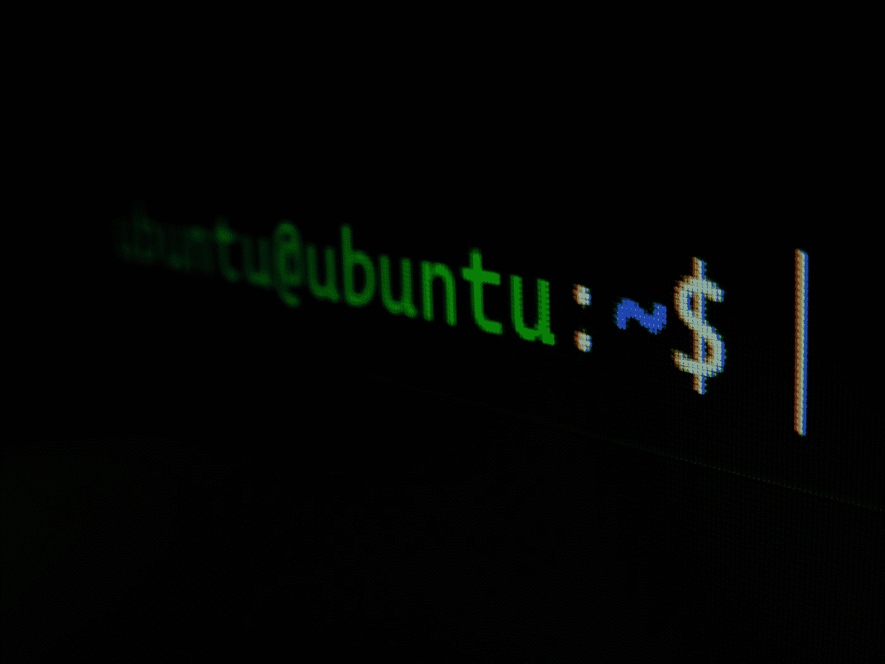

# 适用于初学者的 Ubuntu 命令

> 原文：<https://medium.com/codex/ubuntu-commands-for-beginners-5fa7b4bde11f?source=collection_archive---------9----------------------->

加布里埃尔·海因策在 [Unsplash](https://unsplash.com?utm_source=medium&utm_medium=referral) 上的照片

Ubuntu 是最受欢迎的基于 Debian 的 Linux 操作系统发行版，最初发布于 2014 年。本文总结了 10 个常见任务的基本命令的用法，初学者可能会觉得有用。

[1。当前目录](#5a37)
[2。改变目录](#f907)
[3。创建新目录](#d4b0)
[4。删除目录](#1ea7)
[5。创建新文件](#dc21)
[6。列出所有文件和目录](#fcc5)
[7。读取文件](#e095)
[8。编辑文件(插入/保存/退出/……)](#2a35)
[9](#a4d6)…