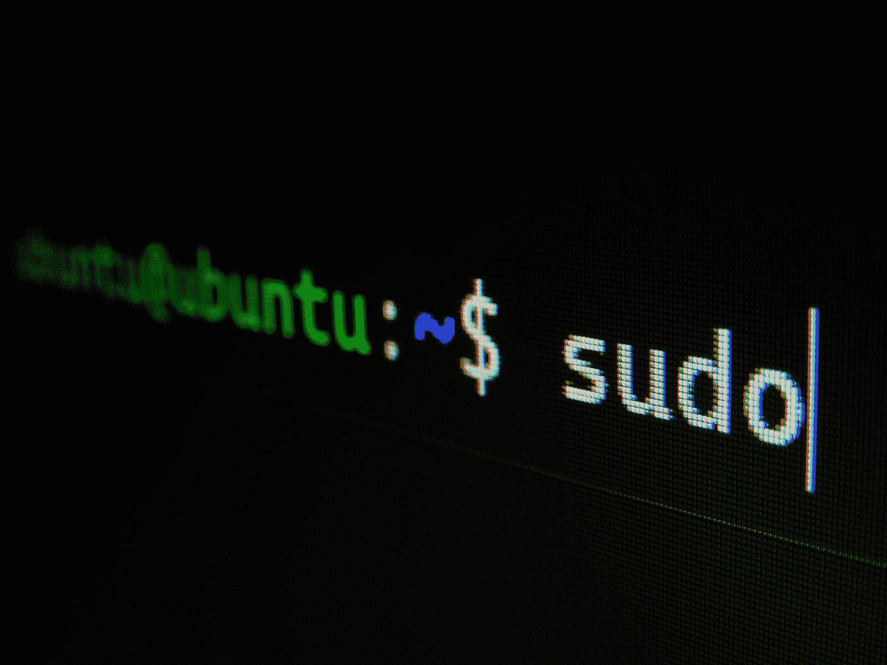

# Ubuntu Linux 发行版

> 原文：<https://medium.com/codex/ubuntu-linux-distro-2808dbcfb58d?source=collection_archive---------6----------------------->

我们的现代世界似乎充斥着由三种不同操作系统驱动的计算机:Windows、Mac 和 Linux。一个是由企业巨头微软开发的，一个是由科技公司苹果创建的，最后一个是由各种不同的公司和组织创建的开源操作系统。Linux 是市场上少数几个可以免费获得的操作系统之一，并且有各种各样的…