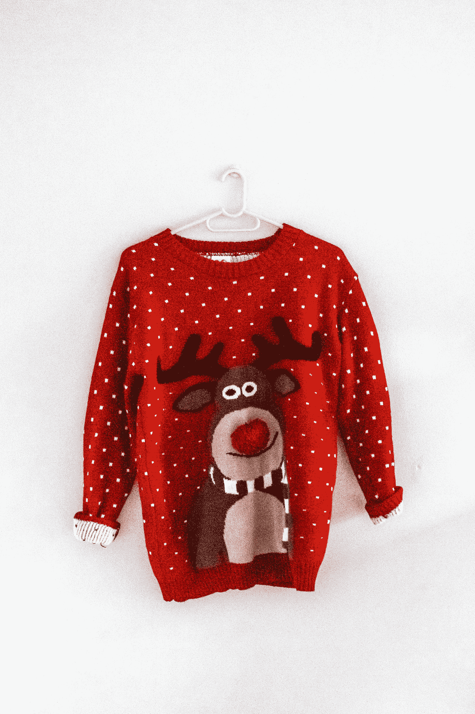
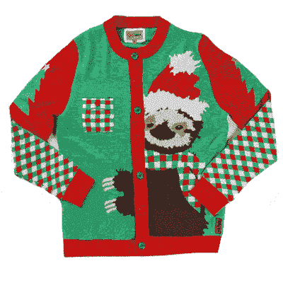
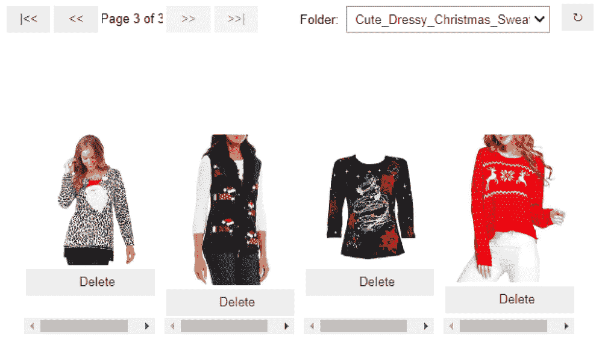
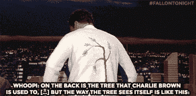
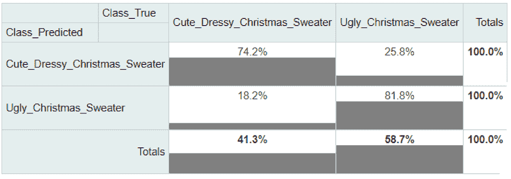
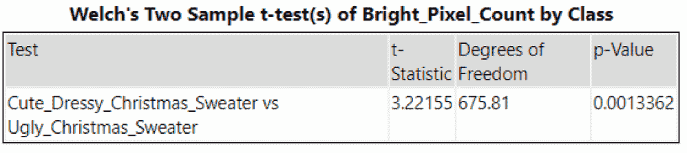
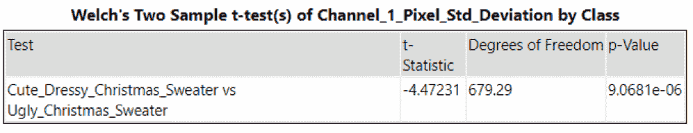
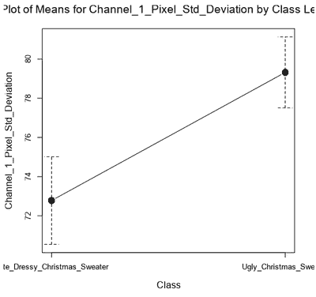
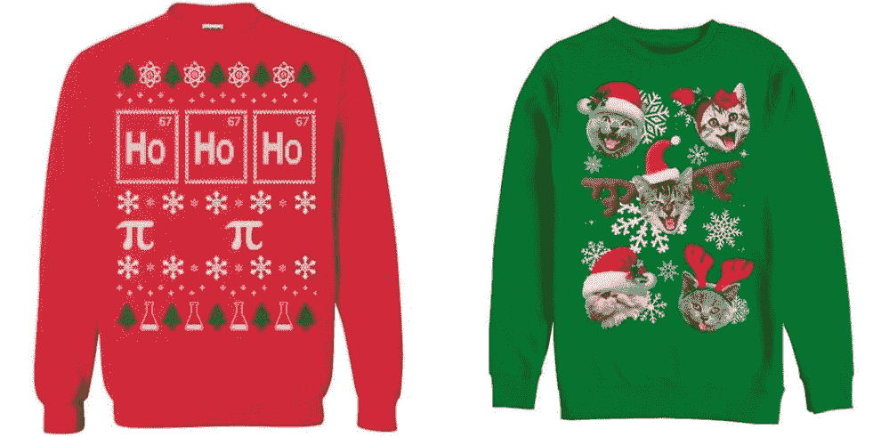

# 丑还是好看？用计算机视觉对圣诞毛衫进行分类

> 原文：<https://medium.com/codex/ugly-or-nice-classifying-christmas-sweaters-with-computer-vision-30e5ff8bdcf7?source=collection_archive---------7----------------------->

## 能不能把“难看的圣诞毛衣”量化？这是你可以利用的新闻——不仅用于数据科学项目，也用于你的节日时尚选择。

[真诚媒体](https://unsplash.com/@sincerelymedia?utm_source=medium&utm_medium=referral)在 [Unsplash](https://unsplash.com?utm_source=medium&utm_medium=referral) 上拍摄的照片

如果你被邀请参加一个以[“丑陋的圣诞毛衣”](https://www.thedatingdivas.com/the-ultimate-ugly-sweater-party/)为主题的派对，你可能会想:是我选的这件毛衣*真的很丑吗*，还是我对时尚的判断力很差？或者你只是穿了一件你认为“好看”的节日毛衣。如果你的“丑陋”选择得到了称赞，那该怎么办？

幸运的是，我们有数据科学工具来解决这个难题！毕竟，这只是一个二元分类问题——“丑”还是“好”。

*图像通过* [*GIPHY*](https://media.giphy.com/media/10M4bOvsYKKTYI/giphy.gif)

利用 Alteryx 智能套件中的计算机视觉工具和一点点 Python，我们将看看我们是否能够正确地对毛衣进行分类，然后探索我们是否能够量化任何可能定义“丑陋的圣诞毛衣”的特征。这是你可以利用的及时消息——不仅仅是为了你的数据科学项目，也是为了你的节日时尚选择。(如果您想跟进，请访问[原始博文](https://community.alteryx.com/t5/Data-Science/Ugly-or-Nice-Classifying-Christmas-Sweaters-with-Computer-Vision/ba-p/851932?utm_content=851932&utm_source=tds)以获取附加的工作流程！)

# 刮毛衣

为了建立一个难看/好看的毛衣图像分类模型，我们需要许多适合这两个类别的毛衣图像。使用名为 [jmd_imagescraper](https://joedockrill.github.io/jmd_imagescraper/) 的 Python 图像抓取包可以很容易地快速收集图像，该包根据您选择的搜索词从 DuckDuckGo 搜索引擎中收集图像。

经过一番试验，我找到了“可爱的、考究的圣诞毛衣”,作为寻找看起来更普通的节日服装的可靠搜索词。虽然可能偏向于更典型的女性风格，但样本中也包括了更男性化的毛衣。

*图片清洗界面显示的据称“可爱”的毛衣样品。图片作者。*

通过 Python 工具中的几行代码，我很快就有了 900 张毛衣的图片。jmd_imagescraper 包还包括一个方便的小工具，允许您预览和删除重复的或不合适的图像，在这种情况下包括偶尔的剪贴画图像或插图。经过一些清理，我最终得到了 752 张图片，几乎平均分配在“难看”和“好看”两个标签之间(避免了[不平衡数据](https://community.alteryx.com/t5/Data-Science/Balancing-Act-Classification-with-Imbalanced-Data/ba-p/841878?utm_content=851932&utm_source=tds)的问题)。

*形象经由*[T5【吉菲】](https://media.giphy.com/media/3oz8xwQF1zecBpmHcI/giphy-downsized.gif) *。*

# 让数据变得漂亮

有了这些图像，我能够从抓取过程中生成的目录名中快速解析出它们的标签，然后通过[图像输入工具](https://help.alteryx.com/20213/designer/image-input)将这些图像带入工作流。(整体来说，建模过程和我最近在[这篇博文](https://community.alteryx.com/t5/Data-Science/Image-Recognition-Classification-Models-Made-Simple/ba-p/802313?utm_content=851932&utm_source=tds)中描述的差不多。)

我使用了[图像处理工具](https://help.alteryx.com/20213/designer/image-processing)来确保图像大小一致，尽管[它能做的不仅仅是调整图像大小。Create Samples 工具将图像整齐地分为评估集、验证集和维持集，我将前两个集输入图像识别工具。](https://community.alteryx.com/t5/Data-Science/Picture-Perfect-Inside-Image-Processing/ba-p/767828?utm_content=851932&utm_source=tds)

在对[图像识别工具](https://help.alteryx.com/20213/designer/image-recognition)中预先训练的模型选项进行试验后，我选定了 VGG16 选项作为总体表现最好的选项。我保存了模型，然后使用[预测工具](https://help.alteryx.com/20213/designer/predict-tool)为维持集分配标签。[列联表工具](https://help.alteryx.com/20213/designer/contingency-table-tool)帮助我总结了模型在维持集上的表现，显示在下面的[混乱矩阵](https://community.alteryx.com/t5/Data-Science/What-is-a-Confusion-Matrix/ba-p/537567?utm_content=851932&utm_source=tds)中。该模型将毛衣分类为“难看”或“好看”，准确率高达 79%。有趣的是，它在难看的毛衣上表现得稍微好一点。

*使用列联表工具评估模型在维持图像上的性能。图片作者。*

就我个人的时尚选择而言，如果我能在 10 次中有 8 次正确选择“可爱”选项，我会非常高兴。你的标准可能更高。

*图像通过* [*GIPHY*](https://media.giphy.com/media/TgMAkXzRxAXyyhYRWn/giphy-downsized-large.gif)

# 量化丑陋的圣诞毛衣

很难知道图像的哪些方面对模型的预测影响最大。然而，我们可以使用图像资料工具查看图像的特征，看看是否有任何有趣的差异，这些差异可能会使这些毛衣的原始标签变得丑陋或可爱(即，在最初发现它们的网站上)。换句话说，我们能不能定量分析这些图像，看看哪些特征与毛衣丑不丑相关？

图像配置文件工具为每个图像提供了许多特征，例如最常出现的颜色(如本文中的[所示)以及亮暗像素的数量。](https://community.alteryx.com/t5/Data-Science/Investigate-Your-Images-with-Image-Profile/ba-p/815532?utm_content=851932&utm_source=tds)

如果你描绘一个黑色到灰色到白色的渐变，“亮像素”是那些更倾向于白色的像素；亮度不是指具体的颜色。然而，如果你想到圣诞老人的衣服和热葡萄酒的暗红色，圣诞老人的衣服是一种更亮的红色。就分配给图像特定像素的值而言，圣诞老人照片中的红色像素将比热葡萄酒照片中的红色像素具有更高的数值。

事实证明，难看的毛衣和好看的毛衣之间的一个区别是，根据使用[均值测试工具](https://help.alteryx.com/20213/designer/test-means-tool)进行的快速检查，难看的毛衣图像中有统计学上显著更高数量的亮像素。所以，如果你正在为一个聚会寻找一件难看的圣诞毛衣，穿亮色的可能更好(更糟？).

图片作者。

当我们查看图像中红色、绿色和蓝色像素的每个“通道”的标准偏差时，我们可以看到，对于难看的毛衣图像，红色通道值的标准偏差(SD)明显更高(*p*0.001)，尽管绿色或蓝色没有。

图片作者。

*由均值工具生成的图来显示通道 1 中像素标准差的差异。图片作者。*

这种显著的差异意味着这些图像中红色的显示有更多的变化，或者换句话说，要么是大量红色和少量其他颜色(如左下方，通道 1 的 SD 较低)…要么是少量红色和大量其他颜色(如右下方，SD 较高)。

向化学家和爱猫人士道歉:图片数据集中有两件难看的圣诞毛衣。图片来源: [*化学*](https://www.350yeezyshop.com/p/?iid=151464878&pr=52.99) *，* [*猫*](https://i5.walmartimages.com/asr/d0d5c380-e1c1-4822-bd33-36e263dd642d_1.b0aa46a5c5e7c43c308cf1926134fb4e.jpeg)

因此，也许丑陋的圣诞毛衣的一个方面是红色的惊人使用——要么全身都是红色，要么最低限度地使用红色的战略流行，以达到最大限度的干扰效果。

# 节日时尚问题得到解决

数据科学提供的时尚建议？无论你选择“丑”还是“好”，有一点算法上的洞察力来通知你的节日服装选择是很有趣的！当然，你可以用这种方法来解决各种各样的图像分类问题，这是值得庆祝的事情。

*原载于* [*Alteryx 社区数据科学博客*](https://community.alteryx.com/t5/Data-Science/Ugly-or-Nice-Classifying-Christmas-Sweaters-with-Computer-Vision/ba-p/851932?utm_content=851932&utm_source=tds) *。*