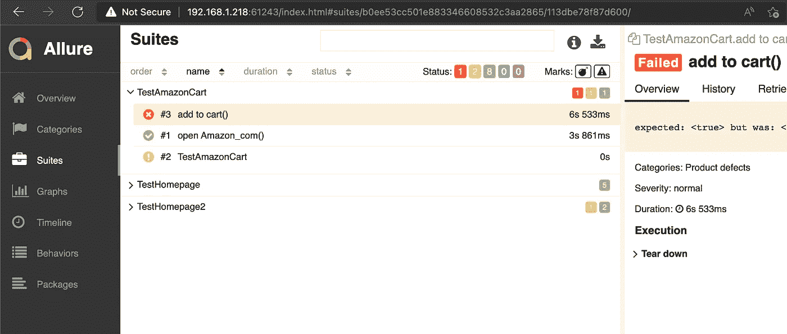

# 使用 Selenium、Gradle、JUnit 进行端到端测试

> 原文：<https://medium.com/codex/ui-testing-with-selenium-gradle-kotlin-junit-57fc9f2aefa1?source=collection_archive---------8----------------------->

## 我想用 JVM 测试一个网页，但是到处都是零散的教程。我决定创建一个准系统项目来演示如何操作。

我们的目标是测试在 Amazon.com 的购物车中添加 Kindle 的端到端流程。


# 1.新项目

请遵循以下步骤:

[](https://lsoares.medium.com/kotlin-gradle-junit-starter-project-a113a2cc9cbb) [## Kotlin/Gradle/JUnit starter 项目

### 只是一个使用 Gradle 和 Junit 启动一个黑色新 Kotlin 项目的快速教程。

lsoares.medium.com](https://lsoares.medium.com/kotlin-gradle-junit-starter-project-a113a2cc9cbb) 

# 2.硒

将 Selenium 添加到依赖项中:

```
implementation("org.seleniumhq.selenium:selenium-java:4.+")
```

为了能够控制浏览器，Selenium 需要一个合适的[驱动](https://www.selenium.dev/documentation/webdriver/getting_started/install_drivers/)。实现这一点有多种方法，但最快的方法是让 [WebDriverManager](https://github.com/bonigarcia/webdrivermanager) 为您管理:

```
implementation("io.github.bonigarcia:webdrivermanager:5.+")
```

现在，编辑`TestAmazonCart.kt`并粘贴以下访问 Amazon 的基本测试:

这假设你有 Chrome，但是你可以用其他的代替`chromedriver()`。

# 3.页面对象模式

测试将很快充满 CSS 选择器和等待等细节，所以我们将求助于[页面对象模式](https://martinfowler.com/bliki/PageObject.html)，它抽象了页面细节。这是遵循 SLA 原则的一种方式。

让我们创建以下文件:

注意，测试方法通过在不同的页面上运行多个指令来利用页面对象模型

有些人喜欢把所有的选择器放在开头，但是我避免这样做，因为简单和[因为它们只使用一次](/codex/when-magic-numbers-are-not-magic-fcdf034295a5)。

# 4.报告

一份漂亮的报告怎么样？在`build.gradle.kts`的`plugins`部分添加诱惑报告依赖即可:

```
id("io.qameta.allure") version "2.9.6"
id("io.qameta.allure-report") version "2.9.6"
```

进行测试。然后，要查看其报告，请运行:

```
./gradlew allureServe
```



测试失败时在报告中添加截图怎么样？创建以下实用程序:

现在，你只需要把它注入到测试中:

```
@RegisterExtension
private val screenshotOnError = ScreenshotOnError(driver as RemoteWebDriver)
```

这足以将截图添加到《倾城报告》中。

# 5.不在意的

如果您需要将此集成到您的 CI/CD 系统中，您需要使用一个无头浏览器(该浏览器无需 UI 即可运行)。为此，您可以将设置更改为:

```
init {
    WebDriverManager.chromedriver().setup()
}

private val driver = ChromeDriver(ChromeOptions().addArguments("--headless"))

@RegisterExtension
private val screenshotOnError = ScreenshotOnError(driver)
```

请注意，`addArguments`部分需要依赖一个环境变量，这样您就可以只在 CI/CD 上运行 headless，而不是在本地测试上运行。