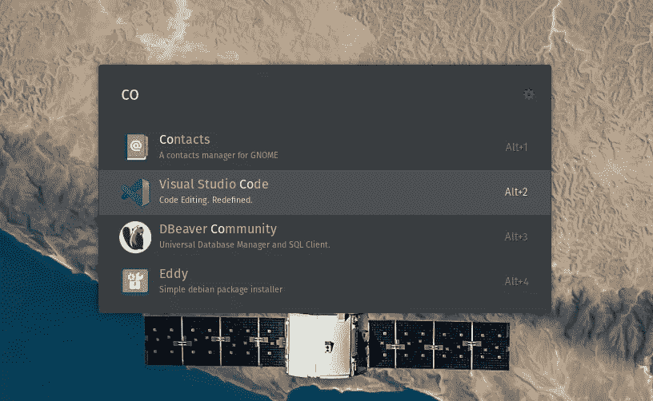

# ulauncher & Gnome Sushi:Linux 的聚光灯式搜索和快速预览

> 原文：<https://medium.com/codex/ulauncher-gnome-sushi-spotlight-like-search-and-quick-look-like-preview-for-linux-1367dc8edf05?source=collection_archive---------1----------------------->

## [法典](http://medium.com/codex)

适用于 Linux 的 Ulauncher 应用程序启动器

# TL；速度三角形定位法(dead reckoning)

Ulauncher 为 Linux 用户提供了一个强大的应用程序启动器，它的工作方式非常类似于 macOS 上的 Spotlight，Gnome sushi 在 Nautilus 中提供了一个简单的预览功能，就像我们在 macOS 的 Finder 中可以找到的一样。这篇文章向你展示了如何设置一切，让你…