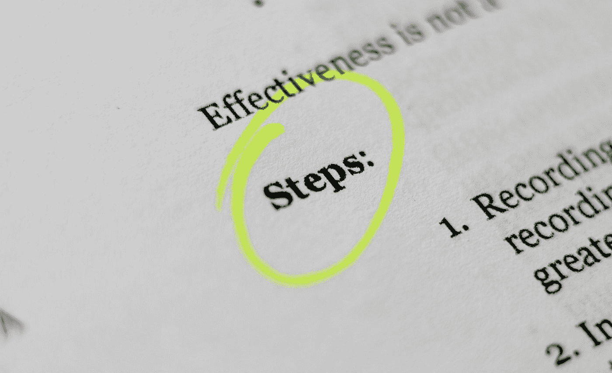

# 前端测试终极指南

> 原文：<https://medium.com/codex/ultimate-guide-to-front-end-testing-b6edafc0aa87?source=collection_archive---------20----------------------->

## 关于前端测试，您需要了解的一切尽在一本终极指南中。

克莱顿·罗宾斯在 [Unsplash](https://unsplash.com?utm_source=medium&utm_medium=referral) 上的照片

前端测试是在向公众发布之前测试网页或应用程序的外观和功能的过程。在本文中，我们将为您提供如何有效地进行前端测试的技巧，并为您提供一步一步地设置…