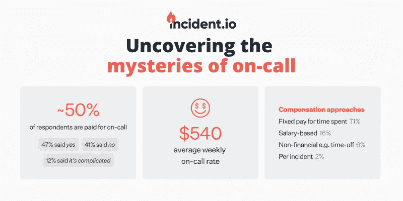
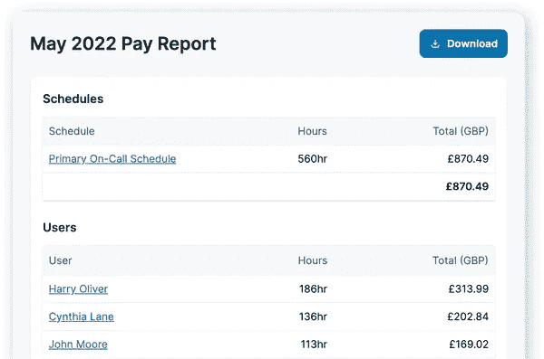

# 揭开随叫随到的秘密

> 原文：<https://medium.com/codex/uncovering-the-mysteries-of-on-call-91e99f668ab7?source=collection_archive---------12----------------------->

对于绝大多数组织来说，某种形式的全天候保护对于成功的业务运营至关重要。随叫随到是有效事件响应流程的重要组成部分，但对于如何最有效地组织和[补偿随叫随到者](https://incident.io/blog/fair-on-call-compensation)，却没有普遍接受的行动手册。

我们进行了一项调查，旨在揭示世界各地不同形状和规模的组织中随叫随到工作方式的奥秘。

你可以在下面下载完整的报告，或者继续阅读下面的标题。

[下载完整报告](https://incident.io/content/uncovering-the-mysteries-of-on-call)

# TL；速度三角形定位法(dead reckoning)

我们收到了 200 多份回复，从谷歌、亚马逊和 Airbnb 等全球知名的科技领军企业，到员工不足 50 人的小型初创企业。以下是亮点:

在近 70%的组织中，每个团队负责自己的待命值班表，而不是有一个或多个集中的待命团队。

超过 40%的参与者没有得到随叫随到的补偿。有趣的是，这在大型组织(+5，000 人)中比在参与调查的中小型组织中更常见。

如果公司确实提供补偿，大多数公司会为随叫随到的时间支付固定金额(例如，每小时、每天或每周 X 美元)。但实际支付的金额相差很大，从每周 5 美元到 1000 美元不等，平均每周 540 美元。

最常提到的随叫随到挑战是:

1.  个人生活受到干扰(30%)
2.  在没有足够背景或知识的情况下处理问题(24%)
3.  睡眠不足(12%)
4.  错误警报(10%)

# 需要帮助计算您的待命薪酬吗？

我们的报告建议，无论是否有人被呼叫，都要为随叫随到的时间支付固定费用，按分钟计算。这有助于弥补需要全天候可用所带来的不便和干扰。从痛苦的经历中，我们知道准确计算随叫随到的时间是很棘手的，尤其是当你要考虑周末费用、假期和多重日程安排时。

这就是我们刚刚推出随叫随到薪酬计算器的原因。只需将您的 PagerDuty 帐户连接到 incident.io，告诉我们您用来计算随叫随到薪酬的规则，剩下的我们会完成。

您将能够自动生成一份报告，根据拿着传呼机的时间，详细说明团队每个成员应得的随叫随到的报酬。你的应答者也可以看到他们每班的工资明细，这对每个人来说都是超级透明的。

瞧，轻松实现随叫随到的补偿。