# Spotify 分析:音乐品味在过去和现在之间如何变化

> 原文：<https://medium.com/codex/understand-how-music-taste-changes-between-now-and-then-on-spotify-7c7af51f2448?source=collection_archive---------16----------------------->

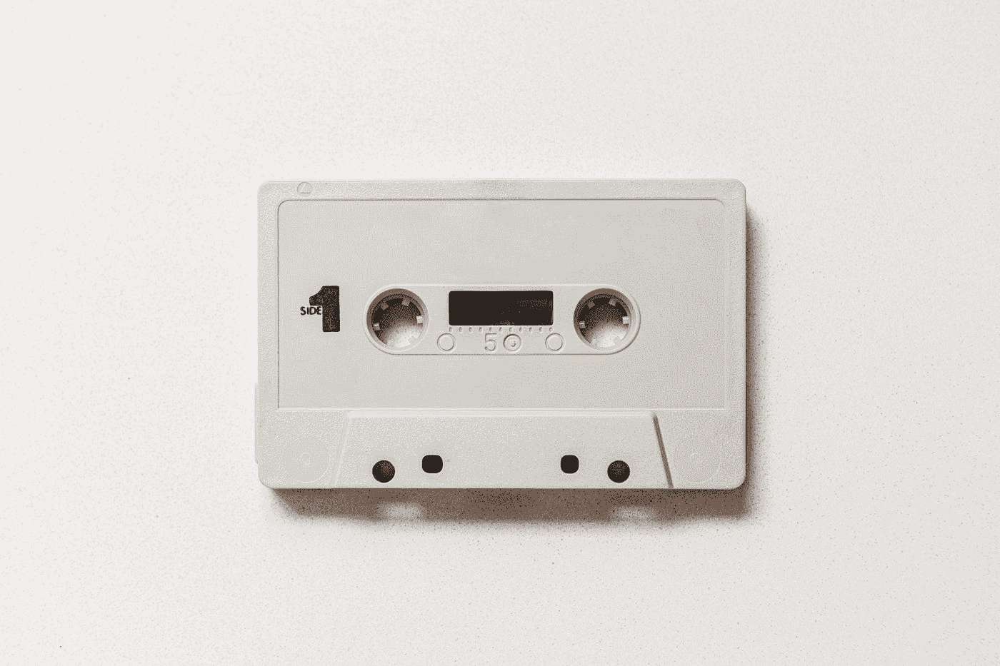

丹尼尔·施鲁迪在 [Unsplash](https://unsplash.com?utm_source=medium&utm_medium=referral) 上拍摄的照片

你有没有想过你对音乐的品味是如何随着时间而改变的？我知道我们有时会喜欢听一些欢快的播放列表，里面有很多流行的 Tiktok 歌曲，但有时我们喜欢听萨姆·史密斯或泰勒·斯威夫特《破碎的心》的柔和旋律来生闷气。但是旋律在声音的清晰度、价数等方面的变化有多精确呢？

因此，我进行了这项分析，通过比较“重复播放”和“重复倒带”这两个播放列表，来发现我的听力偏好倾向于更好地理解我们的音乐品味。这两个播放列表是由 Spotify 系统地制作的:“On Repeat”是我目前重复最多的 30 首歌曲，“Repeat Rewind”是我过去重复最多的 30 首歌曲。

***详细的分析文件和代码，可以查看下面我在 Github 上的资源库:***

 [## GitHub-thuyanhnx/Spotify-Analysis-Between-Now-Then:发现我的音乐在 Spotify 上的味道如何…

### 发现我在 Spotify 上的音乐品味从现在到那时的变化- GitHub …

github.com](https://github.com/thuyanhnx/Spotify-Analysis-Between-Now-and-Then) 

# 首先，我们需要连接到 Spotify API…

Spotify 不仅用各种各样的优秀音乐让我满意，还用他们的开发者网站来满足我，这些网站提供了关于连接到他们的 API 的详细教程:Spotify 开发者网站[。这对我来说真的很“温暖”,因为我是数据科学领域的初学者，详细的教程绝对意义重大。不管怎样，我需要做的就是通过他们的开发者网站申请许可&凭证。然后，我使用 Python 抓取 Spotify API web，将我们的“On Repeat”和“Repeat Rewind”播放列表中的所有歌曲提取到一个 JSON 文件中，然后将其转换为 DataFrame。](https://developer.spotify.com/documentation/web-api/)

这是我的数据的头:

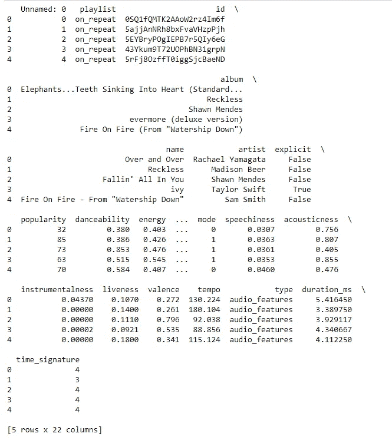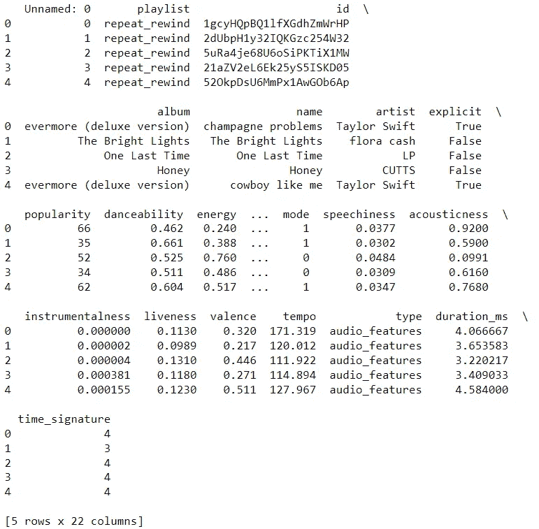

“重复时”和“重复倒带”数据帧中的标题行

# 现在，我们来分析一下！

## 数据概述

在初始数据中有 22 列，每个播放列表有 30 首歌曲。但是，我必须指出，在此分析中仅使用了与音频功能高度相关的变量(根据 Spotify ):

*   **acoustic ness**:0.0 到 1.0 之间的音轨是否声学的置信度。1.0 表示音轨是声学的高置信度。
*   **可跳舞性:**可跳舞性描述了一首曲目根据音乐元素的组合适合跳舞的程度，包括速度、节奏稳定性、节拍强度和整体规律性。值 0.0 最不适合跳舞，1.0 最适合跳舞。
*   **能量**:能量是一个从 0.0 到 1.0 的度量，代表强度和活动的感知度量。通常，高能轨道感觉起来很快，很响，很嘈杂。例如，死亡金属具有高能量，而巴赫前奏曲在音阶上得分较低。对该属性有贡献的感知特征包括动态范围、感知响度、音色、开始速率和一般熵。
*   **乐器性**:预测一个音轨是否不包含人声。“Ooh”和“aah”在这种情况下被视为乐器。Rap 或口语词轨道明显是“有声的”。乐器度值越接近 1.0，轨道不包含人声内容的可能性就越大。高于 0.5 的值旨在表示乐器轨道，但随着该值接近 1.0，置信度会更高。
*   **活跃度:**检测录像中是否有观众。较高的活跃度值表示音轨被现场执行的概率增加。高于 0.8 的值很有可能表示该音轨是实时的。
*   **响度**:音轨的整体响度，单位为分贝(dB)。响度值是整个轨道的平均值，可用于比较轨道的相对响度。响度是声音的质量，是与体力(振幅)相关的主要心理因素。值的典型范围在-60 和 0 dB 之间。
*   **语速**:语速检测音轨中是否存在口语单词。越是类似语音的录音(例如脱口秀、有声读物、诗歌)，属性值就越接近 1.0。高于 0.66 的值描述可能完全由口语单词组成的轨道。介于 0.33 和 0.66 之间的值描述可能包含音乐和语音的轨道，可以是分段的，也可以是分层的，包括说唱音乐。低于 0.33 的值很可能代表音乐和其他非语音类轨道。
*   **效价**:从 0.0 到 1.0 的一个量度，描述一首曲目所传达的音乐积极性。高价曲目听起来更积极(例如，快乐、愉快、欣快)，而低价曲目听起来更消极(例如，悲伤、沮丧、愤怒)。
*   **速度**:轨道的整体估计速度，单位为每分钟节拍数(BPM)。在音乐术语中，速度是给定作品的速度或步调，直接来源于平均节拍持续时间。

## 了解音频功能

首先，根据 Spotify 的说法，我想从最接近音频特征的变量中获得洞察力，这些变量是:可跳舞性、能量、语音、声学、乐器性、活性和效价。

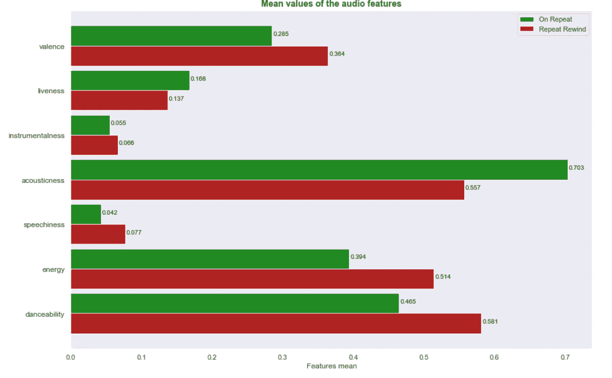

从条形图中，我们可以看到两个播放列表之间的差异。为了让它更清楚，我还建立了一个雷达图如下:

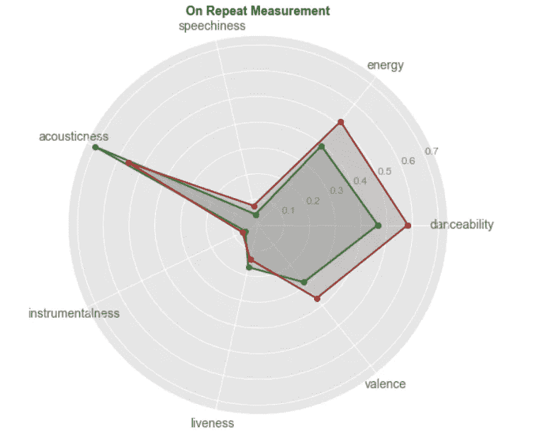

从上面的分析和图表中，我们可以看到，我现在的音乐品味显然是更加声学和活泼，而在可舞性、能量、效价和语言方面则更少。这一事实表明，我正在转向更柔和、更温和、更有旋律的歌曲，不知何故，这些歌曲可能不那么快乐，但却更加忧郁和忧郁。我过去常常听节奏更高、更响、更刺激的歌曲。“化合价”、“可跳舞性”和“能量”的显著下降就是这一事实的证明。

接下来，我们来比较两个播放列表的速度和响度。速度是音乐的速度，而音量是音轨中声音的音量。速度变得越高(以 BPM 为单位)，旋律就越快，类似于响度:响度占的比重越高(以 dB 为单位)，音乐就越响。

例如，时髦摇滚或嘻哈，说唱往往有很高的音量和节奏，而民谣或独立民谣的音量和节奏较低。

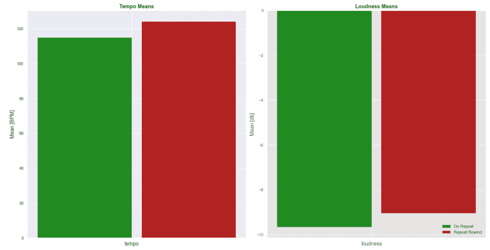

从柱状图来看，很明显我在转向速度和响度都比较小的歌曲。我倾向于更喜欢柔和的歌曲，这更可能是爱情歌谣或柔和的流行音乐。

## 差异分析

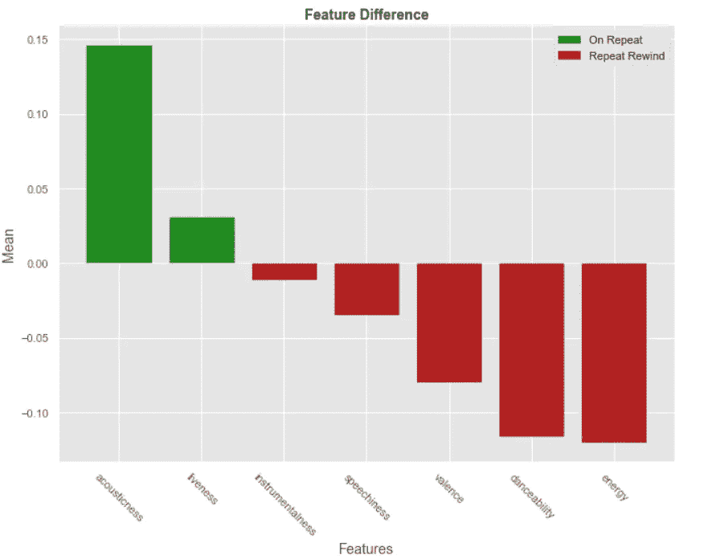

不同点在于,《重复》中的歌曲在声音和活力上更高，而《重复倒带》中的歌曲更有活力，更适合跳舞，更有价值，并且具有更高水平的语言和乐器性。我的音乐品味似乎真的很耐人寻味，由软和忧郁的轨道最近！这可能是因为我们现在经常听民谣或轻音乐，而不是像以前那样听电子流行歌曲。

## 多样性分析

在这一部分，我计算了**标准差**，然后计算其平均值，以了解我们播放列表中的多样性趋势。

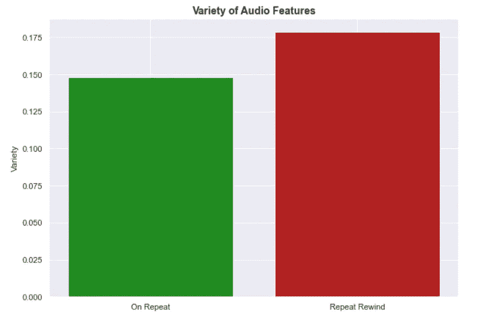

总的来说，我们的音乐品味过去比现在更多样化。为了得到一个更具体的视角，这就是我们音乐中的每个特征是如何尝起来不同的。

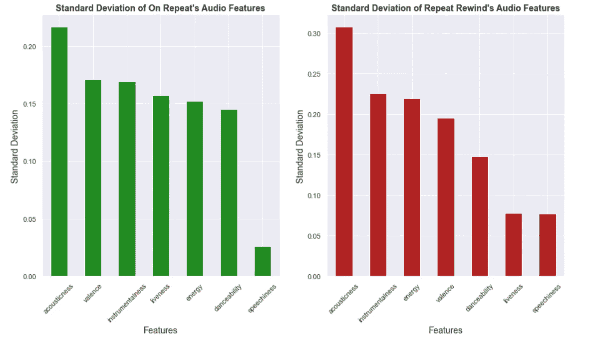

我们过去听的歌曲比现在更加多样化。此外，特征之间的差异量也存在差异。与“重复倒带”相比,“重复播放”中的声音、效价和活性变量更加多样。

## 相关分析

这是我们音频特征的相关图:

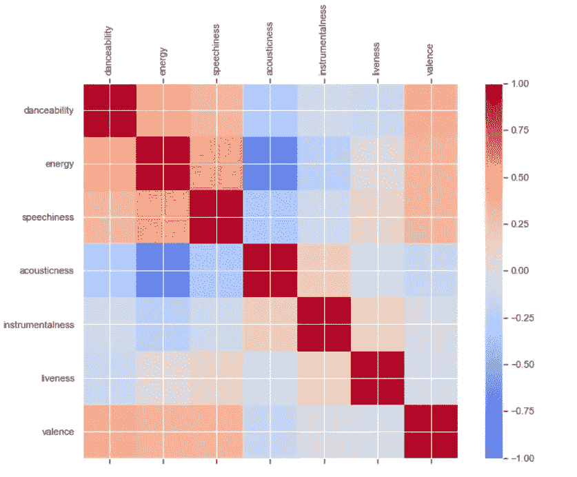

我也很好奇特征之间的线性关系。

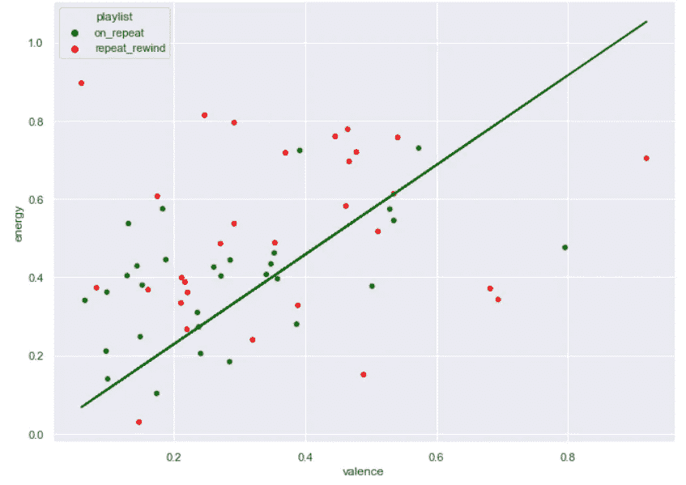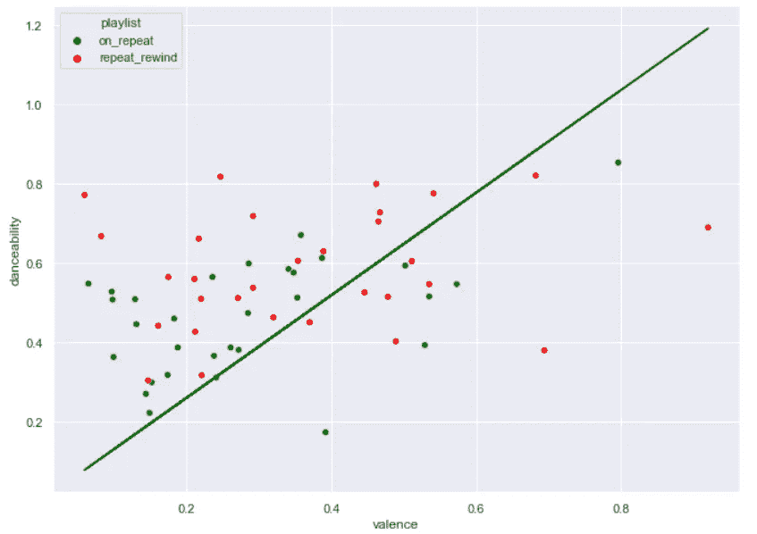

从这些图表来看，当化合价增加 1 个单位时，能量和可跳舞性都增加了约 0.2 个单位。当我们仔细观察时，在“重复倒带”播放列表中，我们有低价但记录了异常高能量的歌曲。此外，在比较“配价”和“可跳性”的图表中，相关性并不明显，并且不管配价的测量，“重复”中的可跳性大多在 0.4 到 0.6 之间，而“重复倒带”中的可跳性大多在 0.5 到 0.8 之间波动。

## 最后，结论…

这是一个有趣的分析(也是我的第一个数据分析项目),用来了解我的音乐品味从现在起是如何变化的。

我在 Github 和《走向数据科学》上阅读了许多类似主题的分析和文章，并从他们身上学到了很多，从而指导了我的第一个项目。从这个分析中，我可以更好地了解我们的音乐偏好，并可以看到我们的音乐品味如何波动。

*参考文献:*

*   [https://towards data science . com/a-conductive-analysis-on-couples-music-and-movie-tastes-via-Spotify-网飞-df40ce274383](https://towardsdatascience.com/a-subtle-analysis-on-couples-music-and-movie-tastes-via-spotify-netflix-df40ce274383)
*   [https://towards data science . com/a-music-taste-analysis-using-Spotify-API-and-python-e52d 186 db 5 fc](https://towardsdatascience.com/a-music-taste-analysis-using-spotify-api-and-python-e52d186db5fc)
*   [https://github.com/makispl/Spotify-Data-Analysis](https://github.com/makispl/Spotify-Data-Analysis)
*   [https://towards data science . com/discovery-your-music-taste-with-python-and-Spotify-API-b 51 b0d 2744d](https://towardsdatascience.com/discovering-your-music-taste-with-python-and-spotify-api-b51b0d2744d)
*   [https://medium . com/@ boplantinga/what-do-spotifys-audio-features-tell-us-about-this-Eurovision-song-contest-66ad 188 e112 a](/@boplantinga/what-do-spotifys-audio-features-tell-us-about-this-year-s-eurovision-song-contest-66ad188e112a)