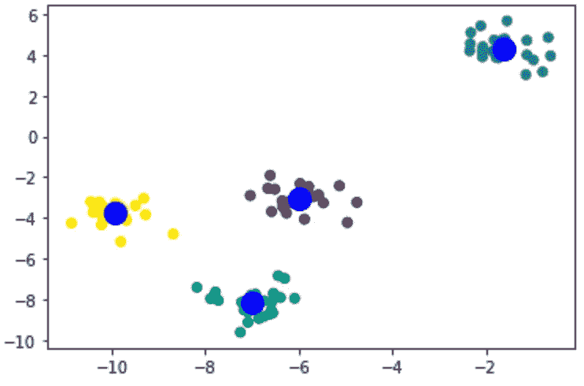

# 了解 K-Means 分类算法

> 原文：<https://medium.com/codex/understand-k-means-classification-algorithm-b5b314b05cad?source=collection_archive---------8----------------------->

## 从头开始创建一个 K 均值模型来理解它

k-均值分类

K-Means 模型是一种无监督的机器学习模型。该模型通常用于将观察到的数据划分成`k`簇。您为模型提供一组具有已定义特征的数据，并告诉它您希望它输出多少个聚类。模型会将数据集分类到…