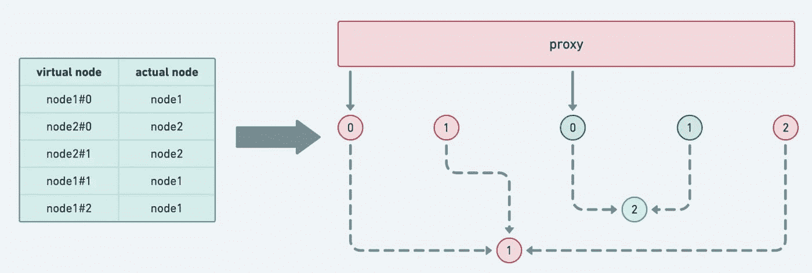

# 理解和实现一致哈希算法

> 原文：<https://medium.com/codex/understanding-and-implementing-consistent-hash-algorithm-e53a35afa428?source=collection_archive---------3----------------------->

在 go-zero 的分布式缓存实现中，我们大量使用了一致哈希算法。在本文中，我们将讨论一致散列的算法及其在 go-zero 中的实现细节。

以存储为例，不可能说我们的存储只是整个微服务体系中的单个节点。

*   首先是提高稳定性。如果单个节点停机，整个存储将面临服务不可用。
*   第二，对于数据容错。单节点数据丢失导致数据丢失。而对于多节点的情况，节点有备份，除非相互备份的节点同时被破坏。

那么问题就来了，多节点的情况下数据应该写到哪个节点呢？

# 混杂


所以本质上:我们需要一个输入值，它可以被“压缩”**并转换成一个更小的值，通常是唯一的，并且格式非常紧凑，比如 uint64**。

*   幂等的:每次用相同的值计算散列，它必须保证获得相同的值

这就是`hash`算法的作用。

而是采用常规的`hash`算法进行路由，例如`key % N`。如果一个节点由于异常或心跳异常而退出集群，那么`hash route`将导致大量数据被`redistributed`到不同的节点。当一个节点接受一个新的请求时，需要重新处理逻辑来获取数据:如果在缓存中，很容易造成 ***缓存雪崩*** 。

在这种情况下，有必要引入`consistent hash`算法。

# 一致散列

我们来看看`consistent hash`是如何解决这些问题的。

# 缺乏创意地改写

让我们从解决巨大的`rehash`问题开始。


如上图，当添加一个新节点时，唯一受影响的键是`key31`。添加(删除)新节点时，只有该节点附近的数据会受到影响。其他节点的数据不会受到影响，从而解决了节点变更的问题。

这正是:单调性。这也是`normal hash`算法无法满足分布式场景的原因。

# 数据偏斜

其实上图显示目前大部分键都集中在`node 1`上。如果在节点数量比较少的时候，可以触发集中在某个`node`上的大部分按键，那么监控时发现的问题就是:节点之间负载不均衡。

为了解决这个问题，`consistent hash`引入了`virtual node`的概念。

由于负载是不均匀的，我们人为地构建了一个平衡的场景，但是实际的节点只有这么多。所以我们用`virtual node`来划分区域，而实际服务的节点还是和前面的一样。

# 具体实施

先说`Get()`。

# 得到


首先说一下实现的原理。

1.  计算`key`的散列值
2.  找到第一个匹配的`virtual node`的索引，并获取相应的`h.keys[index]`:虚拟节点哈希值
3.  去这个`ring`找一个与之匹配的`actual node`

事实上，我们可以看到`ring`得到了一个`[]node`。这是因为在计算`virtual node hash`时，在不同的`virtual node hash`对应于实际节点的情况下，可能存在散列冲突。

这也意味着`node`和`virtual node`是一对多的关系。而里面的`ring`是下面的设计。



这实际上显示了一致性散列的分配策略。

1.  `virtual node`用作值域划分。`key`用于获取`node`，由`virtual node`限定。
2.  `virtual node`确保`hash`分配给不同节点的键大致均匀分布。也就是**拆分装订**。
3.  添加新节点时，会分配多个`virtual nodes`。新节点可以承载多个现有节点的压力，从全局角度来看，扩容时更容易实现负载均衡。

# 添加节点


读完`Get`，你实际上大概知道了整个一致 hash 是怎么设计的。

```
**type** ConsistentHash **struct** {
  hashFunc Func // hash function
  replicas **int** // virtual node amplification factor
  keys []**uint64** // store virtual node hash
  ring **map**[**uint64**][]**interface**{} // virtual node to actual node correspondence
  nodes **map**[**string**]lang.PlaceholderType // actual node storage [easy to find quickly, so use map]
  lock sync.RWMutex
}
```

这样基本的一致散列就完全实现了。

> *代码:*[*https://github . com/tal-tech/go-zero/blob/master/core/hash/consistent hash . go*](https://github.com/tal-tech/go-zero/blob/master/core/hash/consistenthash.go)

# 使用场景

开头实际上是说一致性哈希可以广泛应用于分布式系统中。

1.  分布式缓存。可以在`redis cluster`这样的存储系统上构建一个`cache proxy`，自由控制路由。对于这个路由规则，我们可以使用一致散列算法
2.  服务发现
3.  任务的分布式调度

上述所有分布式系统都可以用于负载均衡模块。

# 项目地址

[T3【https://github.com/zeromicro/go-zero】T5](https://github.com/zeromicro/go-zero)

欢迎使用 go-zero，给个**星**支持我们！