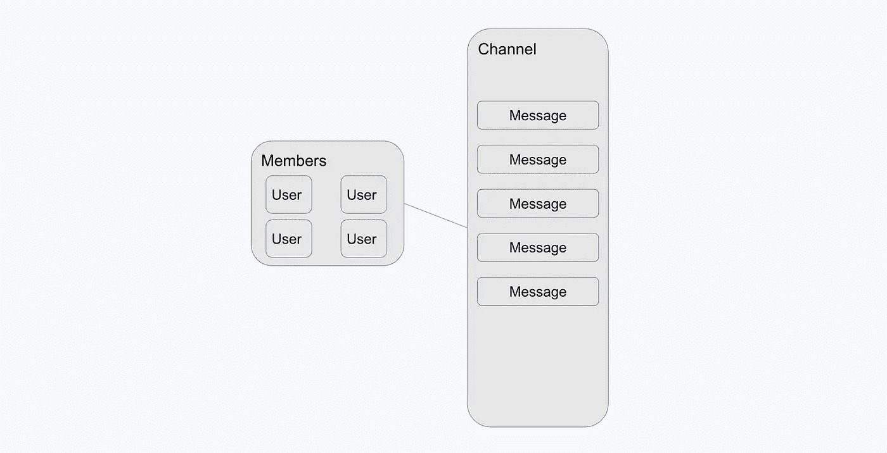
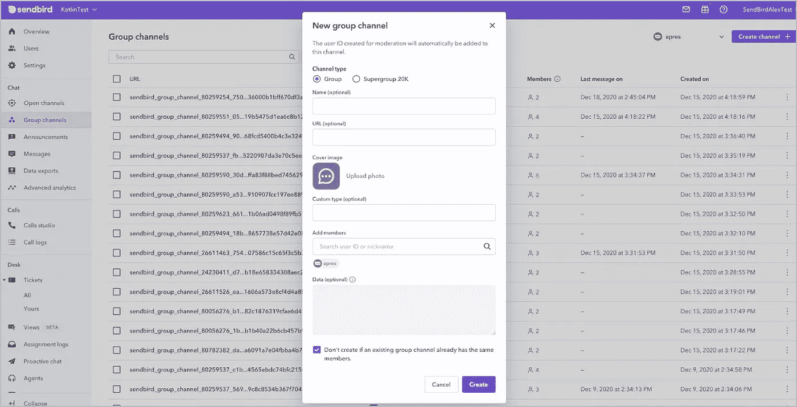
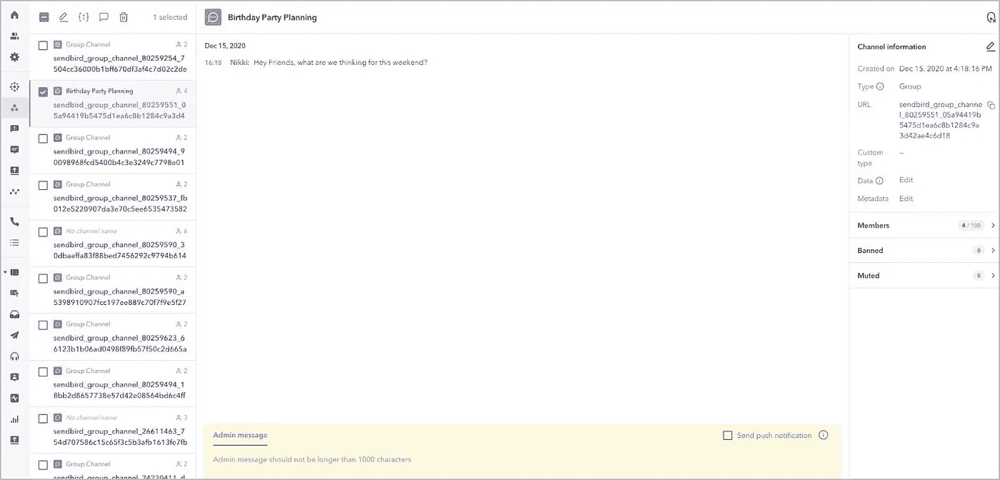
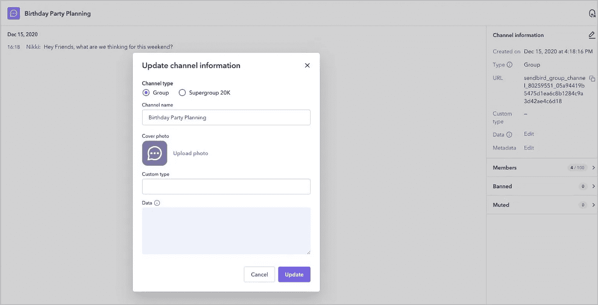
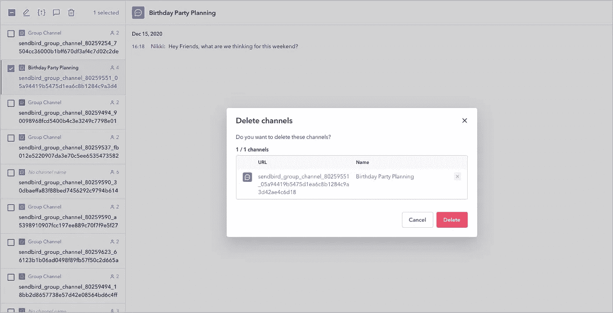

# 了解 Sendbird 聊天中的频道

> 原文：<https://medium.com/codex/understanding-channels-in-sendbird-chat-5c59b0f09783?source=collection_archive---------14----------------------->

仙鸟 2020

## Sendbird Chat 中的频道类型、频道操作及其技术考虑指南

解决方案工程师| [Sendbird](https://www.sendbird.com/)

*有关本教程材料的其他指导，请参见* [*文档*](https://sendbird.com/docs/chat) *。查看 Sendbird Chat 的* [*演示*](https://sendbird.com/demos/in-app-chat) *并访问我们的* [*网站*](https://sendbird.com/features/chat-messaging) *以了解更多关于 Sendbird Chat 的信息。*

> *成为第一个了解新教程、开发者相关聊天/电话发布以及其他重要更新的人，* [*注册*](https://get.sendbird.com/dev-newsletter-subscription.html) *我们的开发者简讯。*

# 介绍

本指南解释了 Sendbird 的另一个核心概念:通道。信道是在你的应用中实现 Sendbird 的基础。本指南结束时，您将了解 Sendbird 中的各种渠道。您还将了解如何创建、更新、删除和查看频道对象。请注意，虽然有些实现会因平台而异，但核心概念在所有 SDK 中都是相同的。

我们将涵盖:

*   两种主要的渠道类型及其使用案例
*   如何创建、查看、更新和删除频道

我们开始吧！💻

# Sendbird 中有哪些频道？

Sendbird 频道对于所有聊天互动都是必不可少的。用户属于它们，消息在其中发送。Sendbird 提供不同类型的通道来支持各种用例。本指南将涵盖 [**两种主要的渠道类型**](https://sendbird.com/docs/chat/v3/platform-api/guides/channel-types#1-channel-types) :集团渠道和开放渠道。我们还将讨论如何使用它们。

用户、消息和渠道之间的关系

## 群组频道

[**群组通道**](https://sendbird.com/docs/chat/v3/platform-api/guides/group-channel#1-group-channel) 是 Sendbird 中使用最多的通道类型。群组频道允许一小组(最多 100 个)用户之间的密切互动。从开发人员的角度来看，这种通道类型提供了更多的定制和控制。这以阅读和交付收据、反应、推送通知、提及等形式出现。如需完整的功能列表，请查看 [**文档**](https://sendbird.com/docs/chat/v3/platform-api/guides/channel-types#2-open-channel-vs-group-channel-vs-supergroup-channel) 。

群组频道主要有两种类型:私人频道和公共频道。

**公共**:公共频道是任何用户无需邀请即可加入的频道。

**私人**:私人频道是只有被邀请的用户才能访问的频道。

虽然默认情况下，群组频道最多可容纳 100 名成员，但我们的许多客户使用它们进行一对一的互动，以创建更亲密的对话。这些对话应该被定义为 [**不同的**](https://sendbird.com/docs/chat/v3/platform-api/guides/channel-types#2-group-channel) ，这意味着任何时候用户试图发起与类似用户的新讨论，相同的频道将被重用。这项功能尤其适用于约会、点播或医疗保健应用。

请参见 [**文档**](https://sendbird.com/docs/chat/v3/platform-api/guides/group-channel#2-resource-representation) 了解群组通道的完整资源表示。

如果您想要使用超过 100 名参与者的群组频道，请查看 [**超级群组频道**](https://sendbird.com/docs/chat/v3/platform-api/guides/channel-types#2-open-channel-vs-group-channel-vs-supergroup-channel) 。这些计划在一个渠道中拥有超过 2，000 名会员，在一个企业计划中拥有多达 20，000 名会员。

## 开放渠道

另一种主要类型的通道是 [**开放式通道**](https://sendbird.com/docs/chat/v3/platform-api/guides/open-channel#1-open-channel) 。与群组频道不同，开放频道的会员资格不是永久的，仅在用户连接时存在。这是一个拥有大量在线用户的公共频道，这些用户可以在没有任何邀请的情况下进入并参与对话。这种类型的频道支持较少的功能和事件通知，以支持更多的受众。要获得完整的特性列表，请查看 [**文档**](https://sendbird.com/docs/chat/v3/platform-api/guides/channel-types#2-open-channel-vs-group-channel-vs-supergroup-channel) 。

有两种不同类型的开放通道:经典的和动态分区的。

[**经典**](https://sendbird.com/docs/chat/v3/platform-api/guides/open-channel#2-classic-vs-dynamic-partitioning) :这是开放频道的默认类型。该通道允许给定通道中最多 1，000 名参与者。(请注意，2021 年 3 月，classic 已被弃用，取代了动态分区通道)。

[**动态分区**](https://sendbird.com/docs/chat/v3/platform-api/guides/open-channel#2-how-dynamic-partitioning-works) :这种类型的通道是为了容纳海量用户而设计的。它们的范围从共享区域的 20，000 名参与者到专用区域的 60，000 名用户。 [**如果您希望将参与人数增加到 60，000 人以上，请联系我们的销售团队**](https://get.sendbird.com/talk-to-sales.html?_ga=2.231090655.1744224355.1641236198-188052033.1627418457) 。开放频道用于直播体育赛事、游戏聊天和聊天室。有关群组通道的完整资源表示，请参见 [**文档**](https://sendbird.com/docs/chat/v3/platform-api/guides/open-channel#2-how-dynamic-partitioning-works-3-resource-representation) 。

# 如何创建、查看、更新和删除频道

默认情况下，可以通过 Sendbird 的创建、更新、查看和删除频道:

*   平台 API
*   iOS SDK
*   Android SDK
*   Javascript SDK

请记住，通道对象包含其成员之间对话的所有高级数据。

通道对象与 SDK 交互。一些交互通过 Websockets 提供实时通信，其他服务通过安全 HTTPS 请求自动联系 Sendbird 发送或获取数据。

## 创建频道

如何创建渠道

**仪表板**

*   单击左侧的开放频道或群组频道选项卡
*   点击“创建频道+”
*   填写相关信息
*   单击创建

**平台 API**

参考 [**文档**](https://sendbird.com/docs/chat/v3/platform-api/guides/group-channel#2-create-a-channel) 了解如何用平台 API 调用创建通道。

**SDK**

*   一般来说，通道通常是通过平台 API 或 SDK 创建的
*   对于您希望限制用户创建通道的能力的用例，您可以将通道创建限制为仅限于平台 API

## 查看频道

观看频道和相关信息

**仪表板**

(请注意，通过仪表板查看频道是一项高级调节功能)

*   点击左侧的开放频道或群组频道选项卡
*   单击您希望观看的频道
*   此视图允许您执行各种审核任务以及查看频道

**平台 API**

参考 [**文档**](https://sendbird.com/docs/chat/v3/platform-api/guides/group-channel#2-view-a-channel) 了解更多关于通过平台 API 调用查看渠道的信息。

**SDK**

*   SDK 提供了查看频道列表以及查看单个频道的方法

## 更新频道

如何更新渠道信息

**仪表盘**

*   点击左侧的开放频道或群组频道选项卡
*   选择相关频道
*   单击右上角的编辑按钮
*   编辑所需的信息
*   单击更新

**平台 API**

查看 [**文档**](https://sendbird.com/docs/chat/v3/platform-api/guides/group-channel#2-update-a-channel) 了解如何使用平台 API 调用更新频道。

**SDK**

*   可以通过 SDK 在所有平台上更新频道
*   如果需要，这个操作可以被限制为只能通过平台 API 来完成

## 删除频道

删除频道

**仪表板**

*   单击左侧的开放频道或群组频道选项卡
*   单击您要删除的频道旁边的复选框
*   单击删除

**平台 API**

参考 [**文档**](https://sendbird.com/docs/chat/v3/platform-api/guides/group-channel#2-delete-a-channel) 了解如何通过平台 API 调用删除通道。

**SDK**

*   SDK 提供了一种通过 SDK 删除频道的方法。这仅限于一个 [**操作符**](https://sendbird.com/docs/chat/v3/platform-api/guides/user-types#2-operator)-的唯一动作
*   这也可能仅限于平台 API

# 恭喜

本指南应该让您对通道、通道类型、它们的用例以及如何通过 CRUD 操作来操纵它们有了坚实的理解。从这里开始，我们建议查看相关的 [**文档**](https://sendbird.com/docs/chat) 用于 [**打开**](https://sendbird.com/docs/chat/v3/platform-api/guides/open-channel#1-open-channel) 和 [**组**](https://sendbird.com/docs/chat/v3/platform-api/guides/group-channel#1-group-channel) 通道，因为有许多更高级的概念和功能可以帮助您创建世界级的应用程序。

开心聊楼！✌