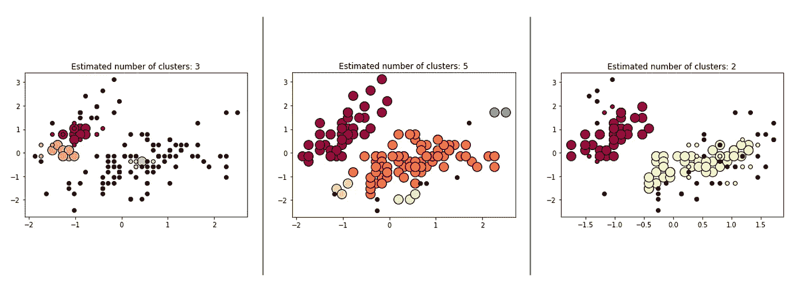

# 了解 DBSCAN 集群:Scikit 实践-学习

> 原文：<https://medium.com/codex/understanding-dbscan-clustering-hands-on-with-scikit-learn-a95cb27f0408?source=collection_archive---------1----------------------->

无监督学习—聚类

含噪声应用程序的基于密度的空间聚类(DBSCAN)算法旨在通过识别高密度区域并将它们与低密度区域分开来识别数据集中的聚类。这种方法允许 DBSCAN 查找任何形状的簇。DBSCAN 的中心概念是“核心……