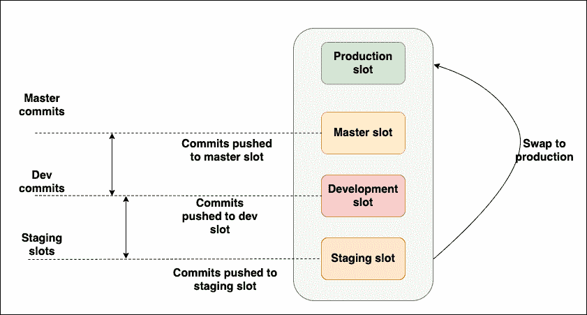
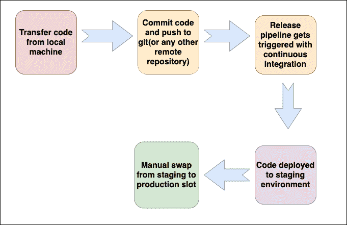

# 了解 Azure 应用服务中的部署插槽

> 原文：<https://medium.com/codex/understanding-deployment-slots-in-azure-app-services-7c88a3e19e2f?source=collection_archive---------5----------------------->

Azure 应用服务对开发者来说是天赐良机。这主要归功于它附带的一系列特性，使开发人员的生活变得轻而易举。

一些最受欢迎的功能包括自动缩放、轻松认证、离线同步(针对移动应用程序)、混合连接等等。

这些应用共有的一个特性，也可能是所有特性中最被低估的一个，就是 Azure 部署槽。

在这篇文章中，我们将了解什么是 Azure 部署插槽，以及为什么我们认为它是 Azure 推出的最佳功能之一。

**目录**

1.  简要背景
2.  什么是 Azure 部署插槽？
3.  为什么选择部署插槽？
4.  Azure 服务部署插槽的工作方式
5.  Azure 服务部署槽的实际应用
6.  结论

# 简要背景

这是一个在开发世界中非常常见的场景——开发人员在执行测试和其他杂七杂八的过程之后，将应用程序推向生产阶段。然后，用户可以通过端点访问网站，主要是通过域名(例如— [www.application.com)。](http://www.application.com).)

现在，如果我们必须发布同一个应用程序的下一个版本，那么我们必须首先将最新的解决方案推送到一个试运行环境中，并注意环境设置。换句话说，必须在相同的设置中手动实现生产环境的精确复制。这是一项非常耗时的工作。

发布管理中的另一个主要问题是回滚。如果最新版本有问题或错误，就需要手动回滚到以前的版本，这又是一项艰巨的任务。您必须恢复设置和环境——所有这些对开发人员来说都是非常困难的。发布期间回滚和更新的最大问题是用户在这段时间内无法使用应用程序，从而导致停机。

这就是 Azure 部署插槽发挥作用的地方，在应用程序发布期间，它将您从复杂性和不必要的问题中解救出来。

# 什么是 Azure 部署插槽？

Azure 部署插槽允许您的 web 应用在称为插槽的不同实例中运行。插槽是通过公共可用端点访问的不同环境。一个应用程序实例总是被分配给生产插槽，您可以根据需要在多个应用程序实例之间切换。在应用服务计划下运行的应用可以容纳多个插槽，而对于未充分使用的计划，只允许一个插槽。

# 为什么选择部署插槽？

## 交换实例的灵活性

不同应用实例从源到目标的交换无需停机，随时随地为用户提供最佳体验。流量重定向是无缝的，不会因为交换而遗漏任何请求。如果在交换过程中执行了一个函数，执行不会中断，下一个触发器将被重定向到交换的应用程序实例。

## 回滚选项

部署槽的另一个有利特性是回滚选项。如果您的团队对最新更新不满意，您可以在同一应用服务中将应用回滚到以前的版本。这消除了停机时间，让您的用户享受中断的服务。

# Azure 服务部署插槽的工作方式

假设您已经在 web 应用程序中部署了一个网站。这个网络应用程序有一个自定义的 URL 地址[https://www.azure-slots.com。](https://www.azure-slots.com.)现在，您的团队创建了一个新版本的网站，您希望在将其推向生产环境之前对其进行测试。因此，您创建了一个名为 staging 的部署槽来推送新版本，它的 URL 是 https://www.azureslots.staging.azureservices.net 的[。](https://www.azureslots.staging.azureservices.net.)

Azure 确保暂存槽具有相同的配置值。因此，它使用与生产插槽相同的数据库和缓存值。

既然新版本已经在部署槽中准备好了，那么它将被部署到生产中。您可以通过交换将新版本推向生产。

首先，将源插槽预热。然后 Azure 向根槽发起请求。最后，Azure 交换源和目标插槽的虚拟 IP 地址，从而交换插槽的 URL。它还受到特定于目标插槽的某些设置的限制。比如发布端点，自定义域名等。

# Azure 服务部署槽的实际应用

## 创建应用服务资源

要做的第一件事是用一个示例 web 服务器设置一个应用服务。这是为了测试更改并执行交换。整个过程包括以下内容:

*   使用示例代码创建一个应用服务槽
*   创建部署插槽
*   使用 CI-CD 方法连接插槽以启用自动同步。这将导致对代码库的更改，并最终触发插槽进行交换。

一旦您的应用程序服务准备就绪，您将看到一个网页，其中显示的内容表明您的应用程序处于活动状态并正在运行。

## 创建应用服务槽

下一步是创建分段插槽。这可以从 Azure 门户轻松完成。以下是步骤-

1.  导航到在您的环境中创建的 Azure 应用服务。
2.  单击左侧面板中的部署插槽，然后选择“添加插槽”来创建您的登台环境。
3.  给它起一个像“Staging”这样的名字，以便于识别。

此时，您将看到部署插槽已经准备好了。您将在您的资源组中看到一个新的应用服务槽，专门用于托管从存储库中推送的代码。该分段插槽将在您的资源组中命名为“Staging/”。

既然登台槽已经初始化，是时候将代码从 repo 推入登台槽了。要做到这一点-

*   导航到部署插槽，并单击新创建的登台插槽
*   转到分段插槽的部署中心，并选择您选择的 repo 位置。

## 将生产插槽与分段插槽交换

这是只需单击交换按钮的最后一步。一旦完成，你将体验插槽的交换。导航回您的生产插槽，并在“部署中心”中单击“交换”以启动交换。然后输入源和目标存储库，以指定要部署到的源和目标。

最后，您应该会看到一条成功消息，表明交换已经成功完成。现在，您可以看到您的应用程序在生产中得到更新。Azure 还提供各种功能，如自动交换和带预览的交换，这涉及到在部署中心更改设置。

# 结论

如您所见，交换两个插槽只需要几个步骤。然而，不要对生产运行应用掉以轻心。在部署到生产环境之前，建议在非生产环境中测试您的应用程序，因为您永远不知道在交换过程中什么时候会遇到问题。

*原载于*[*https://www . partech . nl*](https://www.partech.nl/nl/publicaties/2021/06/understanding-deployment-slots-in-azure-app-services)*。*