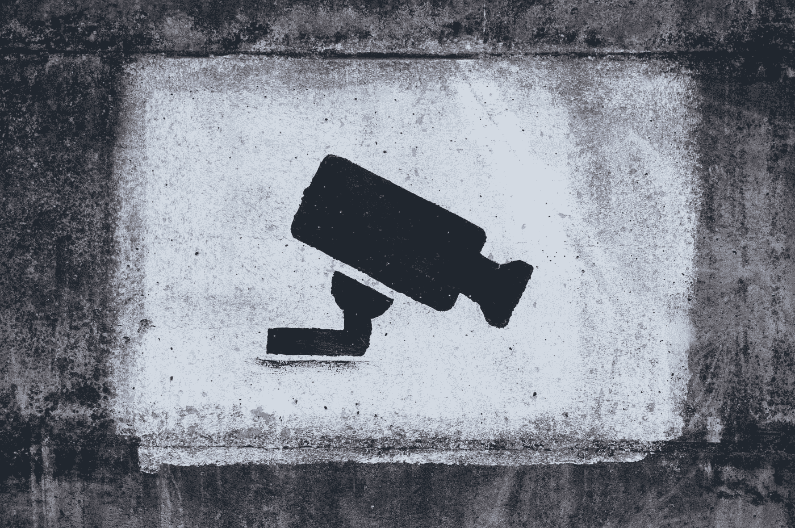
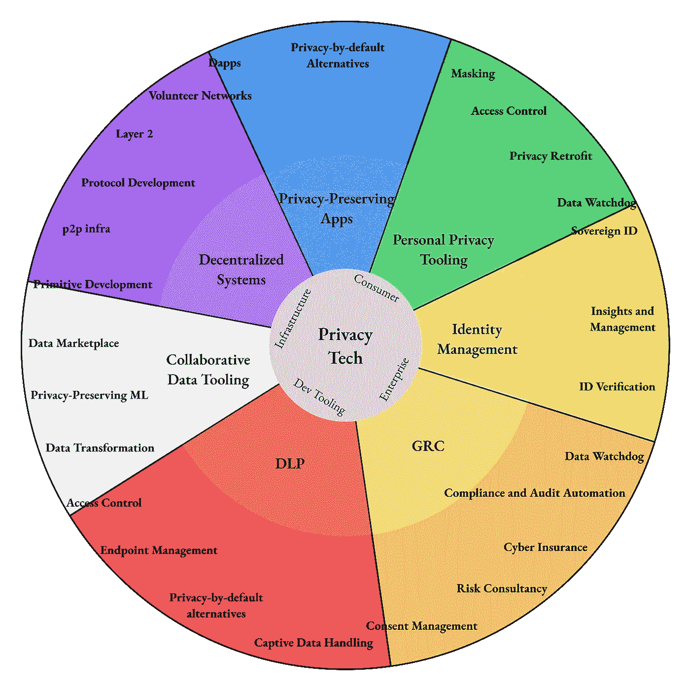
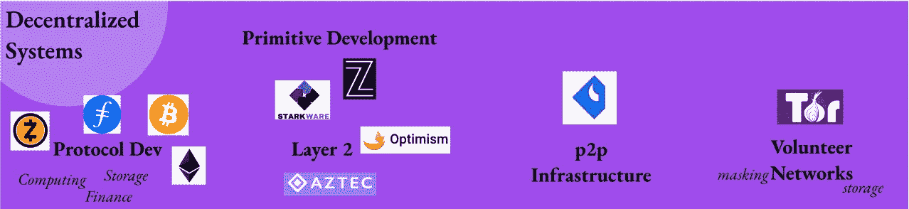
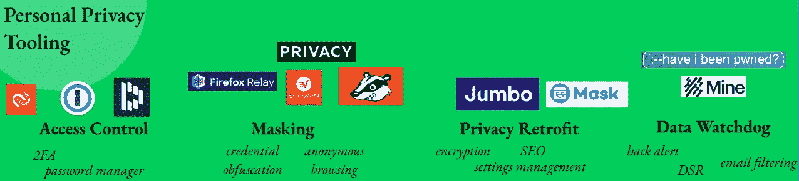
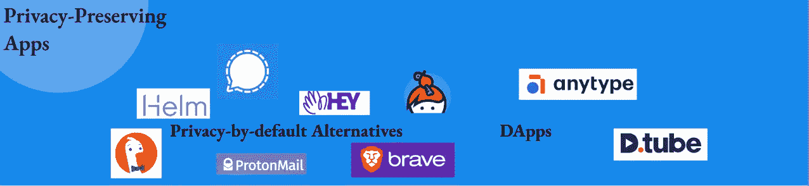
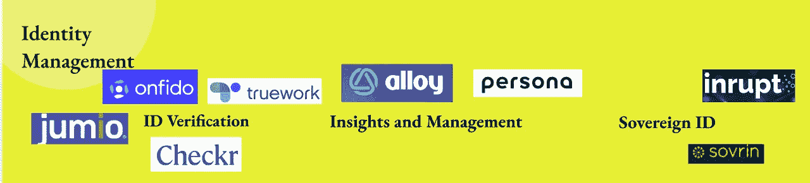
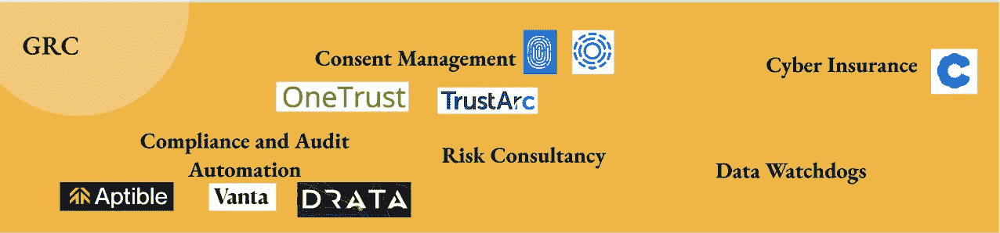
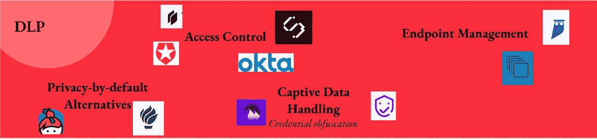
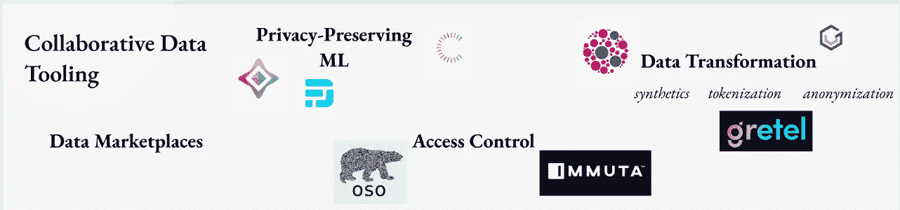

# 理解当今的数字隐私。

> 原文：<https://medium.com/codex/understanding-digital-privacy-today-714c57329593?source=collection_archive---------2----------------------->

## 第 1 部分:隐私技术的地形图。

托拜厄斯·图利乌斯在 [Unsplash](https://unsplash.com?utm_source=medium&utm_medium=referral) 上的照片

*这是关于在线隐私的系列思考的第四部分的前半部分。我并不假装要解决这个问题，只是探索空间的各个方面，拉动琴弦，使网络成为一个更有益的探索场所，并帮助构建者思考他们的技术决策的道德价值。查看* [*第 3 部分，*](https://sternhenri.medium.com/is-web-3-0-our-only-way-out-of-a-world-of-bad-privacy-incentives-8df8b08d80a0) [*第 4 部分的后半部分*](https://sternhenri.medium.com/understanding-digital-privacy-tomorrow-7a37ebcd74ab) *。*

***TL；DR —*** *监管、用户情绪和开发者可用工具的变化导致了新的数据隐私工具的产生。从分散系统到数据丢失预防，以及身份管理系统和合规工具，在线创作者有许多新的选择。这篇文章试图解释这个空间。*

网络创造者正被迫重新思考他们的数据实践。在为创作者创造更好的数据工具的推动下，新的隐私标准出现的时机已经成熟。

软件在吃世界，数据在吃软件。越来越多的“真实世界”数据被放到网上，与此同时，越来越多的“数字原生”数据被生成。在我们的模拟生活中，数字风险不可避免。

然而，数据管理的复杂性和结果的不透明性意味着数据隐私没有成为开发人员和创建者最关心的三件事。隐私选择就像是要么全有，要么全无，要么不收集，没有中间选择。

绝地只是想考虑你的数据。

鉴于多个领域的深刻市场变化，

*   **技术—** 现在有一些新工具可以让隐私决策变得更容易，包括那些来自分散技术的工具。技术限制不再是伤害消费者的借口
*   **监管—** 急需(如果不完善)的监管措施(如 GDPR、CCPA 等。)正在跨辖区出现，并改变着企业的数据风险计算
*   **需求—** 消费者变得越来越精明，要求对他们使用的产品提供更多保护

许多新产品正在被开发，以帮助创造者进行数据决策，并赋予消费者掌控自己数据的权力。

我想知道这在实践中意味着什么，以及未来几十年我们可能会在隐私技术领域看到什么。**因此，我做了一份隐私领域 250 多个项目的观察清单，以勾勒出现代隐私技术的合理轮廓。**

**很明显，隐私、安全和 web 3.0 产品之间的界限是模糊的。但是**在这次搜索中，我关注的是隐私:数据是如何被收集、保护和交流的。**我关注的是那些直接处理用户数据管理的公司，或者那些其工作需要从根本上改变在线数据处理方式的公司。**

**我在另一篇文章中整理了这项研究的见解:[了解未来的数字隐私](https://sternhenri.medium.com/understanding-digital-privacy-tomorrow-7a37ebcd74ab)，看看吧！**

# **猫的地图**

****

**跨越上述类别的子类别可以很容易地应用于任何一个(或两个)类别。**

**我将浏览我在下面找到的类别和子类别。他们跨越了**

*   **基础设施，**
*   **消费品，**
*   **企业产品，**
*   **开发者工具。**

**这些类别是不完善的。有些项目可能适合多个项目，也可能不适合一个项目。尽管如此，我还是给每个项目分配了一个单独的类别/子类别，以便真正阐明它们的核心产品。**

**这些类别是:**

*   ****分散式系统** —推动私人数据处理方式创新的点对点系统。**
*   ****个人隐私工具**—旨在帮助消费者收回对其在线数据的控制权的工具。**
*   ****隐私保护应用** —默认隐私设计，尽可能少地收集您的数据。**
*   ****身份管理** —帮助在线管理您的身份(针对消费者)以及了解和验证您的用户(针对企业)的解决方案。**
*   ****GRC(治理、风险、合规)** —RegulationTech(或 RegTech)帮助公司保持合规。**
*   ****DLP(数据丢失预防)** —数据管理和控制系统，帮助项目匿名化或保护受控用户数据。**
*   ****协作数据工具**—寻求打破数据孤岛的数据共享和匿名工具。**

**我把这些类别分成下面的子类别，包括一些我觉得特别有趣或能说明这个领域的公司。**

## **🟣分散系统**

****

**这个类别通常包括点对点技术。这些项目为分散/分布式网络供电。在这些网络中，所有参与的计算机都平等地(对等地)运行着一个协议，而不是依赖于一个单一的真实来源来提供数据(这是我们在网络上所习惯的)。**

**这个[去中心化的网络](https://sternhenri.medium.com/is-web-3-0-our-only-way-out-of-a-world-of-bad-privacy-incentives-8df8b08d80a0)不是关于隐私，而是关于可验证性。例如，区块链的产品确保任何同行都可以验证数据的有效性(因为它是公开记录在链上的)，而不是相信它(例如，你假设你的脸书墙准确反映了你的网络帖子)。**

**鉴于对可验证性的强调，分散式系统在数据方面往往非常透明/容易泄漏。信息是通过网络广播的，而不是交给可信的看门人。**因此，数据隐私是分散式网络的核心问题**。该领域的大量工作正在改变我们对数据处理、用户同意和数据控制的看法。**

**我把空间分成:**

*   ****协议开发**，运行激励分布式网络的基本协议(即第一层区块链)。这些有许多用例，包括可验证的计算、存储、货币。比特币就是一个很好的例子。**
*   ****第 2 层**，是让区块链更好工作的一组协议。例如，这些协议(运行在第 1 层协议之上)有助于网络扩展，更加私密，支持更复杂的事务。**
*   ****p2p 基础设施**公司正在建设基础设施来帮助运行点对点网络。它们包括企业节点公司(如 Bison Trails 或 Alchemy)，或开源网络库(如 libp2p)等。**
*   ****志愿者网络**，这些是 OG p2p 网络，如 Tor 或 Bittorrent，由志愿者节点驱动(而不是由令牌激励)。**
*   ****原语开发**指定为空间开发密钥加密原语的大量项目。这是零知识证明、多方计算技术、差分隐私等方面的工作。**

## **🟢个人隐私工具**

****

****此类别包括帮助您(消费者)管理如何在线使用您的数据并使您的在线体验更加安全的工具。****

**前两个类别是关于泄漏预防(确保您的数据不会被不情愿地共享)，后两个类别是关于补救(当泄漏时该怎么做)。**

*   ****访问控制**工具旨在通过保护对数字世界的访问来防止个人数据丢失。想想密码管理器(例如 1Password、Dashlane)、2FA 提供者(例如 Authy、Duo)等。**
*   ****屏蔽**服务帮助你在网上冲浪时保持匿名。他们匿名或掩盖你的 PII。它们包括 VPN(Nord，ExpressVPN，Algo)和广告拦截器(Ghostery，PrivacyBadger)，以及临时电子邮件(Firefox Relay)或临时信用卡发行商(Privacy.com)。**
*   ****隐私翻新**产品帮助保护网络上的遗留系统。它们包括 SEO 管理工具，第三方协议和服务的加密工具(加密你在 Dropbox 上的数据，加密你的脸书帖子，加密你的电子邮件，等等。)，或者帮助您跨服务管理隐私设置的工具(例如 Jumbo Privacy)。**
*   **代表你的数据看门狗保持警惕。他们跟踪你的在线服务，为你与他们互动，并观察互联网对你的数据的威胁。你可以在这里看看 haveibeenpwned，还有 Google alerts，还有像我这样的 DSR(数据主体请求)工具。**

## **🔵隐私保护应用**

****

****这些产品将隐私作为其价值主张的核心部分。**这些产品中的大多数最终会在成熟的软件领域中竞争，为您提供更多数据尊严的同等功能(希望如此)。在实践中，这可能意味着不同的事情。有些产品避免出售您的数据，有些产品避免收集您的数据或首先生成关于您的数据(“默认隐私”)。其他公司只是提供内部选项或您控制的硬件平台。**

**这里有两个主要的子类别:构建在 Web 3.0 中的应用程序和构建在传统互联网(Web 2.0)上的应用程序。如今，他们的不同之处在于他们持有的筹码数量和赚钱的方式。很明显，随着空间的成熟，这种区别将变得模糊。产品将混合使用集中和分散的基础设施，数据主权(见下文)将变得更加普遍。**

*   ****默认隐私替代方案**是 Web 2.0 隐私优先产品。分别是浏览器(Brave)，邮件客户端(嘿，Helm，ProtonMail 等。)、搜索引擎(DuckDuckGo)、信使(Signal、Mattermost)、操作系统(Tails)等...**
*   ****Dapps** 是 Web 3.0 工具。对许多人来说，隐私并不是首要问题，但鉴于 Web 3 默认透明的特性，他们必须解决这个问题。**

## **🟡身份管理**

****

**大量隐私技术涌现的领域之一是身份管理。**从高层次来看，这些解决方案正在分解许多征信机构几十年来一直在做的事情:帮助公司了解谁是他们的客户。****

**这个领域的解决方案跨越企业和消费者工具，有一些非常传统的 SaaS 工具，以及完全分散的协议。大声疾呼 TrueWork(我在这个领域最喜欢的产品之一)和其他直接针对征信机构的产品，让人们回到自己的身份检查中来。**

**我将空间分割如下:**

*   ****身份验证**解决方案帮助公司验证其用户(或其他组织)的身份和个人数据。这是出于监管目的(如 KYC/反洗钱合规)，也是为了提供更好的服务(如通过验证金融工具的雇佣或工资信息)。**
*   ****洞察和管理**解决方案位于验证工具的下游。他们帮助组织管理内部风险，打击欺诈，清除机器人生成的内容或虚假评论等。这些组织通常也会进行身份验证。请注意，该子类别与下面的法规遵从性和审计自动化有很多重叠。**
*   ****Sovereign ID** (也称为自我主权身份或分散身份)解决方案寻求让消费者控制他们的个人数据如何被共享(即还给他们主权)。这个想法是，消费者应该对谁能访问他们的个人数据、访问多长时间等有精确的控制。给网络一个默认的私有标准。**

## **🟠 GRC(治理、风险、合规)**

****

**治理、风险管理和法规遵从性(GRC)软件在历史上(90 年代)一直是枯燥的一体化 SaaS，将一些风险/法规遵从性咨询、培训和一些用于跟踪风险载体的瘫痪软件工具捆绑在一起。**

****GRC 包括直接帮助公司应对监管、认证和数据风险的所有工具。**把它想象成“RegTech”**

**下面的类别介入潜在违规的各个方面。它们涵盖了预防(通过审计自动化)、数据管理(同意管理)以及当事情发生时会发生什么(监管机构和保险)。**

*   ****合规和审计自动化**公司正在帮助组织通过认证流程，如 SOC2 或 HIPAA(如 Vanta、Drata 等。)，以及管理他们的合规性(例如，Clausematch，或我的一个最爱，Aptible)。**
*   ****风险咨询**公司大多是从事咨询和风险评估的传统 GRC 公司(如 BlueUmbrella)。他们提供了一些工具来帮助自动化常见的法规遵从性工作流。**
*   ****同意管理**解决方案填补了 GDPR、CCPA 等人创造的空间，帮助公司获得用户同意(如 cookie:one trust、TrustArc 等)。)并帮助他们服务于 DSR(如 Transcend、Ethyca)。这些工具中有许多直接与最终用户交互。**
*   **像消费者一样，数据监管机构帮助跟踪组织的在线数字足迹。它们有助于跟踪给定产品内或关于给定组织(如 Cyabra、Spectrum Labs)生成的数据或内容…**
*   ****网络保险**公司(如 At-Bay)在数据泄露的情况下为组织提供财务保护，并帮助他们采用网络安全最佳实践。**

## **🔴数据丢失防护**

****

****数据丢失防护旨在防止受控数据被滥用或窃取。**虽然 DLP 通常是网络安全的一部分，但它通常直接处理数据隐私。**

**这些项目的 DLP 方法各不相同。例如，有些帮助公司一开始就不收集数据(默认隐私工具)或控制网络内外的人对数据的访问(访问控制、受控数据管理)。**

*   ****企业市场中的默认隐私替代方案**包括提供内部部署元素或(更有趣的是)默认为私有构建的生产力套件(如 Keybase、Nightwatch)。**
*   ****访问控制**是一个大段。它涵盖了用户访问控制(Auth0，Keyless)、基于资源的访问控制(Symops)、VPN 替代方案(Twingate，Strongdm)、车队管理(MobileIron，Jamf)等等。**
*   ****受控数据处理**工具帮助创建者保护他们存储的数据。它们可以分为数据保护工具(在内部保护敏感数据，如 Evervault)和数据发现工具(在堆栈中查找 PII，如 Gamma 或 Nightfall)。**
*   ****端点管理**工具通过查看系统边缘的数据来执行 DLP，如您使用的第三方工具(如 Cyral 等 SaasOps 工具)、您的 API 或您发送的电子邮件(如材料安全)...**

## **⚪协作数据工具**

****

**隐私技术的一大部分是协作数据工具。**这里的前提是，由于更好的隐私原语，打破数据孤岛将使数据更有价值。**这些工具帮助组织内(或跨组织)的团队在共享数据集上协作。**

**这一类别与上述独占数据解决方案(在 ID 管理中)以及部分受控数据处理(在 DLP 中)有着有意义的交集。这里的工具使用了许多在分布式网络中使用的相同原语。**

**我划分了以下子类别:**

*   ****数据市场** s 创建选择加入、开放的数据交换。这一领域的产品包括受监管的数据交换(和工具)，使用户能够将自己的数据货币化的个人数据交换，甚至像 Delphia 这样的产品，这是一个机器人顾问，用其资助者的数据驱动投资决策。**
*   ****数据转换**工具确保数据可以在团队间安全共享，而不会危及用户隐私。这是通过各种数据匿名化和令牌化技术实现的。Gretel 是一个很好的选择！**
*   ****隐私保护 ML** 工具能够在不泄露底层数据的情况下训练机器学习模型。例如，使用差分隐私(向数据集注入噪声以匿名化数据)或联合学习(在设备边缘训练模型)可以做到这一点。在这个领域工作的组织包括 Cape Privacy、OpenMined 或 DataFleets。**
*   ****这里的访问控制**工具支持更健壮的多租户数据库。这里有非常有趣的解决方案。它们包括访问控制策略/治理工具(最值得注意的是 Oso)以及默认开放的数据库。**

**这就是了。**

**正如你所看到的，现在有很多创作者试图解决产品设计领域的这个巨大漏洞:隐私。这是一个令人兴奋的在线时间！**

****

**从老鼠到蜜獾:隐私保护将权力还给网络冲浪者！**

**在我做这项研究的几个月里，我注意到我的观察名单中的一些组织改变了关注点，初创公司改变了他们的定位，等等。隐私技术领域的发展速度非常快，虽然许多市场动态仍不明朗，但一些模式已经开始出现。**

**作为对这个地形学的补充，我写下了我注意到的穿过这个空间的最有力的模式。查看它们。我相信他们掌握着理解未来网络隐私的一些关键。**