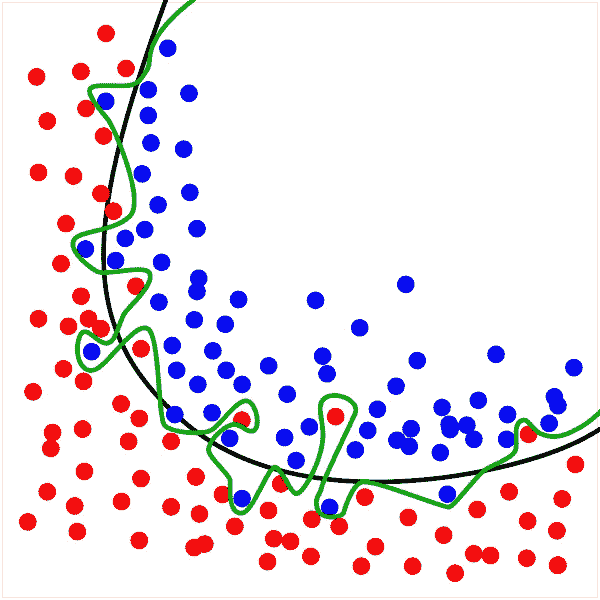
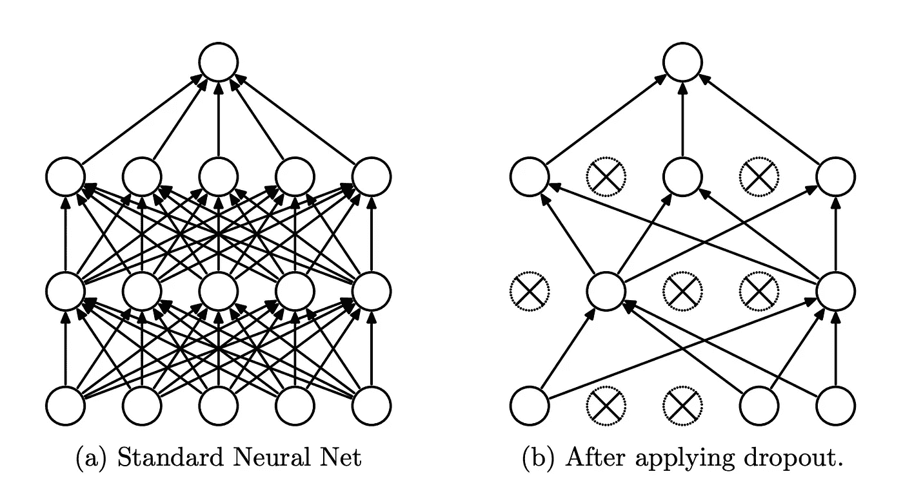
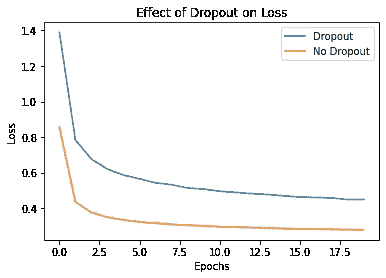
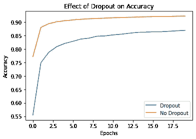

# 理解深层神经网络中的丢失

> 原文：<https://medium.com/codex/understanding-dropout-in-deep-neural-networks-95e7d1b11c58?source=collection_archive---------7----------------------->


照片由 [JJ 英](https://unsplash.com/@jjying?utm_source=medium&utm_medium=referral)在 [Unsplash](https://unsplash.com?utm_source=medium&utm_medium=referral)

这篇文章旨在提供对一种非常流行的正则化技术的理解，这种技术叫做 ***退出*** 。它假设预先了解模型训练、创建训练和测试集、过拟合、欠拟合和正则化等概念。

这篇文章从辍学的背景和原因开始。然后，它解释了辍学如何工作，以及它如何影响深度神经网络的训练。最后，它通过 Keras 的辍学层如何使用它。

# 1.背景

深度神经网络是高度参数化的模型。通常，他们有数万甚至数百万个参数要学习。这些参数提供了大量的能力来学习一组不同的复杂数据集。这并不总是一件好事。这样的容量通常会导致[过拟合](https://en.wikipedia.org/wiki/Overfitting)，这是一种训练集性能较高而测试集性能较差的情况(*低偏差、高方差*)。该模型可能有更高的测试错误率，因为它太依赖于训练数据。为了避免这种情况，我们尝试使用各种正则化技术来减少模型的学习能力。一种这样的正则化技术是 ***退出*** 。正则化确保模型在看不见的数据上很好地概括。



图一。合身和过度合身的对比。来源:维基百科

图 1 显示了由*绿色*边缘表示的过拟合模型和由*黑色*边缘表示的正则化模型之间的对比。即使绿色边界似乎更适合训练数据，它也不太可能在看不见的实例(测试集)上表现得足够好。图 1 提供了过度拟合的一个很好的图像。

# 2.输入辍学

这是最流行的正则化技术之一，由 Geoffrey Hinton 于 2012 年在论文[“通过防止特征检测器的共同适应来改善神经网络”](https://arxiv.org/pdf/1207.0580.pdf)中提出。这是一个相当简单但非常有效的想法。

> 在每个训练步骤中，每个神经元被分配一个概率' ***p*** '，以暂时不参与训练过程(*退出*')。这里，“p”是一个超参数，称为辍学率，可以调整。



图二。上图显示了实施 dropout 对网络连接的影响。(左)具有密集连接的标准前馈网络。(右)由于辍学，连接数量急剧减少。来源:“辍学:防止神经网络过度拟合的简单方法”论文。

例如，如果 p=0.5，这意味着一个神经元有 50%的机会在每个时期退出。如果一个神经元不参与训练步骤，它的所有连接都会被切断，这将影响下游层。这将大大降低神经网络中的连接密度(如图 2 所示)。丢弃可以应用于输入层和隐藏层，但不能应用于输出层。这是因为该模型必须总是为损失函数生成输出，以实现训练。退出过程仅在培训阶段进行。在推理阶段，网络中的所有神经元都充分参与。

随意关闭神经元的做法可能会令人惊讶。有理由认为这可能会使培训过程变得非常不稳定。但实践证明，它在降低模型的复杂性方面非常有效。为了理解我为什么要引用《用 Scikit-Learn 和 TensorFlow 进行机器学习》这本书中的一个例子。

> 如果让员工每天早上抛硬币来决定是否去上班，公司的表现会更好吗？谁知道呢。也许会！该公司显然将被迫调整其组织结构；它不能依靠任何一个人来填充咖啡机或执行任何其他关键任务，因此这种专业知识必须在几个人之间传播。员工必须学会与他们的许多同事合作，而不仅仅是少数几个。该公司将变得更有弹性。如果一个人退出，也不会有太大的影响。目前还不清楚这个想法是否真的适用于公司，但它肯定适用于神经网络。

类似地，在深度神经网络中，在训练过程中的每个时期，网络架构不同于前一个。此外，每个神经元被迫不要过于依赖少数几个输入连接，而是要关注所有的输入。这使得它们更能适应输入连接的变化。这种方式确保了一个更健壮的网络，可以更好地推广。

丢失中的可调超参数是*丢失率，*用 *p.* 表示，其调节相当简单。

*   当你的模型过度拟合时，增加 p
*   当你的模型不合适时，减少它
*   对于较大的图层，保持较高的值；对于较小的图层，保持较低的值

# 3.展示辍学的影响



图 3。丢失对 MNIST 数据集上训练的网络损失函数的影响



图 4。辍学对 MNIST 数据集上训练的网络精度的影响

从上图中可以清楚地看到辍学的影响(图 3 和图 4)。这来自使用 Keras 的简单实验，其中前馈神经网络在 MNIST 数据集*和 ***上训练，而没有*** 丢失，保持所有其他因素恒定。蓝色线条表示 ***有漏接*** 的型号，橙色线条表示 ***无漏接*** 的型号。在图 3 中，“漏失对精度的影响”*，可以清楚地观察到漏失增加了模型的损失。这不一定是坏事，但可能需要更长的时间来收敛。因此，在图 4 中精度下降。实验中使用的网络架构如下所示。**

```
**Model: "sequential"
_________________________________________________________________
Layer (type)                 Output Shape              Param #   
=================================================================
dense (Dense)                multiple                  401920    
_________________________________________________________________
dropout (Dropout)            multiple                  0         
_________________________________________________________________
dense_1 (Dense)              multiple                  131328    
_________________________________________________________________
dropout_1 (Dropout)          multiple                  0         
_________________________________________________________________
dense_2 (Dense)              multiple                  32896     
_________________________________________________________________
dropout_2 (Dropout)          multiple                  0         
_________________________________________________________________
dense_3 (Dense)              multiple                  1290      
=================================================================
Total params: 567,434
Trainable params: 567,434
Non-trainable params: 0
_________________________________________________________________**
```

****Github:** 生成上述图形的代码可从[这里](https://github.com/mvshashank08/dropout/blob/main/implemeting-dropout.ipynb)获得。**

# **4.Keras 实施**

**Keras 使用`[tf.keras.layers.Dropout](https://keras.io/api/layers/regularization_layers/dropout/)`提供了一个脱落层。它将辍学率作为第一个参数。您可以在 Keras 的文档中找到更多详细信息。下面是一个小片段，展示了从动手 ML 书辍学的使用。**

# **5.其他正则化技术**

**除了丢弃之外，其他正则化技术也可以应用于神经网络。下面列出了一些最受欢迎的方法。**

*   **l₁和 l₂正规化**
*   **[提前停止](https://en.wikipedia.org/wiki/Early_stopping)**
*   **辍学的其他变体(如[蒙特卡洛辍学](https://arxiv.org/pdf/1506.02142.pdf)**

# **6.参考**

**以下是我用来写这篇文章的参考资料。关于辍学的原始论文(在下面的列表中)详细论述了辍学背后的理论以及为证明其有效性而进行的实验。**

*   **Book: [使用 Scikit-Learn、Keras 和 TensorFlow 进行机器实践学习](https://www.amazon.com/Hands-Machine-Learning-Scikit-Learn-TensorFlow/dp/1492032646/ref=sr_1_3?dchild=1&keywords=Hands-On+Machine+Learning+with+Scikit-Learn%2C+Keras%2C+and+TensorFlow&qid=1609912582&s=books&sr=1-3)**
*   **Github 库:[https://github.com/mvshashank08/dropout](https://github.com/mvshashank08/dropout)**
*   **论文:“[通过防止特征检测器的协同适应来改进神经网络](https://arxiv.org/pdf/1207.0580.pdf)**
*   **论文:[“辍学:防止神经网络过拟合的简单方法”](https://jmlr.org/papers/volume15/srivastava14a/srivastava14a.pdf)**
*   **维基百科:[过度拟合](https://en.wikipedia.org/wiki/Overfitting)**

**谢谢你的时间。请在评论区留下任何建议。**