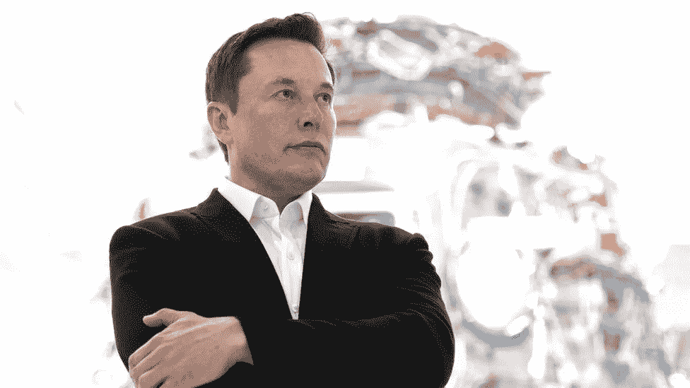
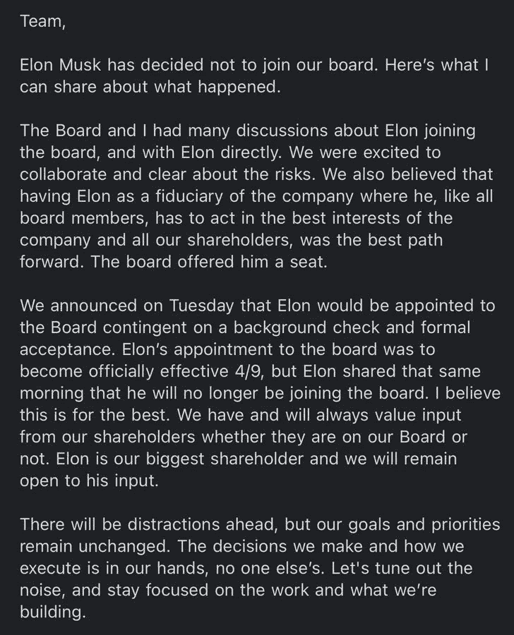

# 了解 Elon x Twitter

> 原文：<https://medium.com/codex/understanding-elon-x-twitter-10080630386b?source=collection_archive---------18----------------------->

亿万富翁、创新者和互联网巨魔埃隆·马斯克。

这是 4 月的一天，就像其他任何一天一样——无聊而平静，看起来会一直如此，直到有消息爆出，让互联网陷入狂热——可能是世界上最古怪的亿万富翁埃隆·马斯克刚刚收购了 Twitter 9%的股份，就在几天前，他在推特上发布了一项关于社交媒体平台上言论自由状况的调查。这一定是亿万富翁有史以来最大的“去他妈的”行动之一。至少在当时是这样。

在马斯克收购了 9%的股份后不久，他成为了该平台的最大股东[收购后，该平台的股价上涨了 27%]，拥有的股份超过了前 Twitter 首席执行官杰克·多西，他获得了该平台董事会的一个职位，这看起来几乎所有人都认为马斯克真的会接受这个职位，因为这将赋予他实施他所设想的平台变革所需的权力。所以你可以想象，当帕拉格·阿格拉瓦尔不久后发表声明，通知公众马斯克拒绝了董事会席位时，人们有多惊讶。

马斯克对阿格拉瓦尔声明的回应是一个神秘的表情符号，在声明发布后不到一个小时，尽管他已经删除了这条推文。

首席执行官阿格拉瓦尔关于埃隆·马斯克的声明

在这一点上，我要和你坦诚相见。我不知道埃隆·马斯克脑子里在想什么。见鬼，没人知道他脑子里在想什么……我们唯一能做的，就是猜测。作为你，这个故事的读者，我只是一个旁观者，一个在埃隆的魔法象棋大游戏中的观察者，你现在正在阅读的和将要阅读的一切，都只是一个和你一样困惑的观察者的思辨。

好吗？

很好。

这里有几点你需要知道:

*   埃隆·马斯克是一个著名的巨魔——我的意思是，这个人被美国证券交易委员会(SEC)起诉欺诈，因为他在 2018 年发布的一条推文误导了投资者，这条推文是一个关于 4 月 20 日大麻文化节日的笑话。我们只能想知道当 4 月 20 日再次到来时，他会遇到什么样的麻烦。
*   作为一个平台，Twitter 和大多数其他社交媒体平台一样，因审查而臭名昭著——近年来，它因审查而更加臭名昭著。仅在一两年前，Twitter meme 账户被该平台删除的比率飙升，被判定违反了某些条款和条件，但在最近结束的美国总统选举期间，社交媒体平台上的审查达到了顶峰，Twitter 将前总统唐纳德·特朗普的推文标记为误导，之后他的账户最终被该平台暂停。唐纳德·特朗普并不是推特被关闭的唯一政治牺牲品，尼日利亚总统穆罕默杜·布哈里最近也发现自己被暂停了平台[尽管，我想不出有谁会对此感到不快。这是老家伙自找的。].虽然我同意互联网应该是每个人的安全空间，没有毒性和滥用，但也不可否认，Twitter 近年来的审查相当激进。
*   我说过埃隆·马斯克是个巨魔吗？一个恰好是世界上最富有的人的巨魔？

埃隆·马斯克(Elon Musk)拒绝了 Twitter 董事会的一个职位，随后以每股 54.20 美元的高价收购了该平台，这将相当于大约 430 亿美元的惊人金额。如果你对一连串的事件感到困惑，这里有一个简单的提纲:

*   马斯克在推特上发布了一项关于言论自由原则的民意调查，称民意调查的结果将会产生影响。
*   在投票结果中，约 70%的选民投票认为该平台没有遵守言论自由原则，马斯克获得了 Twitter 9%的股份，成为该平台的大股东。
*   马斯克获得了 Twitter 董事会的一个席位。
*   马斯克拒绝了这一提议。
*   马斯克出价 430 亿美元收购 Twitter。四十三！！！[$43，000，000，000]——天哪，这么多零。

从一个完全投机的角度来看，我只能假设，在 Twitter 董事会提供一个职位之后，马斯克和其他董事会成员之间肯定进行了很多幕后讨论，如果他的反应是挥霍 430 亿美元，这种讨论肯定让马斯克非常不满。马斯克对社交媒体平台的愿景是在全球范围内捍卫言论自由，这肯定与 Twitter 现任高管的愿景有冲突，马斯克没有成为董事会的一部分，因为在董事会中，他会受到股东投票的阻碍，无法改变太多，而是决定简单地展示他膨胀的金融二头肌和腹肌，然后收购整个该死的公司。

马斯克对 Twitter 的计划相当大，因为他也表示，他认为 Twitter 成为全球言论自由平台的唯一途径是公司私有化。在所有这一切中，有一点是肯定的，在可预见的未来，Twitter 必将成为科技领域的关注中心，因为世界各地的许多人都在等待着这一切将如何展开。如果埃隆·马斯克收购 Twitter 的目标成功，可以保证该平台将经历相当激烈的改革——尽管不能保证所有这些改革都是积极的还是消极的。[我的意思是，这一切才刚刚开始，Twitter 已经宣布推出编辑按钮功能。嘘。]

也就是说，就像所有阅读这篇文章的人一样，我将会关注这一切，从我的孤独堡垒中观看和观察，看看这一切是如何发生的。