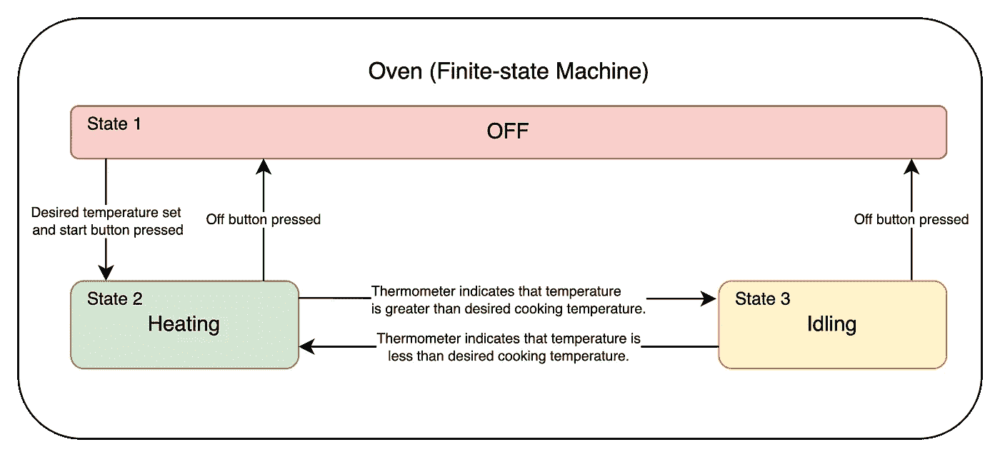
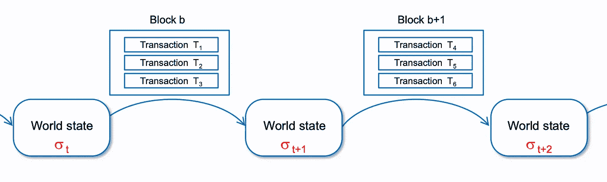
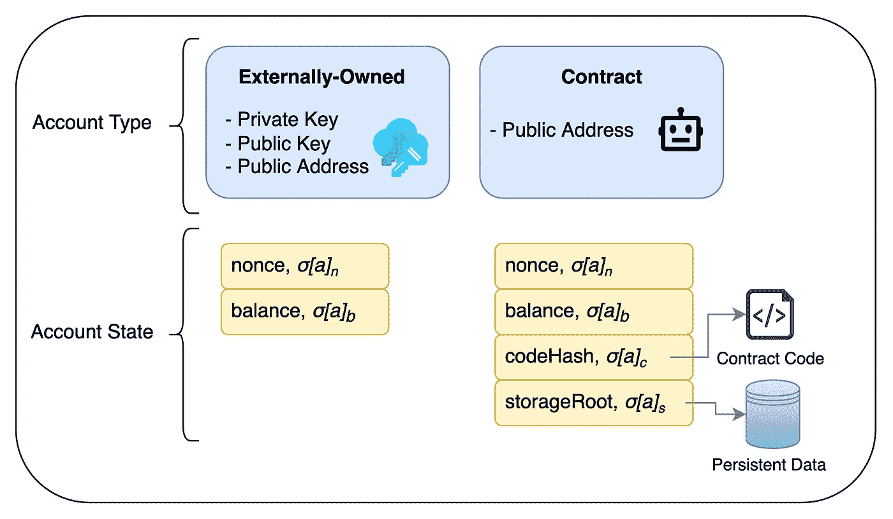

# 从头开始理解以太坊(账户)

> 原文：<https://medium.com/codex/understanding-ethereum-accounts-4b4904c796f?source=collection_archive---------10----------------------->

**前言:**下面这篇文章旨在巩固知识，作为我对以太坊的了解。如果任何信息是不正确的，部分不正确的，或不完整的，我竭诚欢迎您的投入。

**文章结构:**在本文中，我们将介绍:

*   以太坊网络，从高级系统的角度来看
*   以太坊账户，作为基本实体
*   帐户状态，作为分布式数据存储

**基础:**作为本文的基础，对区块链有一个大体的、高层次的了解是很有帮助的。了解以下情况也很有帮助:目前，以太坊使用工作证明风格(PoW)区块链向其不可变的记录分类帐添加新的分组数据条目(块)。如果你对以太坊或者更一般的区块链有点模糊，以下是建立基础的好资源:

1.  [互动区块链可视化](https://andersbrownworth.com/blockchain/)
2.  [但是比特币实际上是如何运作的呢？](https://www.youtube.com/watch?v=bBC-nXj3Ng4)
3.  [以太坊社区主页](https://ethereum.org/en/)

# 基础问题

*   **以太坊是什么？**我将以太坊定义为遵循非常特定规则的计算机网络，这些规则指导如何维护和添加到被称为“账户”的实体之间的交互(交易)的分布式“记录分类账”(数据库)。**规则是如何实施的？**规则由安装在网络中计算机上的“以太坊客户端”(软件)实施。合在一起，[运行“以太坊软件”(客户端)的计算机就是我们所说的“节点”](https://ethereum.org/nl/developers/docs/nodes-and-clients/)。好了，我们知道软件实现了“数据输入”规则，比如说，**但是数据(状态)存储在哪里呢？**客户端安装还将安装并利用键值存储数据库，例如 [levelDB](https://github.com/google/leveldb) ，来存储相关状态(下面将详细介绍数据存储)。明确地说，状态数据驻留在客户机内的分布式键值存储数据库中，在网络内的完整节点上运行。有不同类型的节点(完整节点、轻型节点和归档节点)，但我们将在另一个时间讨论这些节点。为了更好地说明这一想法，请参见下图 A。

**图一:**

一个可视化的节点网络。

*   **以太坊不是状态机吗？**我相信你一定遇到过更抽象的定义，“以太坊是基于事务的状态机”。下文旨在澄清这一定义。**什么是国家机器？**[有限状态机](https://en.wikipedia.org/wiki/Finite-state_machine)是一种在任何给定时间都能处于有限数量状态中的一种状态的机器。作为一个简化的例子，在任何给定的时间，烤箱只能处于以下状态之一:关闭、加热或空转。请看下图(图 B)，状态机图包括状态、状态之间的转换(箭头)以及触发这些转换的规则(箭头上的标签)。

**图 B:**

来源:[https://www.youtube.com/watch?v=-Yicg2TTMPs](https://www.youtube.com/watch?v=-Yicg2TTMPs)

*   **以太坊在什么意义上是状态机？**交易由每个网络节点验证和执行。随后，每个节点需要根据新的事务集更新其状态。例如，如果 Bob 向 Alice 发送了 10 个以太网，那么 Bob 和 Alice 的帐户余额(状态)都需要更新，以定量地反映该交易。正是在这个意义上，事务充当了更新机器状态的“触发器”，因此有了“基于事务的状态机”这个术语。**什么是“机器”？**从这个意义上说，机器是以太坊网络中的所有节点，每个节点根据新的事务“块”独立地更新它们的状态。与上面的烤箱场景(具有三个状态的有限状态机)不同，以太坊可以被归类为“实际上无限的”状态机，因为潜在状态的数量实际上是无限的。

**图 C:**

来源:[https://takenobu-hs . github . io/downloads/ether eum _ EVM _ illustrated . pdf](https://takenobu-hs.github.io/downloads/ethereum_evm_illustrated.pdf)

# 以太坊账户(基础实体)

在以太坊中，有两种不同类型的账户:“外部拥有的”账户和“合约”账户:

1.  **外部拥有的账户:**通常由人控制的账户，具有允许授权(和可验证)令牌转移的私有-公共密钥对。
2.  **合约账户(智能合约):**自治账户 ***，代码*** 部署到以太网，具有可调用的功能。作为一个不完美的 Web2 类比，合约账户可以被认为拥有自己的[API](https://www.ibm.com/cloud/learn/api)，有端点(智能合约功能)可以点击。

正如[以太坊账户文档](https://ethereum.org/en/developers/docs/accounts/)所述，两种账户类型都可以接收、存储和发送[以太](https://www.coindesk.com/price/ethereum/)(以太坊网络的本地令牌)和其他令牌。两者都可以与部署的智能合约进行交互。

## **外部所有账户**

在某种普遍意义上，作为 Web2 的类比，人们可以认为外部拥有的以太坊账户类似于社交媒体账户或银行账户(执行在某处被记录的动作的实体)。本质上，**外部拥有的**以太坊账户是一个私有-公共密钥对，从这个密钥对中可以导出以太坊公共地址。实际上，派生的根是从私钥开始的。一旦有了**私钥**，就可以使用[椭圆曲线数字签名算法](https://en.wikipedia.org/wiki/Elliptic_Curve_Digital_Signature_Algorithm)导出**公钥**。从那里，**一个公共地址**可以通过取 **Keccak-256 散列**的最后 20 个字节和添加`**0x**` 到开头来导出。需要明确的是，以下包括一个外部拥有的以太坊账户:

*   **私钥** (64 位十六进制字符)
*   **公钥，**源自公钥(128 个十六进制字符)
*   **一个公共地址**，来源于公钥

## 合同账户

另一方面，契约帐户没有私钥-公钥对。然而，它们确实有公共地址，这些公共地址是从合同创建者(发送者)的**公共地址**和发送者的**随机数**(发送者账户已经发送的交易数量)中得到的。更具体地说，发送者和随机数被 RLP 编码，然后被 **Keccak-256** 散列。

# 帐户状态

好的，*很好*，但是我认为以太坊账户有状态，比如一个以太余额，与之相关联？他们做到了！这里的关键词是“关联”。在以太坊的世界状态中，可以在每个节点的**状态数据库**中找到，在 **Keccak-256 散列的公共地址**和“ [RLP 编码的](https://eth.wiki/fundamentals/rlp)”**帐户对象**之间存在键值映射。记住加密和编码的区别！加密隐藏了数据，只有用某种密钥才能访问。另一方面，编码只是将数据转换成更易利用的格式(例如，base64 编码 JSON 以存储为环境变量字符串，或类似的格式)。

## 帐户状态对象

每个以太坊账户都有自己的账户状态对象，*。为了简化，我们可以说每个公共地址都有自己的状态对象，**，其中 ***a*** 是一个公共地址:***

*   ****nonce** :对于外部账户，nonce 是一个标量值，等于从此公共地址发送的交易数量。在与代码相关联的账户(合约账户)的情况下，现时是等于由该账户创建的新合约的数量的标量值。**
*   ****balance:** 一个标量值，等于这个地址所拥有的 Wei (1E-18 Ether)的个数。**
*   ****storageRoot:** 对于合约账户，Merkle Patricia 树的根节点的 **256 位哈希**，对账户的存储内容进行编码。换句话说，这个值是一个完整的、单独的数据结构(存储在节点的状态数据库中)的根散列，该数据结构存储任何**持久** **数据**(数组、整数、对象等)。)帐户的合同代码可以利用。然而，对于外部帐户， **storageRoot** 是空的——外部帐户没有与之相关联的代码，这消除了存储持久的、代码可利用的数据的需要。**
*   ****codeHash** :对于合约账户，该字段存储其合约代码的**Keccak-256 hash**——该地址收到呼叫或交易时执行的代码；它是不可变的，因此与所有其他字段不同，在构造后不能更改。所有这样的代码片段都包含在状态数据库中它们相应的散列下，以供以后检索。另一方面，对于外部账户， **codeHash** 是一个空字符串的散列——外部账户没有与之相关的代码。**

****图 D:****

****

**账户状态，可视化。**

# **结论**

**虽然有许多悬而未决的问题，但我希望这篇文章为您的学习提供一个合理的基础。如前所述，如果有任何不正确或值得补充的地方，我邀请您在评论中留下您的意见，以便改进本文档。既然我们已经介绍了以太坊基本实体的一些高级概念，接下来我们将讨论[数据如何存储在以太坊网络](/@adamcuc/understanding-ethereum-from-the-ground-up-data-storage-2b55022aa663)中。**