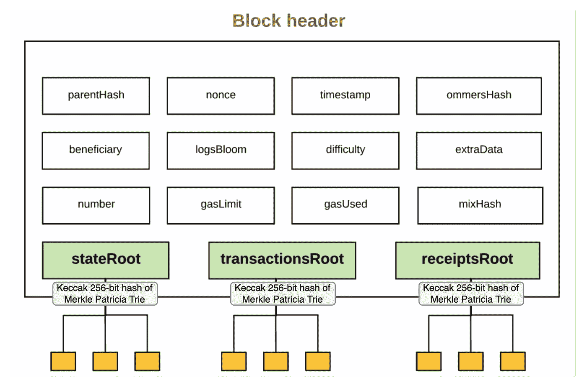
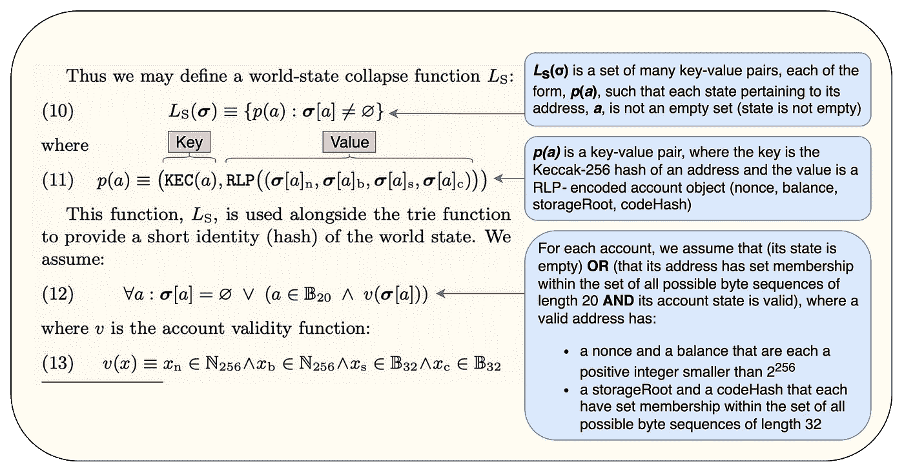
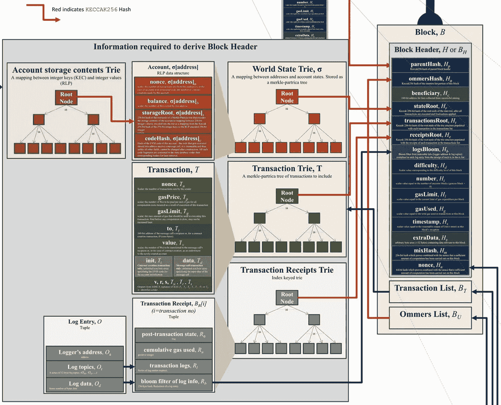
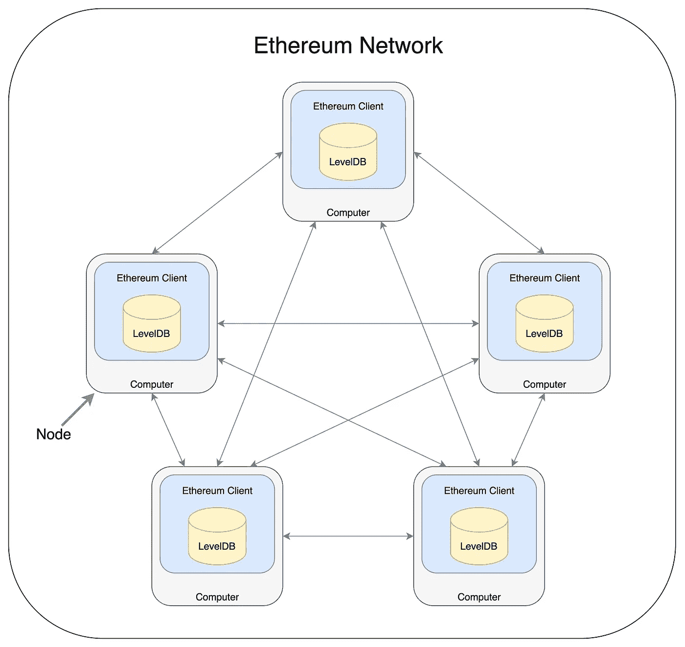
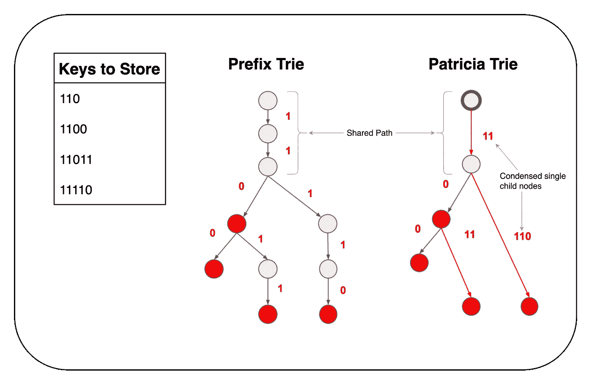
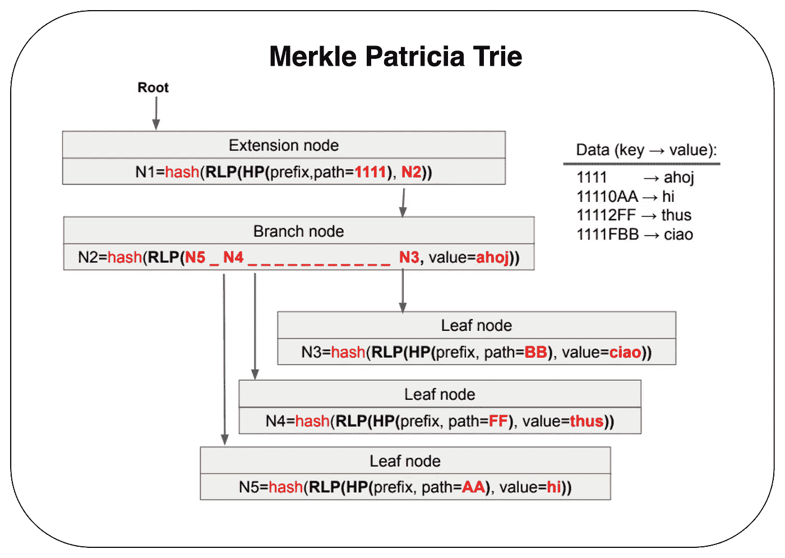
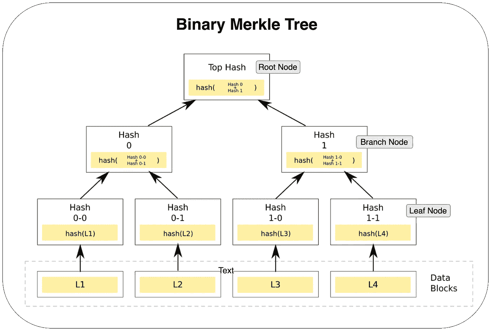
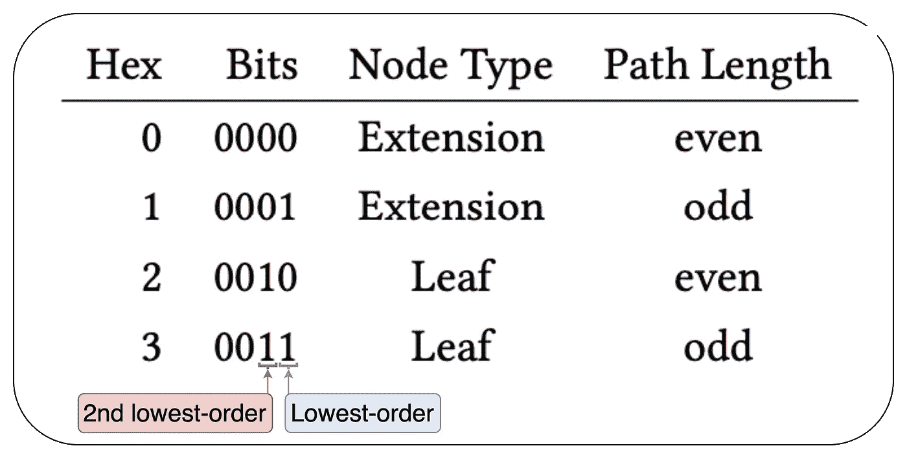
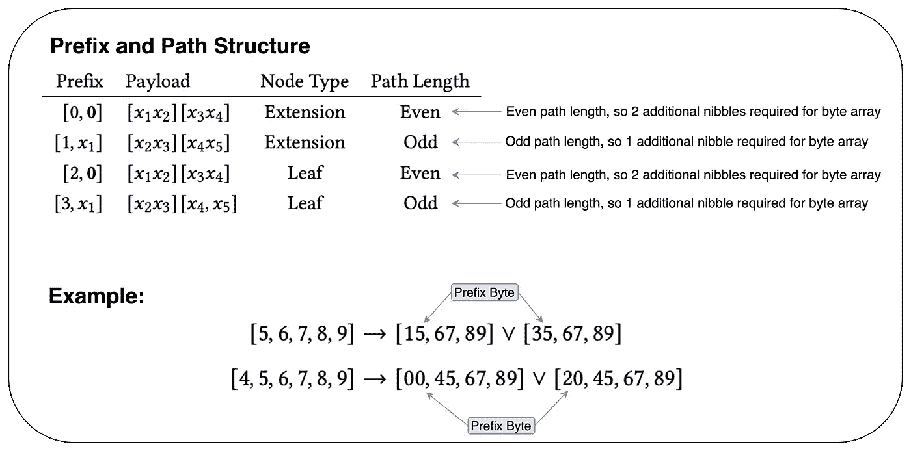
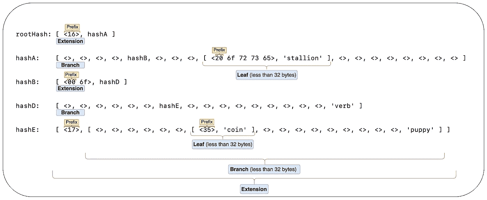

# 从头开始理解以太坊(数据存储)

> 原文：<https://medium.com/codex/understanding-ethereum-from-the-ground-up-data-storage-2b55022aa663?source=collection_archive---------19----------------------->


**前言:**下面这篇文章旨在巩固知识，就像我了解以太坊一样。如果任何信息是不正确的，部分不正确的，或不完整的，我竭诚欢迎您的投入。

**目的:**我有一种感觉，正确理解以太坊数据存储所必需的信息是高度碎片化的，并且缺乏说明性的例子。本文旨在通过巩固和澄清以太坊如何存储数据的知识来解决这个问题。

**文章结构:**在本文中，我们将介绍以下概念:

*   存储了哪些以太坊数据
*   以太坊数据的存储位置(分布式数据库)
*   以太坊数据是如何存储的(数据结构)
*   编码如何为哈希奠定基础
*   Merkle Patricia Trie 示例

# 存储了哪些数据？

区块链是链接(严格格式化)的数据组(“块”)的“链”。在以太坊区块链中，添加到“数据块链”中的每个新数据块都包含:

*   **一个块标题**
*   **以太坊交易列表**
*   **“ommer”(大叔)块头列表**，与上述块头格式相同

现在，让我们把重点放在块头上，因为它与我们讨论的数据存储最相关。下图 A 摘自 Preethi Kasireddy 的文章，“[以太坊到底是如何工作的？](https://www.preethikasireddy.com/post/how-does-ethereum-work-anyway)“清楚的说明了块头中包含的信息(我稍微修改了一下):

**图一:**



来源:[https://www . preethikasireddy . com/post/how-does-ether eum-work-anyway](https://www.preethikasireddy.com/post/how-does-ethereum-work-anyway)

关于数据存储， **stateRoot** 、 **transactionsRoot** 和 **receiptsRoot** 很重要，因为它们代表三个独立的“Merkle Patricia Tries”(一种以太坊特有的数据结构)的根节点的 **Keccak 256 位**散列。我们将在下面详细介绍这种数据结构。这三个 try 都存储键值对，因此出于我们的目的，我们将使用符号来表示它们，`key` **→** `value`。

*   `**stateRoot**`**:****世界状态 Trie，** ***σ的 Keccak 256 位散列。*** 这个 trie 包含了地址、 ***a*** 和账户状态、 ***σ* [ *a* 之间的映射。**更具体地说，键值映射是以太坊公共地址的 **Keccak 256 位**hash`keccak(*a*)`到“RLP”编码的账户对象`RLP(accountState)`之间的映射，可以表示为`keccak(ethereumAddress)` **→** `RLP(accountState)`。如果不清楚什么是以太坊账户或账户状态，请参阅我之前关于以太坊账户的文章。此外，我们将在下面讨论 RLP 编码。如黄皮书所示，图 B 描述了世界状态的正式表示:

**图 B:**



以太坊黄皮书的世界状态解释。

*   `**transactionsRoot**` **:** 用块的事务列表部分中的每个事务填充的 trie 结构的根节点的 Keccak 256 位哈希。每个新块都有自己的事务 trie，其中键-值对采用的形式是，`RLP(transactionIndex)`**→** `RLP(ethereumTransaction)`，其中`transactionIndex`是指其块中某个事务的索引，`ethereumTransaction`是以太坊事务对象。一旦挖掘出来，这个 trie 就不可改变。
*   `**receiptsRoot**`**:**trie 结构的根节点的 Keccak 256 位哈希，该结构由块的事务列表部分中每个事务的收据填充。与事务尝试类似，每个块都有自己的收据 trie，其中键-值对采用的形式是，`RLP(transactionIndex)` **→** `RLP(transactionReceipt)`，其中`transactionIndex`指的是其块内事务的索引，`transactionReceipt`是以太坊事务收据对象。一旦被挖掘，这个 trie 也是不可变的。

图 C 中的下图清楚地说明了上述概念。即组成一个块的组件以及`stateRoots`、`transactionsRoots`和`receiptsRoots`所代表的数据。值得花些时间来消化这张图片，因为它是信息密集型的。

**图 C:**



来源:[https://i.stack.imgur.com/afWDt.jpg](https://i.stack.imgur.com/afWDt.jpg)

# 数据存储在哪里？

正如我在之前关于以太坊账户的文章中提到的，以太坊是一个计算机网络，每个计算机都运行软件，称为以太坊客户端。客户端软件安装还会安装一个键值存储库(一种数据库)，如 [LevelDB](https://github.com/google/leveldb) 或 [RocksDB](http://rocksdb.org/) 。每个节点将其数据存储在其安装的键值存储库中，这导致相同的数据分布在相同类型的所有节点中——请记住，有不同类型的节点:[归档节点、完整节点和轻型节点](https://www.quicknode.com/guides/infrastructure/ethereum-full-node-vs-archive-node)。为了说明这一想法，见下图 D:

**图 D:**



节点网络，其中每个节点都有自己的数据库。

# 数据是如何存储的？

现在我们知道了存储的是什么数据以及它驻留在哪里，让我们讨论一下它是如何存储的。从上面，我们知道以太坊使用了一种键值存储机制。明确地说，键值存储库存储键值对。作为一个高级的例子，考虑类似于 [Python 字典](https://www.w3schools.com/python/python_dictionaries.asp)或 [JavaScript 对象](https://www.w3schools.com/js/js_objects.asp)的东西。这意味着无论使用什么数据结构，最终都必须很好地适应键值存储结构。此外，由于每个完整节点都复制存储的数据，因此尽可能压缩数据以节省存储空间非常重要。为了实现上述两个目标，以太坊采用了一种叫做“改进的 Merkle Patricia Trie”的数据结构。

# 默克尔帕特里夏试图解释说

## **键值结构**

Merkle Patricia Trie 是一种独特的数据结构，它结合了 Patricia Trie 的数据压缩元素和 Merkle 树的确定性散列属性。Merkle Patricia Trie 中的一个“节点”可以被认为是一个更大的 Trie 结构中的一个小数据结构，所有节点都必须适合一个键值数据库。为了实现这一点，每个键-值对采用的形式是，`**keccak(RLP(node))**` **→** `**RLP(node)**`。为了清楚起见，每个键都是其对应值的散列。也就是说，从上面，我们知道`stateRoots`、`transactionsRoots`和`receiptsRoots`是存储*它们自己的*键-值对的尝试的散列——这意味着这三个尝试的键*和*值必须存储在`**nodes**`中。更具体地说，它们存储在父节点和子节点的序列中，这些节点构成了整个 Merkle Patricia Trie 数据结构。在上面的键值对中， **RLP** 代表“递归长度前缀”编码。编码用于以可用于某些用例的方式表示数据。这里的用例是将**节点**(一个子数据结构)转换成可以被散列的格式，因为**散列函数需要以** [**字节数组**](https://stackoverflow.com/questions/4019837/what-do-we-mean-by-byte-array#:~:text=A%20byte%20array%20is%20simply,%2C%20the%20second%20byte%20etc..) 的形式输入数据。RLP 编码算法正是实现了这一点:它将一个结构化的节点转换成一个字节数组，这样它就可以被散列。

## **让我们提高储物效率(Patricia Trie 影响力)**

给定大量的十六进制键(RLP 编码的节点的散列)，很可能许多键将共享公共“路径”，这些路径是许多键之间共享的、非发散的字符子集。例如，“car”和“cars”这两个词共用一个路径，“car”。从这个意义上来说，共同的道路类似于(有机的)树的主干，而分歧的道路类似于它的分支。如果多个键共享相同的路径，那么单独存储所有的键就是多余的。公共路径只需要存储一次，而分歧分支路径可以在分歧字符的点上专门处理。这样的存储结构被称为**前缀 Trie** 。也就是说，存储效率仍然可以提高:如果一个节点只有一个子节点，或者如果对于给定的数据集出现了一系列的单个子节点，那么这个单个子节点的序列可以压缩成一个节点。这样的结构被称为**帕特丽夏·特里**。一个 Patricia Trie 规定所有*内部* *节点*必须至少有两个子节点。图 E 摘自卡米尔·耶泽克的论文“[以太坊数据结构](https://arxiv.org/pdf/2108.05513.pdf)”，描述了 Prefix 和 Patricia 试图存储一组给定的二进制密钥。然而，在以太坊中，密钥是十六进制字符，而不是二进制数字。正是这种数据压缩技术解释了 Merkle Patricia Trie 的“Patricia”部分。

**图 E:**



资料来源:https://arxiv.org/pdf/2108.05513.pdf

## **Merkle Patricia Trie 节点类型**

为了实现上述数据压缩，Merkle Patrica Trie 使用了三种类型的节点。请记住，Merkle Patrica Trie 中的键值对采用的形式是，`**keccak(RLP(node))**` **→** `**RLP(node)**`。

*   **扩展节点(2 项):** `**node ≡ [encodedPath, key]**`，其中`key`代表，`keccak(RLP(node))`**`encodedPath`代表`HP(prefix + path)`，其中`HP`为“十六进制前缀编码”功能(详见下文)。替换后，一个扩展节点可以表示为`node ≡ [HP(prefix + path), keccak(RLP(node))]`。扩展节点在数据压缩中起着重要的作用，因为它们负责对键之间的公共路径进行分组(分支节点之前和之后)。**
*   ****分支节点(17 项):** `**node ≡ [branchCharacters, value]**`，其中`branchCharacters`为数组的前 16 个元素，`value`为第 17 个元素。`branchCharacters`表示路径可以采用的 16 个可能的十六进制字符，从一个键中的一个字符到下一个字符(`0-F`)；每个索引(0–15)要么是`NULL`，要么保存子节点的散列值`keccak(RLP(childNode))`(一个新的键)。`value`表示一个*可选的*终止父扩展节点的值，如`RLP(accountState)`、`RLP(ethereumTransaction)`或`RLP(transactionReceipt)`，具体取决于您所在的 trie 如果其父节点不是终止扩展节点，则为`NULL`。**
*   ****叶节点(2 项):** `**node ≡ [encodedPath, value]**`，其中`value`代表一个键的终止 RLP 编码值，`encodedPath`代表`HP(prefix + path)`。叶节点终止 trie 中的路径，它们也有助于数据压缩，因为它们将单个子节点序列(键后缀)组合成一个节点。这种数据压缩也受到 Patricia-Trie 的影响。**

**图 F 中的下图也摘自卡米尔·耶泽克的论文“以太坊数据结构”[清楚地描述了 Merkle Patricia Trie 节点类型及其在简单键值存储示例中的功能:](https://arxiv.org/pdf/2108.05513.pdf)**

****图 F:****

****

**来源:https://arxiv.org/pdf/2108.05513.pdf**

## ****节点被加密链接(Merkle 树影响)****

**注意上面的每个键:`N1`、`N2`、`N3`、`N4`和`N5`，都是一个编码节点的 Keccak 265 位散列。另外，注意父节点，`N1`和`N2`包含散列的子节点(分别是`N2`和`N3`)。这就是 Merkle Tree 影响的来源。假定父节点是节点的散列，包含它们的子节点的散列，每个父节点确定性地链接到它的子节点持有的数据。因为根节点实际上是整个 trie 的父节点，所以它确定性地链接到 trie 包含的所有数据。trie 中任何节点的变化都会导致不同的根节点散列。这一特性使得比较大型数据集变得简单，人们可以简单地比较两个数据集的根哈希，而不是将每个数据块与另一个数据集中的数据块进行比较。给定哈希的确定性属性，如果根哈希不同，数据集就不相同。作为参考，下面的图 G 描述了一个二叉树，其中每个非叶节点都有两个子节点。需要说明的是，二进制 Merkle 树与 Merkle Patricia Trie 没有直接关系，但是我将它包括进来是为了更好地理解它对加密的影响。底层:`L1`、`L2`、`L3`和`L4`，代表组成树的数据。**

****图 G:****

****

**来源:[https://en.wikipedia.org/wiki/Merkle_tree](https://en.wikipedia.org/wiki/Merkle_tree)**

****主要观察:****

*   **叶节点是数据块的加密散列**
*   **分支节点是其两个子节点的散列，这两个子节点本身也是散列**
*   **所有叶节点深度相同**
*   **该树在顶部收敛到一个根节点**

**类似于 Merkle Patricia Trie 中的上述内容，包括根节点在内的父节点被确定性地链接到驻留在其子节点中的数据，这允许数据集的有效比较。**

# **编码如何为哈希奠定基础**

## ****递归长度前缀(RLP)编码****

**给定`**keccak(RLP(node))**` **→** `**RLP(node)**` 为键值对格式，我们知道 Merkle Patricia Trie 中的每个键都是其对应值的 keccak 256 位 hash。这意味着该值本身必须采用合适的格式*作为散列函数的* *输入*。如上所述，散列函数要求其输入是一个 [**字节数组**](https://stackoverflow.com/questions/4019837/what-do-we-mean-by-byte-array#:~:text=A%20byte%20array%20is%20simply,%2C%20the%20second%20byte%20etc..) 。这一需求导致了使用 [RLP 编码](https://eth.wiki/fundamentals/rlp)，因为它确实完成了:它将一个结构化的节点编码成一个单字节数组。这种编码方法可以接受一组结构化的或任意嵌套的输入数组，并将它们序列化为一个输出字节数组，适合于散列。由于值也是 RLP 编码的(不是加密的)，它们很容易被解码。编码的目的是将数据组织成用例的特定格式，而加密隐藏数据，只有通过某种密钥才能访问。**

## ****十六进制前缀(HP)编码****

**注意上面的**叶节点**和**扩展节点**都是 **2-item** 节点——它们具有相同的结构。此外，第一个元素在每两者中都采取了形式，`HP(prefix + path)`。考虑到这一点，必须有一种方法来区分这两者。我们知道扩展节点和叶节点都将一个子节点序列合并到一个节点中，或者表示一个公共路径(在扩展节点的情况下)，或者表示一个键的后缀(在叶节点的情况下)。这些合并序列中的每个十六进制字符称为一个“半字节”。为了区分扩展节点和叶节点，可以添加一个额外的半字节(十六进制字符)作为节点当前半字节的前缀。然后，根据这个新添加的字符的值，我们可以获得关于节点的信息，包括节点类型。记住，[十六进制字符可以转换成二进制数字系统](https://www.youtube.com/watch?v=8T4F7WboWPQ)，这样每个字符代表 4 位。**

****前缀规则:**由于可以用 4 位来表示一个十六进制字符，所以我们可以把这样一个“节点类型解密”的前缀半字节看作一个 4 位前缀。有了这个前缀，我们可以为扩展和叶节点灌输以下规则:**

*   ****偶数还是奇数:**最低位(最右边)告诉我们“单节点字符合并序列”(一个节点的半字节)的*长度*是偶数还是奇数，其中`0 = even`和`1 = odd`**
*   ****节点类型:**第二低阶(第二右)位告诉我们该节点是扩展节点还是叶节点，其中`0 = extension`和`1 = leaf`**

**根据上述规则，我们现在可以通过添加和解释前缀十六进制字符(半字节)来解密扩展节点和叶节点之间的内容。下图 H 说明了这个前缀及其编码含义:**

****图 H:****

****

**来源:https://arxiv.org/pdf/2108.05513.pdf**

****字节数组需要偶数个半字节:**好奇的读者可能会质疑知道路径长度是奇数还是偶数的重要性。这样做的原因是，我们需要再次将`HP(prefix + path)`中的`prefix + path`放入一个字节数组，因为大多数计算机存储的是字节，而不是半字节([半字节](https://en.wikipedia.org/wiki/Nibble))。将一个前缀半字节添加到一组偶数长度的半字节*会导致半字节的*奇数长度*(偶数加 1 是奇数)，这不能恰当地放入一个字节数组。请记住，1 个字节(8 位)需要 2 个半字节(每个 4 位)，这意味着一个字节数组需要偶数个半字节。对于诸如此类的情况(在添加前缀半字节*之后的半字节总数*为奇数)，在第一个前缀半字节之后插入一个额外的半字节`0`，以使半字节总数为偶数，从而可以获得适当的字节数组。这里，这两个新引入的半字节组成了“前缀字节”。另一方面，如果添加前缀半字节导致偶数长度路径(其中添加前缀半字节*之后的半字节总数*是偶数)，则节点的第一个*非前缀*半字节直接包括在前缀半字节之后的前缀字节中。参见下图一中的示例:***

****图一:****

****

**来源:https://arxiv.org/pdf/2108.05513.pdf**

**一旦扩展节点和叶节点的键被 HP 编码，它们连同它们的值可以被 RLP 编码，使它们准备好被散列。结果呢？我们可以哈希节点来生成 Merkle Patricia Trie 键，我们还可以区分叶节点和扩展节点(分支节点显然是可区分的，因为它们是 17 项节点)。**

# **Merkle Patricia Trie 示例**

**现在我们对 Merkle Patricia Trie 数据结构有了一个不错的概念性理解，让我们通过一个具体的例子来巩固我们的知识，这个例子可以在[以太坊 Wiki](https://eth.wiki/fundamentals/patricia-tree) 上找到。假设我们要存储以下键值对:`('do', 'verb')`、`('dog', 'puppy')`、`('doge', 'coin')`、`('horse', 'stallion')`。**

*   **首先，**键**和**值**都被转换成字节(为了更容易理解，本例中仅以字节显示键):**

```
<64 6f> : 'verb'
<64 6f 67> : 'puppy'
<64 6f 67 65> : 'coin'
<68 6f 72 73 65> : 'stallion'
```

*   **然后可以将键值对构造成 Merkle Patricia Trie，如下图 J 所示:**

****图 J:****

****

****主要观察结果:****

*   **所有键都以一个共享路径`6`开始，这就是为什么 6 会进入与`rootHash`关联的扩展节点的`HP(prefix + path)`部分。换句话说，所有键共享一个公共半字节，`6`。假定公共半字节组的长度为 1(奇数)，添加前缀半字节`1`足以构建字节数组，因此按照 HP 编码规则，半字节`6`直接添加到前缀半字节之后的前缀字节。**
*   **路径的分歧发生在第二个半字节:三个键有第二个半字节，`4`，一个键有`8`。因此，属于`hashB`的分支节点的第 4 和第 8 个索引是非空的。**
*   **所有扩展节点的值都是新的子节点的散列(键)。**
*   **也有一些节点包含其他节点的情况，比如带键的节点，`hashA`和`hashE`。当子节点的 RLP 编码小于 32 字节时，子节点不会被散列，而是直接包含在父节点中，这是另一种数据压缩技术。**
*   **值`‘verb’`和`‘puppy’`是分支节点中的值，但是它们实际上表示它们的父*扩展*节点的终止值，因为扩展节点不包含“值”字段，而是包含子节点键。**

## **结论**

**我希望在读完这篇文章后，以太坊数据存储能更有意义一些。如果你想了解最新的以太坊和 Web3 知识，请随时订阅[我的简讯](https://adamcuc.substack.com/)！谢谢你。**