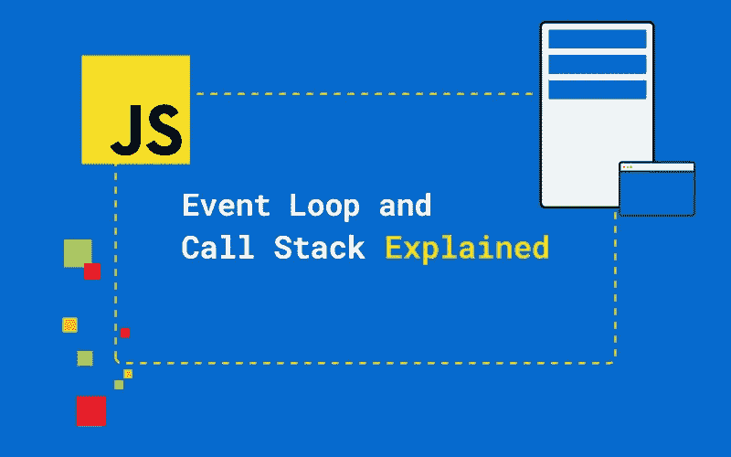
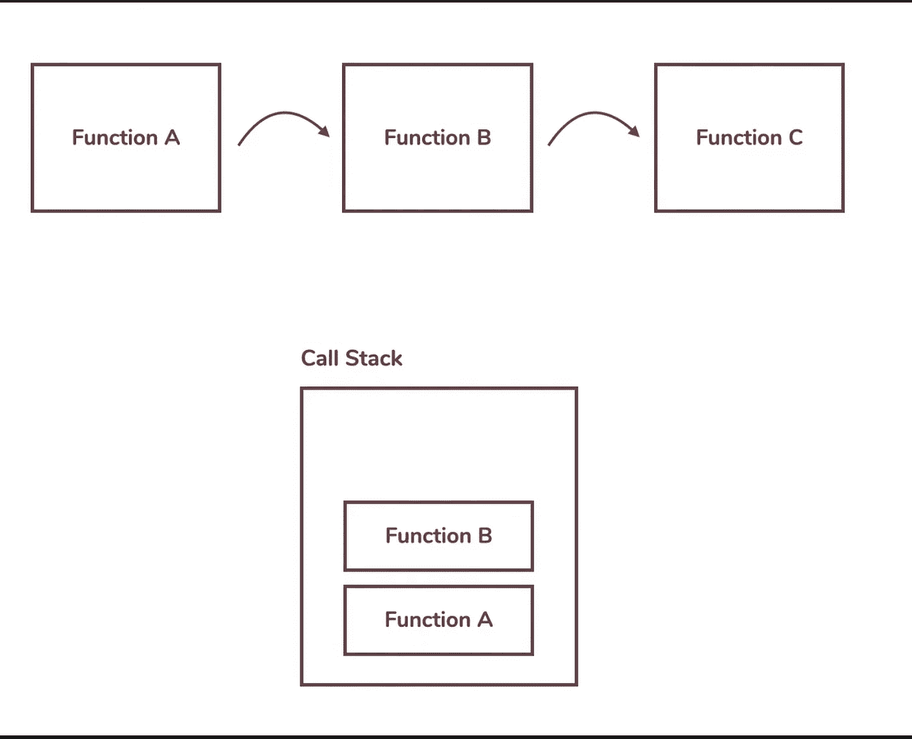
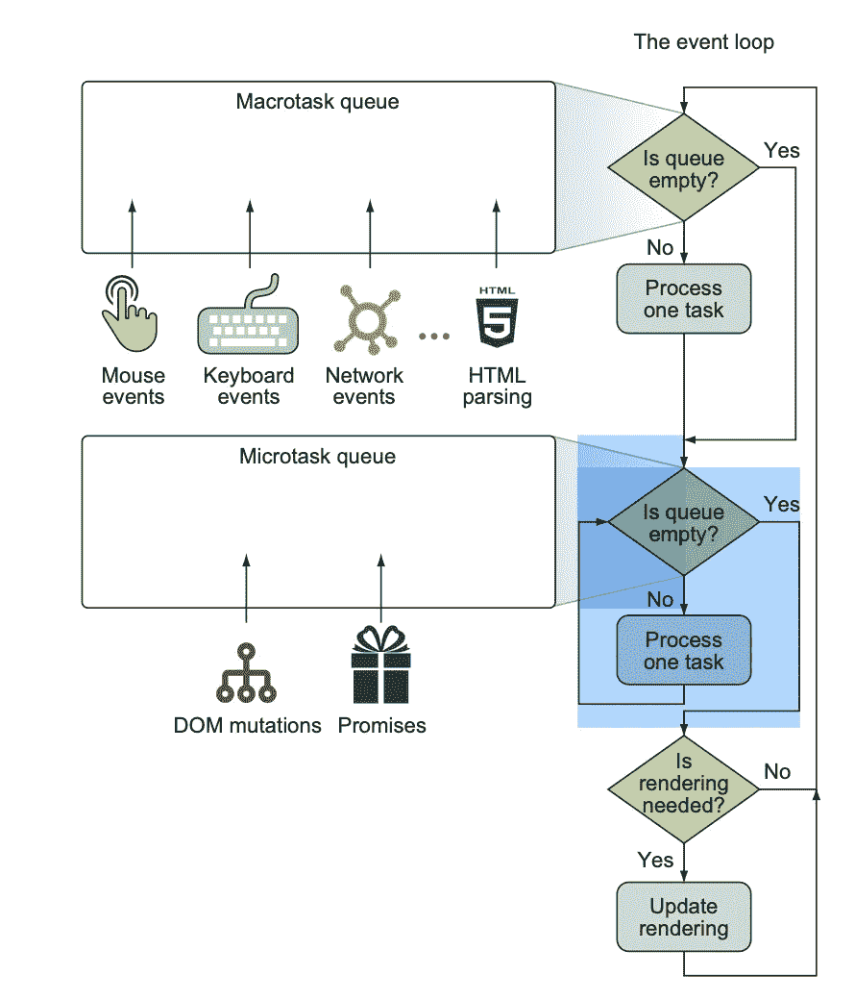

# 理解 JavaScript 中的事件循环

> 原文：<https://medium.com/codex/understanding-event-loop-in-javascript-be44340e243b?source=collection_archive---------13----------------------->

# 定义

JavaScript 有一个基于事件循环的运行时模型，它负责执行代码、收集和处理事件，以及执行排队的子任务。可能发生的事件有:

*   浏览器事件，比如当一个页面加载完毕或者要卸载的时候
*   网络事件，比如来自服务器的响应(Ajax 事件、服务器端事件)
*   用户事件，如鼠标点击、鼠标移动和按键
*   计时器事件，例如当超时过期或时间间隔触发时

所有生成的事件都按照浏览器检测到它们的顺序放置在事件队列中。该流程可以简单地解释为:

*   浏览器检查事件队列的头部
*   如果没有事件，浏览器将继续检查
*   如果有一个事件，浏览器将执行它，在此期间，其他事件将不得不等待轮到他们。因此，请记住事件的处理时间，以防止崩溃或冻结。

这很容易理解，不是吗？但是还有更多的。

我们知道 JavaScript 是由**同步**和**异步**事件组合而成的。**同步**是一个接一个，**异步**是回调或者承诺。让我们进入刚才的**同步**

## **同步事件**

JavaScript 是单线程的，这意味着总有一个线程完成所有的工作。假设你点击按钮 A 来触发一个函数，JavaScript 将执行这个点击的工作，但是如果你点击按钮 B，JS 会立即放弃正在做的事情来执行这个动作吗？**不**，它把动作推入一个队列，那个队列叫做**任务队列，意思是任务的队列**

这个动作可能是一个简单的函数，但是如果是一个复杂的函数，它会调用其他函数吗？事情是这样的:

这种情况下的单线程别无选择，只能跟随那个函数调用栈，这种嵌套的函数调用通常使用栈数据结构来管理，它被称为**调用栈**

## 异步事件

JavaScript 中的异步事件通常伴随着回调。回调意味着传递给另一个函数的函数。当一个异步事件开始执行时，回调没有立即开始，而是被推入，它进入任务队列的末尾。这解释了你现在看到的大多数 JavaScript 行为

# 潜得更深

首先，事件循环至少有两个队列，除了保存事件之外，还保存浏览器执行的其他操作，而不是只保存事件的单个事件队列。这些动作被称为*任务*并被分为两类: ***宏任务*** (或者通常只是称为任务)和 ***微任务*** 。

我就不解释“任务”的事情了，有了上图，你就能明白什么是**宏任务**和什么是**微任务**

事件循环首先检查宏任务队列，如果有宏任务等待执行，就开始执行。只有在任务被完全处理之后(或者如果队列中没有任务)，事件循环才移动到处理微任务队列。如果队列中有一个任务在等待，事件循环就会接收它并执行它直到完成。这是对队列中的所有微任务执行的。注意处理宏任务和微任务队列的区别:在一次循环迭代中，最多处理一个宏任务(其他的留在队列中等待)，而所有的微任务都被处理。

当微任务队列最终为空时，事件循环检查是否需要 UI 呈现更新，如果需要，则重新呈现 UI。这将结束事件循环的当前迭代，返回到开始处并再次检查宏任务队列。

# 结论

在文章的最后，我希望你能理解什么是事件循环，它是如何工作的，理解任务队列，如果你理解宏观和微观任务队列，那就很好了。
我希望这篇文章能帮助你更好地理解 JavaScript，提高你的知识！

# 遗言

虽然我的内容对每个人都是免费的，但是如果你觉得这篇文章有帮助，[你可以在这里给我买杯咖啡](https://www.buymeacoffee.com/kylele19)