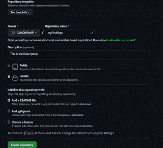

# 简单了解 GitHub |第 1 部分

> 原文：<https://medium.com/codex/understanding-github-in-a-nutshell-part-1-61b710fdec6a?source=collection_archive---------6----------------------->

在上一篇关于 Git 和 Github 的文章中，我们简要比较了它们之间的区别。现在是时候详细了解它们每一个了，[让我们从 GitHub](https://www.mayhemcode.com/2021/10/understanding-github-in-nutshell-part-1.html) 开始。为整个开源社区和开发者提供动力的 Web 应用程序，它是如何开始的，以及如何成为其中的一部分。

这是 Github 和 Git 系列的**第二部分。在本文中，我们将了解如何创建我们的第一个存储库，如何提交变更，以及如何将一个存储库派生给它。**

# 什么是 GitHub？

**GitHub 是在 2008 年使用 Ruby on Rails** 开发的。现在由微软维护。这是一个 web 应用程序，世界各地的开发人员可以在其中保存/存储他们的应用程序。这种类型的应用程序被称为开源技术，世界各地的任何人都可以对其做出贡献，在这里的文章中了解**开源技术**最强大的版本控制工具和开源社区。Github 一出现，整个行业就发生了变化，传统上，像谷歌、网飞、脸书这样的大公司都在开发应用程序，但是源代码并不是每个人都可以获得的。

不仅这家公司的任何软件都没有公开，考虑到安全和隐私问题，这可能会导致软件被利用。但是当 Github 出现的时候，它引入了一个新的术语“开源”,这个术语并没有被很多应用开发者所接受，但是很快就流行起来了。这背后的原因是，当来自世界各地的人们为一个应用程序或软件做出贡献时，通过不同的方法找到最佳方法变得更加容易。

因此，了解这项技术并学习如何使用它来提高我们的技能并为开源社区做出贡献是非常重要的。开始这个过程的第一步是创建一个 Github 帐户。转到 [Github](https://draft.blogger.com/blog/post/edit/3504568035593819778/4069863677238177668#) 的官方页面，创建一个新账户。

# 我们可以用 GitHub 做什么？

为此，让我们了解 Github 是如何工作的。创建帐户后，您可以查看您的个人资料页面。Github 有一个**功能叫做 Repositories** ，把这个想象成某种文件夹，每个文件夹都有特定应用的全部代码。我们将创建一个回购，向您展示如何创建一个。第一步是转到您的个人资料页面，然后点击存储库。

因此，正如您在图片中看到的，导航到“存储库”部分，然后单击“新建”按钮。然后你需要命名你的存储库，**你可以使回购私有或公共**。如果回购是公开的，每个人都可以访问它，并看到应用程序代码，如果回购是私人的，除了你没有人可以看到代码。

因此，我将回购命名为 myFirstRepo，并将其设为私有，因为这仅用于文章。您可以添加附加功能，如添加描述、自述文件。MD 文件，添加一个许可证，这是没有用的。然后单击“创建存储库”,将在您的库中创建存储库。现在，让我们也添加一些文件到回购，并提交它。**提交只是保存所做的更改**转到您的存储库并点击添加文件按钮，这将提示您选择您想要上传的文件。

在本例中，我上传了一个检查偶数或奇数的 python 文件。然后，您可以为该提交添加描述和名称，最后单击提交更改，然后更改将反映在您的存储库中。好了，您刚刚创建了您的第一个提交和存储库。但有时我们想要的代码可能在另一个回购中，在这种情况下如何获得代码。

# 如何在 GitHub 中派生一个存储库

Forking 是 Github 针对上述**抄袭他人回购**的问题提供的功能。无论何时你想复制别人的库，那么你可以简单地执行回购，所有的文件都会被添加到你账户的回购副本中。让我们通过一个简单的演示来看看这一点，为此，我们将分叉 Linux 库。首先，让我们在搜索栏中搜索 Repo，转到第一个存储库，或此链接 [Torvalds/linux](https://draft.blogger.com/blog/post/edit/3504568035593819778/4069863677238177668#) 。这是 Linus Torvalds 为 Linux 操作系统创建的官方存储库。

单击回购名称右上方的 Fork 选项。然后，您可以看到该存储库已经添加到您的库中，但是这里有几点需要记住。他们是。

欲了解更多信息，请访问:

[https://www . mayhemcode . com/2021/10/understanding-github-in-shell-part-1 . html](https://www.mayhemcode.com/2021/10/understanding-github-in-nutshell-part-1.html)

*原载于 2021 年 10 月 16 日 https://www.mayhemcode.com***。**