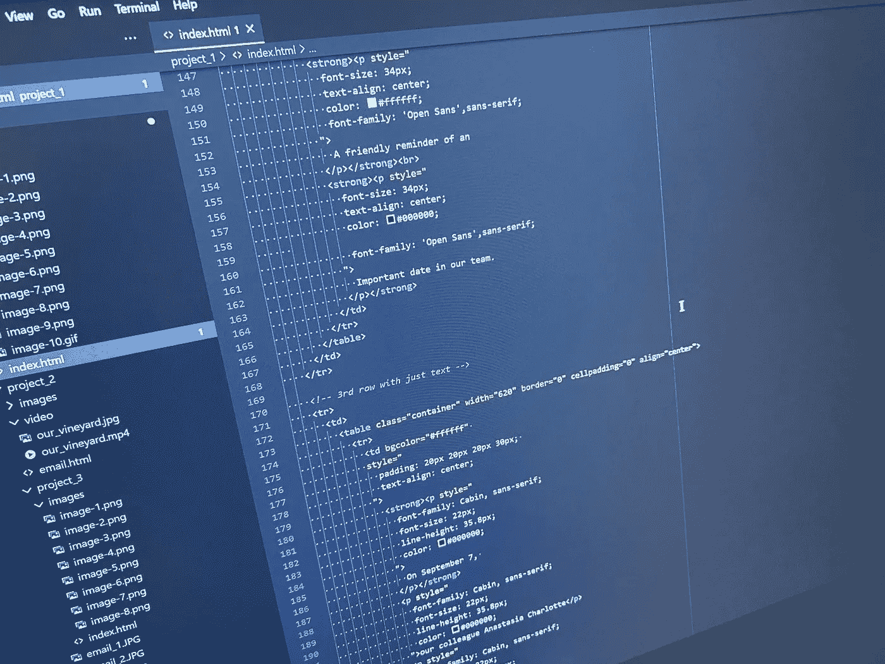

# 理解 HTML 电子邮件以及如何正确构建它们

> 原文：<https://medium.com/codex/understanding-html-emails-and-how-to-properly-build-them-30b807f32e7e?source=collection_archive---------23----------------------->

我的代码

HTML 电子邮件几乎被目前存在的每一个企业和公司所使用。HTML 电子邮件是发送到您收件箱的电子邮件，通常是服务或产品的广告。有时，HTML 电子邮件用于向您发送提醒、购物收据或优惠券代码，以不断吸引您再次购物。如果你在过去的 15 年里没有生活在岩石下，这应该…