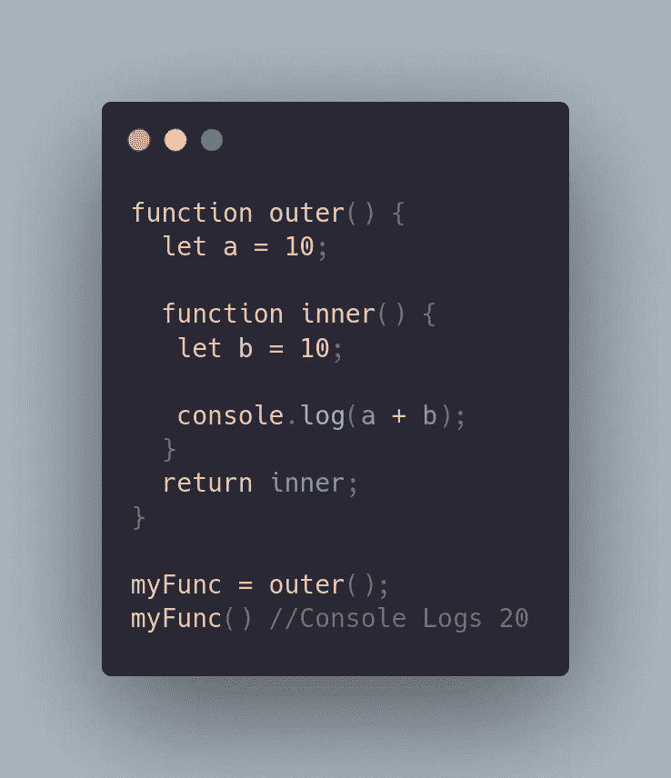
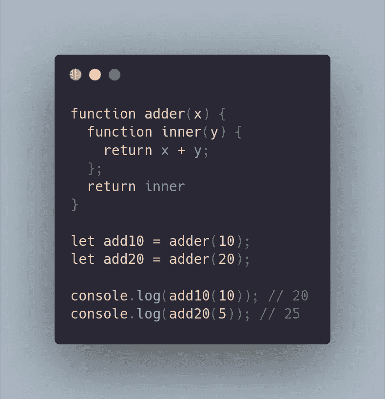

# 理解 JavaScript 闭包

> 原文：<https://medium.com/codex/understanding-javascript-closures-5b3f184e82ec?source=collection_archive---------11----------------------->

凯文·Ku 在 [Unsplash](https://unsplash.com?utm_source=medium&utm_medium=referral) 上的照片

今天我将谈论 JavaScript 编程中一个非常令人困惑但却非常基础的话题。我很难理解 JavaScript 闭包。在一个关于这个话题的非常痛苦的面试问题之后，我决定真正地尝试和理解闭包，以及为什么它们会有用。我也会尽力解释清楚。让我们开始吧。

那么什么是终结呢？闭包是一个与对其周围状态的引用捆绑在一起的函数。更明确地说，我们可以说闭包是外部函数内部的一个函数，它可以访问外部函数的作用域。闭包可以访问它自己的变量、外部函数的变量和全局变量。仅仅阅读这个可能没有多大意义，所以让我们看一个例子。

这里我们有两个函数。外部函数有一个名为“a”的变量，并返回内部函数。内部函数有一个名为“b”的变量，并从外部函数访问该变量。之后，我们将外部函数的执行结果保存到一个变量‘my func’中。这意味着‘my func’现在拥有内部函数。当执行时，我们实际上在终端上得到 sum 输出。为什么？起初，这段代码实际上能够工作可能没有意义。在其他编程语言中，函数中的局部变量只在函数执行期间存在。您可能会认为在外部函数执行后,' a '变量将不再可访问。多亏了闭包，JavaScript 就不是这样了。闭包是函数和声明函数的词法环境的组合。这个环境由创建闭包时在作用域内的所有局部变量组成。JavaScript 的这个特性允许这样的代码运行。当这些函数开始接受参数时，事情变得有趣多了。让我们看一个例子。

闭包允许您将数据与操作该数据的函数相关联。这可以与面向对象编程中对象如何允许您将数据与方法相关联相比较。如你所见，我们可以将闭包保存到两个不同的变量中，并对不同的值进行运算。即使外部函数已经运行，内部函数仍然可以访问其中的环境，因为它保存在内存中。环境由闭包存储，供自己以后使用。

我希望这将有助于任何人理解闭包的基础知识。这是一个非常有趣的话题，我还需要学习更多的东西。和他们一起练习只会更有帮助。面试中经常会问到关于闭包的问题，所以理解这个概念对于赢得面试非常重要。编码快乐！😎