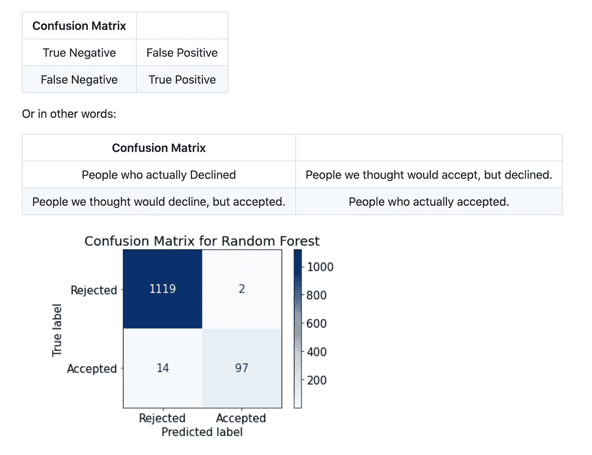
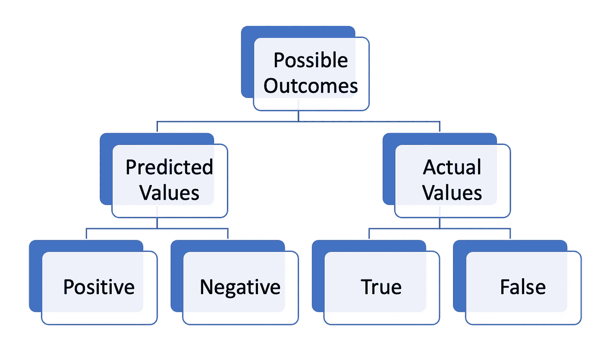
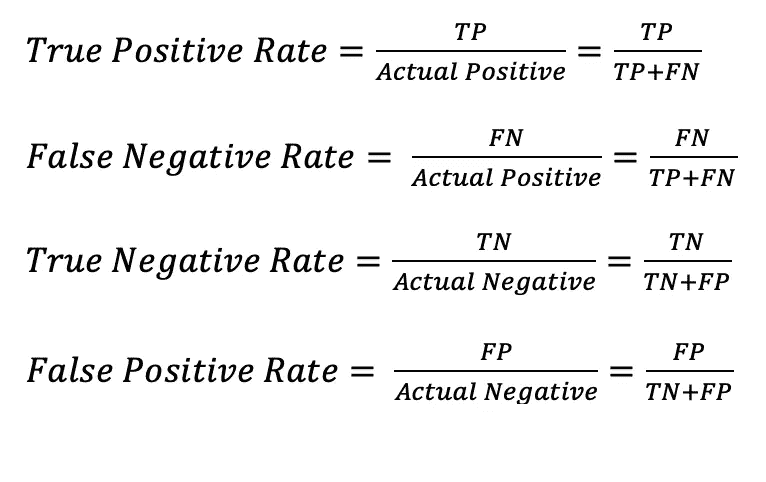
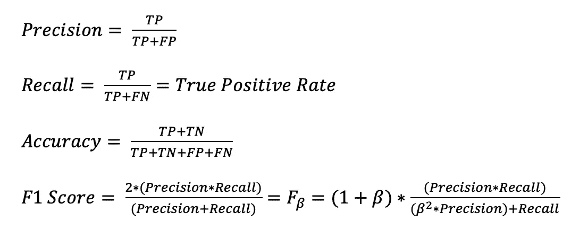
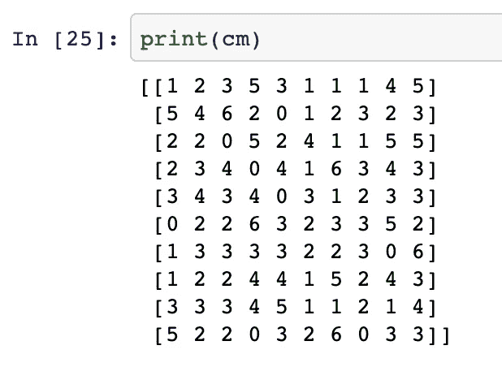
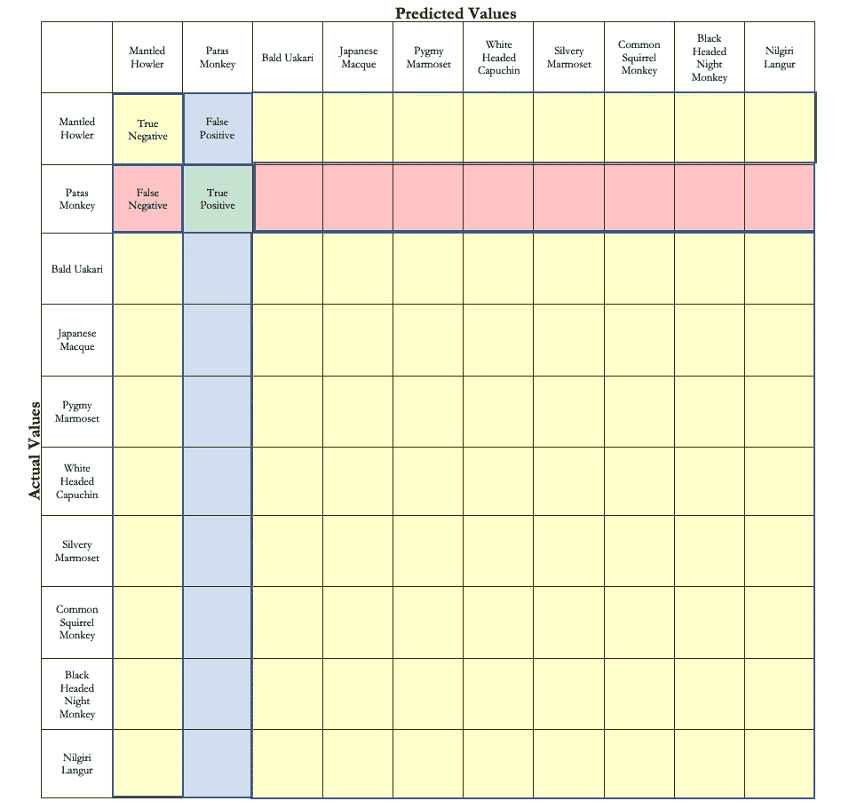
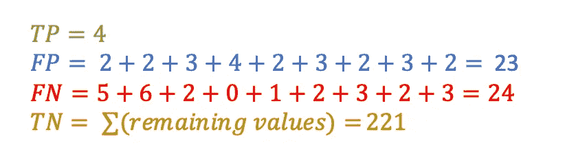

# 理解大型混淆矩阵。

> 原文：<https://medium.com/codex/understanding-large-confusion-matrices-215e061dc323?source=collection_archive---------12----------------------->

## [法典](http://medium.com/codex)

混淆矩阵是我们作为数据科学家工作的精髓部分。我们的面包和黄油；这是一种可视化模型性能的形式。对于两个类来说，解决这个问题仍然相对简单，但是当我们的矩阵膨胀时，计算就会变得混乱。

本文中相关和回顾的技术术语包括真阳性、真阴性、假阳性和假阴性，从而得出真阳性率和假阳性率以及真阴性率和假阴性率。我们还可以评估准确性、精确度、召回率和 F1 分数等指标。

我们将触及三个要点来简洁地描述在处理多类问题时如何理解更大的混淆矩阵。

1.  混淆矩阵是如何构造的？
2.  我们从混淆矩阵中得到的工作度量是什么。
3.  我们如何将这一点大规模应用于多类问题。

# 混淆矩阵是如何构造的？

最简单形式的混淆矩阵仅由两个类的结果创建。出于演示的目的，我将使用我做的一个关于银行贷款的项目，银行试图确定一件事:一个人会接受还是拒绝个人贷款？随后，这意味着我们将人们分为**两个**组:接受和拒绝。为了分析我们预测的准确性，混淆矩阵由四种可能的结果组成，如下所示:

上面概述的是银行贷款项目的混乱矩阵以及我们如何解读它。

## 真阳性和假阳性以及真阴性和假阴性。

混淆矩阵本质上是总体概率的直观表示。下面描述了一个概率树，类似于你在一个初级统计职业中为掷硬币所画的概率树。您可以将此视为两个组，两个类别产生四种结果:

**真阳性(TP)** :真阳性率是机器准确预测到有阳性结果的人数。在我们的例子中，这是计算机认为会接受银行贷款的人数，并且接受了。

**真阴性(TN)** :真阴性率是机器准确预测到有阴性结果的人数。在我们的例子中，是计算机认为不会接受银行贷款的人数，而他们实际上没有接受。

**假阳性(FP)** :假阳性率是机器不准确地预测到有阳性结果的人数。换句话说，机器认为会接受银行提议但实际上拒绝了的人数。也称为 I 类错误。

**假阴性(FN)** :假阴性率是机器不准确地预测到有负面结果的人数。在我们的例子中，机器认为会拒绝个人贷款，但在现实生活中想要接受它的人数。也称为第二类错误。

*关于第一类和第二类错误的注意事项*——在银行是否应该邮寄成本低于 1 美元的小册子的情况下，风险非常低。在我们讨论医疗诊断的情况下，这些误差的准确性变得极其重要。

# 这如何为我们提供可用的度量？

剩下的就是从这里开始的基本代数，插入混淆矩阵中的数字。真假阳性&真假阴性让我们深入了解四种基本计算方法(如下所示):

使用这些指标，我们可以用百分比(或 0 到 1)量化每个可能场景的发生频率。

## 精确度、召回率、准确度和 F1 分数。

有了对这些比率的理解，我们可以从混淆矩阵中推导出四个主要的重要指标:精确度、召回率、准确度和 F1 分数。

**Precision** : Precision 量化实际属于肯定类的肯定类预测的数量。

**Recall** : Recall 也和 True Positive Rate 一样，量化了数据集中所有正例做出的正类预测的数量。

**准确性**:准确性是正确预测的总数除以对数据集做出的预测总数。

**F1 分数**:该测量提供了一个单一的分数，该分数在一个数字中平衡了对精确度和召回率的关注。

当我们定量定义这些时，它看起来像这样:

# 这是如何应用于更大规模的？

理解银行贷款项目的混乱矩阵是一件简单的事情。当遇到更大的分类问题时，这变得相当令人头痛。

作为我在训练营期间做的一个项目，我试图用图像识别和神经网络对 10 种猴子进行分类。下面是纯数字格式的混淆矩阵，很容易混淆。

请注意，这个项目的准确性非常低，更多信息请访问我的 github。

我最终制作了一个使用颜色编码的混淆矩阵示例，这样我就可以了解哪些值被分配给了哪些指标。简单来说:

**真阳性(绿色)**是位于网格上相同物种交叉点的细胞。这些是电脑认为是帕塔斯猴子的图像，事实也的确如此。

**假阳性(蓝色)**是包含相关物种的预测值下的垂直列中的单元格减去真阳性单元格的总和。这些是电脑认为是帕塔斯猴的图像，但实际上是另一个物种。

**假阴性(红色)**是水平行中含有相关物种的实际值下的单元格减去真阳性单元格的总和。这些是电脑没有想到是帕塔斯猴子，但实际上是。

**真阴性(黄色)**是不在相关物种的垂直或水平行或垂直列中的所有细胞的总和。这些是电脑认为不是猴子的图像，在现实生活中也不是。

上图是在 10 种猴子的分类中，帕塔斯猴的混淆矩阵解释。

对于这个具体的例子，基本的加法已经根据前面描述的数字混淆矩阵在下面完成。

有了这些基本的计算，人们可以继续计算每一次出现的频率、精确度、准确度、召回率和 F1 分数。当理解如何得出这四个数字时，计算和解释结果的能力就大大简化了。

# 结论。

原来潜入多类分类的想法总是那么刺激。这是超越简单的二元分类的一步，让你的思维与可能的问题和假设赛跑。然而，复杂性的陷阱就是复杂性。我想说的是，随着探索无限类的兴奋而来的是无限的复杂性。花时间慢下来，手工拼凑一个多级混淆矩阵，可以对你的结果和过程提供更深入和更周到的理解。

**资源:**

[https://towards data science . com/performance-metrics-confusion-matrix-precision-recall-and-f1-score-a8fe 076 a 2262](https://towardsdatascience.com/performance-metrics-confusion-matrix-precision-recall-and-f1-score-a8fe076a2262)

 [## 理解混淆矩阵

towardsdatascience.com](https://towardsdatascience.com/understanding-confusion-matrix-a9ad42dcfd62) 

[https://machine learning mastery . com/precision-recall-and-f-measure-for-balanced-class ification/](https://machinelearningmastery.com/precision-recall-and-f-measure-for-imbalanced-classification/)