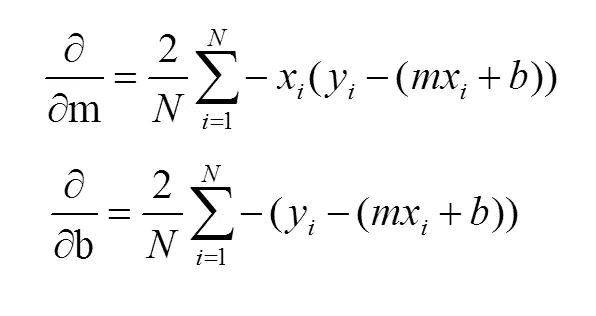
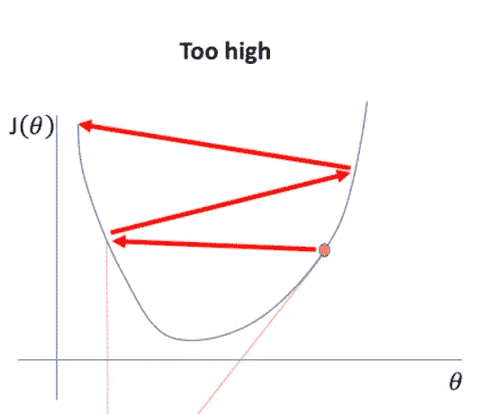

# 了解线性回归

> 原文：<https://medium.com/codex/understanding-linear-regression-402df5a4667e?source=collection_archive---------6----------------------->

坦纳·博瑞克在 [Unsplash](https://unsplash.com?utm_source=medium&utm_medium=referral) 上拍摄的照片

## [抄本](https://medium.com/codex)

## 在这篇博客中，我们将会了解机器学习中最基本的算法——线性回归

# 介绍

线性回归是一种对关系变量进行线性建模的算法。当我们说关系时，它是因变量和自变量之间的关系。在这个算法中，我们创建了一个“线性”回归线，使其“适合”我们的数据集。这是一种回归算法，这意味着它用于找出因变量的连续值。这不应该与我们的分类问题混淆。

**例如**

如果你预测今天会不会下雨，你的答案要么是“会”，要么是“不会”。所以你的答案分为两组，即“是”或“否”。

然而，对于房价数据集，我们预测的是不能分组的房价，因此，这是一种回归问题。

既然我们已经暖和了一些，我们就要进入正题了。

# 解释基础知识:简单线性回归

为了理解线性回归，我们将首先从简单的线性回归开始，即涉及一个自变量和一个因变量。*我们的自变量又称为* ***【预测变量】*** *，因变量称为* ***【反应变量】*** *。*线性回归模型，一般来说，涉及到我们比较两个模型:

*   只包含因变量的模型
*   包含自变量和因变量的模型

如果是第一个模型，我们进行某种程度的“预测”的唯一方法是找到因变量的平均值。这是一个基础模型，我们将用它来比较第二个模型的回归线。如果比较后我们没有看到任何改进，这意味着我们的自变量没有提供新的信息，丢弃它没有多大关系。

## 但是，我们首先如何比较这两个模型呢？

*为此，我们将引入* ***残差*** *的概念，它是原始值和由我们的回归线* *预测的值之间的* ***的一个奇特的词。残差也称为误差。***

因此，为了进行比较，我们对两种模型都遵循以下步骤:

*   我们将首先找到原始值和我们的回归线预测值之间的残差。
*   我们将对所有这些残差求平方，并将它们相加。

这个总和被称为**“误差平方和”**或 **SSE。**以此作为比较上述两种模式的标准。SSE 也被称为“未知错误”,如果一个模型有更多的未知错误，那么它需要更多的优化。

除了上交所，我们还有 SSR 和 SST。

**SST** 为**“平方和”**说明了所有已知或未知的误差。它是从我们的回归线预测的因变量和因变量的均值之间的差的平方和。

**SSR** 是**“平方和回归”**，它解释了所有已知的错误原因，并描述了我们的线如何“符合”我们的数据集。它是因变量的值和因变量的平均值之间的差的平方和。

这三个术语具有以下关系:

**SST = SSE + SSR**

***注:*** *对于我们这个只有因变量的模型，SSE = SST*

资料来源:Vitalflux.com

**R 平方值(决定系数):**该值用于判断我们的回归线与数据集的吻合程度。这可以通过下面的表达式找到，

**R = 1-( SSE/SST) = SSR/SST**

如果 **R** 接近 1，那么这表明回归线与数据集非常吻合。否则，如果它接近 0 或者甚至是负数，它就不适合。

**代码片段:**

# 回归线

由于这是“线性”回归，我们的回归线将是以下形式:

y = b₀+ b₁*x

对于多元线性回归，我们的直线将具有以下形式:

y = b₀+ b₁*x₁+ b₂*x₂ + …+ bₙ*xₙ

在哪里，

*   y 是我们的因变量(响应/结果)
*   b₁,b₂,…,bₙ是参数，b₀是我们的截距
*   x₁、x₂,…、xₙ是独立变量

要找到我们的回归线，我们首先需要参数和线截距。为了找到以上的东西，我们有两种方法:

1.  最小二乘法
2.  梯度下降

## 最小二乘法

相同的步骤给出如下:

1.  求因变量和自变量的平均值。让我们称之为 yₘₑₐₙ和 xₘₑₐₙ.
2.  对于每个 x 值，从它们中减去 xₘₑₐₙ，对于每个 y 值，从它们中减去 yₘₑₐₙ。
3.  找出(xᵢ-xₘₑₐₙ)和(yᵢ-yₘₑₐₙ)的乘积，其中 1≤i≤n，n 是变量值的个数。然后加上这些产品。
4.  然后，平方(xᵢ-xₘₑₐₙ)并将它们加在一起。
5.  将(3)的结果除以(4)的结果，得到回归线的斜率。
6.  为了找到截距，我们用 yₘₑₐₙ代替 y，用 xₘₑₐₙ.代替 x 来求解 **b₀ = y - b₁*x**

请注意，我们基本上是以下列方式寻找斜率的:

***斜率为回归线(* y = b₀+ b₁*x)**

***=【σ协方差(xi，易)/方差(x)】for 1≤I≤n***

绿线是使用简单线性回归的最小二乘法找到的。

## 梯度下降

在我们理解这个方法之前，我们需要知道什么是成本函数。

**成本函数:**又称**均方误差，**是原始因变量和我们回归线预测的因变量之间的差的平方和。

这种方法需要我们找到成本函数相对于斜率 m 和截距 b 的一阶偏导数。但是，我们为什么需要找到它呢？

(来源:morioh.com)注意步长在不断减小。这是因为当我们向下移动时，我们的斜率也会减小。

在上图中，我们有一条成本曲线。假设我们在 x 轴上有斜率 m。为了找到全局最小值(我们的成本函数是最小的)，我们通过一个可变因子一点一点地向下步进。请注意，全局(甚至局部)最小值是成本曲线斜率为 0 的点。这是**汇合点**。类似地，对于截距 b，我们可以找到偏导数 w . r . t . b。

*对某个变量的偏导数 w.r.t 只表明成本函数 w.r.t 那个变量的变化率。*

计算结果如下:

**梯度下降的步骤:**

1.  求成本函数 J(b，m) w.r.t m 和 b 的偏导数。
2.  通过**学习率(α)** 和它们各自的偏导数的乘积来减少 m 和 b。
3.  我们对指定数量的**迭代(时期)**执行(1)和(2)步骤，直到我们达到收敛。
4.  调整α和历元值，直到达到收敛。

***注意:α值不能太大，否则我们可能会绕过下图所示的收敛点。如果它太小，在它到达会聚点之前将花费很长时间。***

来源:jeremyjordan.me

来源:jeremyjordan.me

来源:jeremyjordan.me

θ0 是 b，θ1 是 m

对于多元线性回归。

# 具有多个预测值的多重共线性:

每当我们进行多元线性回归时，除了自变量和因变量之间的“相关性”之外，自变量之间也可能存在相关性。这使得一个变量对我们的因变量有多大影响变得“模糊不清”。

为了获得一个预测因子与其他预测因子“相关”程度的基本概念，我们可以使用皮尔逊相关系数，你可以在这个[博客](/@tanya-gupta18/intern-diaries-statistics-67c7d2e75192)中读到。

使用热图可以很好地展示这一点。

以房屋预测数据集中的一个例子为例，我们看到这三个因素相互之间有很高的相关性，最好使用其中一个因素来预测房屋的价格。尤其是与我们的反应变量“价格”更相关的那个。

**代码片段:**

从头开始寻找多元线性回归的梯度下降。这种方法也可以用于简单的线性回归，只是你的 x 矩阵只包含一列而不是多列。

在哪里，

*   **cost:** 存储每次迭代中所有开销值的列表；稍后用于绘制成本与迭代次数(或时期)的关系图。
*   **min_cost:** 初始化为 None，在迭代过程中检查最小值。
*   **b_min:** 用于存储迭代过程中 min_cost 值的参数。
*   **h:** 假设值，用参数值执行 x 值查出。
*   **b:** 用 1 初始化的参数数组。

****绘制图形的代码片段:****

****

****输出:****

****

**今天就到这里，感谢您抽出时间阅读！！！**