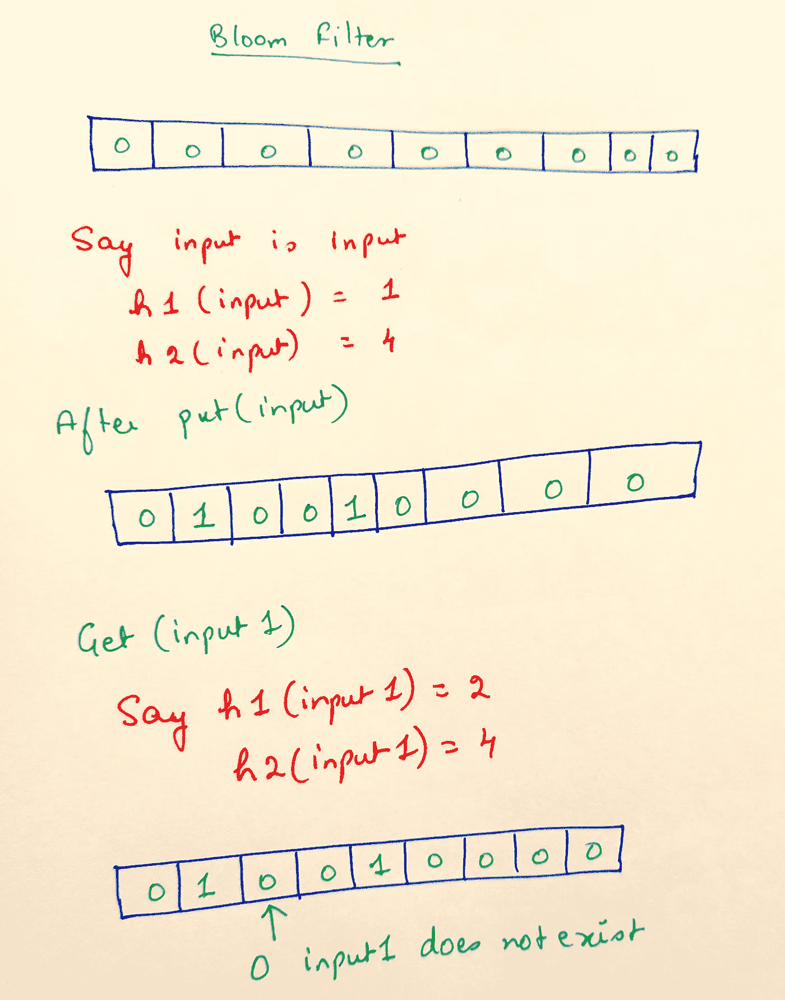
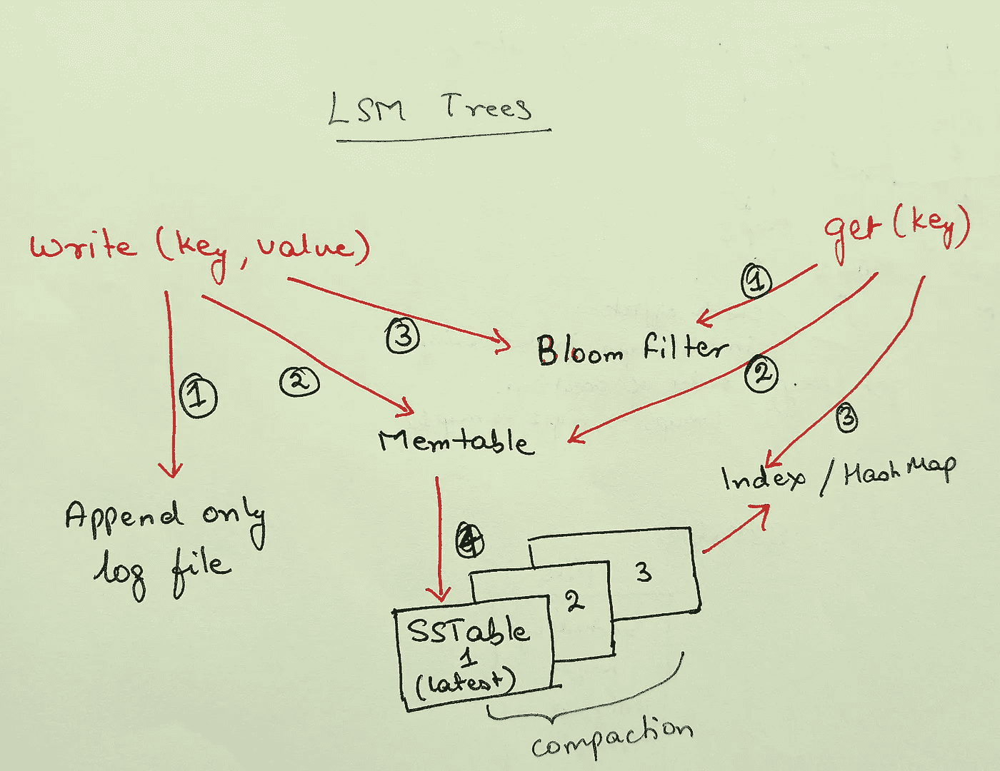

# 日志结构化合并(LSM)树

> 原文：<https://medium.com/codex/understanding-log-structured-merge-lsm-trees-c4a0039f17a8?source=collection_archive---------10----------------------->

许多数据库使用 LSM 树来存储需要高写吞吐量的数据。在这篇文章中，我们将通过设计和使用的数据结构。

为了便于讨论，让我们假设我们只有键值对。另外，为了简单起见，我们假设键和值都是字符串。

## 仅附加日志文件

为了确保高写入率，我们需要顺序写入并减少随机写入。让我们从将键值写入一个只追加文件开始。

我们还在内存中维护一个哈希映射，它包含从文件开始的键和值。每当我们更新一个值时，我们就把散列表更新到文件中的新偏移量。

对于 put(key，value ),我们只需添加到文件中。

对于 get(key ),我们检查 hashmap 中的偏移量，并对该值的给定偏移量进行磁盘搜索。

对于删除，我们在日志文件中写一个 **tombstone** 条目，并在 hashmap 中更新它。我们需要 tombstone，因为我们需要获得密钥被删除的信息。当我们在失败后重新构建 hashmap 时，以及在压缩的情况下，这很方便。

如果我们继续写入文件，我们最终将耗尽空间。因此，我们需要

## 压紧

压缩实质上意味着从日志文件中删除一个键的所有实例，最新的实例除外。

当前一个文件已经达到指定的大小或密钥或任何其他参数的阈值时，让我们开始将文件分成片段并开始新的文件。

此外，让我们为每个片段保留一个散列表。

在压缩中，我们取 2 个或更多的段，打开一个新文件，在新文件中插入所有带有最新值的键(仅一次),并针对这个新文件创建一个新索引。我们需要 tombstone 条目来删除压缩时删除的键。

一旦创建了新文件，我们就丢弃旧文件和旧索引。

## 表或排序字符串表

SSTable 是一个日志文件，具有以下两个属性。

a)它包含按排序顺序排列的记录，即日志文件中的键值对按键排序。

b)它只包含一个密钥一次。

SSTables 比上面的日志文件提供了更好的性能，因为我们现在可以拥有稀疏的索引。如果对键进行排序，我们可以在索引映射中拥有更少的键。对于不在索引中的给定键(在内存映射中)，我们可以查找最近的可用键，并从该偏移量在文件中进行查找。

此外，这种结构现在允许范围查询，并允许任何给定键之间的数据。

如何创建 STables？

## 内存表

让我们首先维护一个存储键值对的内存数据结构，并在删除重复项的同时按排序顺序存储键。我们可以使用 AVL 树或红黑树。你可以把这些树想象成自我平衡的二叉查找树。一种二叉查找树，其中叶节点的高度差不大于 1。

每当有写操作进入时，将其添加到内存平衡树结构中，这也被称为 **memtable** 。

每当内存树的大小增加到指定的阈值时，该树就会以**表**的形式写入磁盘。该文件满足上述属性。

走旁门左道。假设我们需要检查一个键是否存在于一个列表中。让我们也声明，我们能够承受假肯定，即，当检查声明一个密钥存在，但实际上它不存在，但是我们不能承受假否定，即，当检查声明一个密钥不存在，但它存在。

如果我们使用以下命令在列表中检查键

线性搜索—这将是 O(n)

二分搜索法——这将是 O(lg n)

**布鲁姆滤镜**

让我们取一个 m 位数组。将每个位设为 0。

同样，让我们假设 k 个散列函数。回想一下，对于任何给定的输入，散列函数都返回 0-m 之间的值。

对于给定的输入，说 input(哇，多么有创意的名字)。

对于每个散列函数 hj(其中 j = 1 到 k)(在上面我们有 k = 2，即 2 个散列函数)

设置 m[hj(inp)] = 1，即我们使用所有散列函数计算输入的散列。对于每个哈希函数，返回的索引被设置为 1。在上面的例子中，散列函数返回索引 1 和 4。

为了检查一个键是否存在，我们检查哈希函数返回的所有索引是否都设置为 1。在上面的例子中，当检查输入 1(另一个创意名称)时，我们检查 m[h1(输入 1)]…..m[hk(input1)]全部为 1 或不为 1。

复杂度= O(c) + pO(n)其中 p =假阴性的概率，即布隆过滤器声明一个键存在，而它不存在。对于 m 和散列函数的确定值，p 可以保持足够小，以使复杂度为常数。

布隆过滤器没有删除机制。

回到正轨

**日志结构化合并树(LSM 树)**

现在我们已经有了创建 LSM 树的所有基本构件。

**写**

我们按照下面的步骤写。

1.  每当我们得到一个写操作时，我们首先将它写入一个只附加的日志文件。这样做是为了确保我们可以在崩溃后恢复，也就是说，当 memtable 丢失时，我们使用这个只添加日志文件来创建 memtable。
2.  我们将数据写入 memtable。
3.  我们为这个密钥更新布隆过滤器中的比特
4.  当 memtable 超过大小时刷新(定义如下)。

## 阅读

我们按照下面的步骤进行阅读。

1.  我们检查布隆过滤器是否存在密钥。这避免了检查所有索引是否存在键。
2.  我们在 memtable 中查找密钥。最近一次写入会在这里。
3.  我们检查索引映射中的键(按降序)，并找到包含该值的文件和偏移量。

## 其他操作很少

为了确保内存中的数据结构不超过给定的大小，我们需要不时地将它刷新到磁盘。

# 脸红

当 memtable 增长超过指定大小时，它的所有内容都被刷新到磁盘上的一个 SSTable 中。

1.  Memtable 被写入磁盘。
2.  仅附加文件被丢弃，并创建一个新的仅附加文件。
3.  针对该文件创建一个索引 hashmap，包含从文件开始的键和偏移量。每个表都有自己的索引。
4.  创建一个新的 memtable，所有新的写操作都被写入这个 memtable 和新的仅追加文件。

## 压紧

随着时间的推移，文件/段的数量将会增加。为了减少磁盘空间，有时需要压缩。

压缩可以通过使用合并排序来完成。可以使用 k 路合并来合并这些表，并将其写入一个新文件。索引和旧文件将被丢弃，新段和新索引将用于读取。

## 为什么我们需要布鲁姆过滤器？

当检查一个不存在的键时，我们需要检查多个索引。当索引的数量(等于段的数量)很大时，对于不存在的键，将需要在所有索引中查找。Bloom filter 致力于减少这些索引中的查找次数。

## 摘要

虽然创建上述解决方案是为了提高写入吞吐量，但一般来说，它取决于许多其他因素，尤其是工作负载。这篇文章提供了一个概述和对 LSM 树如何工作的理解。这些树现在在很多数据库下使用，如 Cassandra，InfluxDB 等。