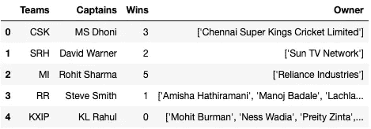
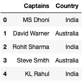
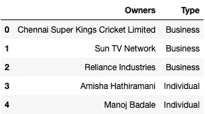
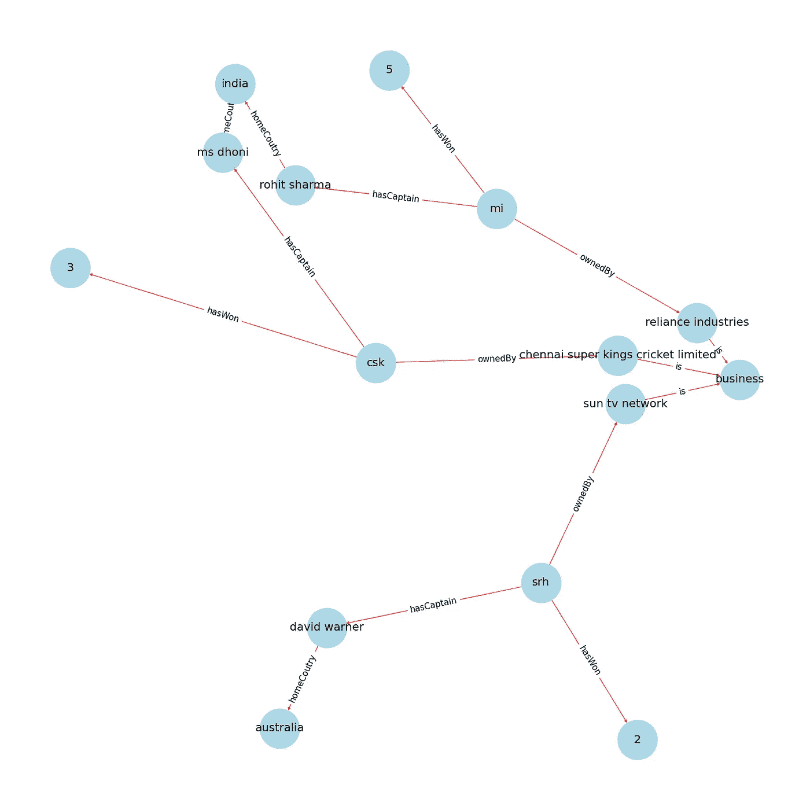
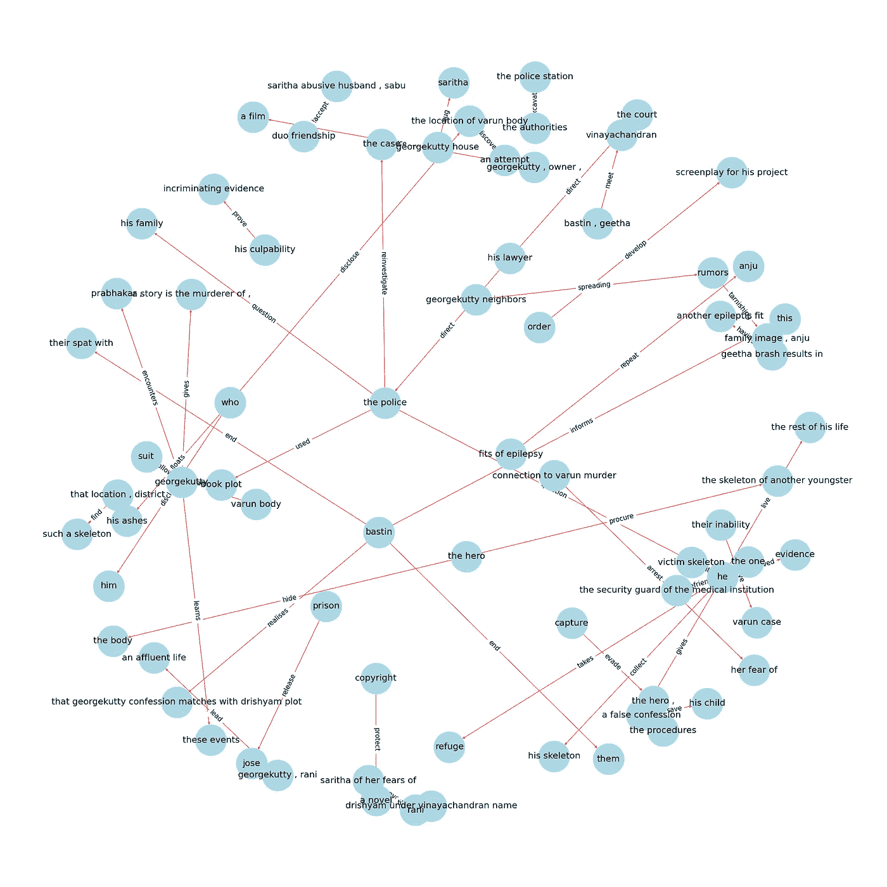
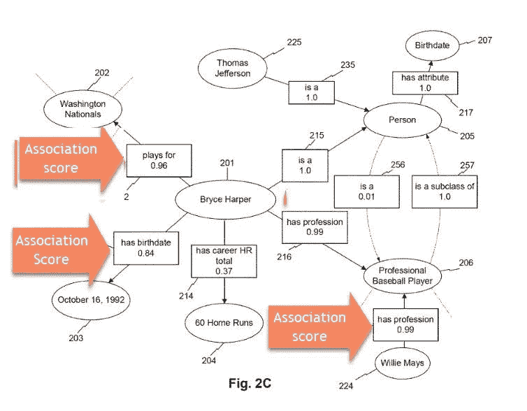

# 理解本体和知识图

> 原文：<https://medium.com/codex/understanding-ontologies-and-knowledge-graphs-4664afc4f961?source=collection_archive---------1----------------------->

艾莉娜·格鲁布尼亚克在 [Unsplash](https://unsplash.com/s/photos/network?utm_source=unsplash&utm_medium=referral&utm_content=creditCopyText) 上的照片

知识图表已经席卷了许多人。它表示数据和推导推论的能力已经被证明是信息表示和检索的游戏规则改变者。在这篇文章中，我们将浏览本体论，讨论几个例子。然后，我们深入知识图表，并讨论一个有趣的应用。

## 什么是本体？

本体对广义数据建模，也就是说，我们考虑具有共同属性的一般对象，而不是特定的个体。“建筑”是一个概括的模型，而“泰姬陵”是一个具体的实体。使用这些模型，我们创建了一个概念，它是我们所拥有的数据的一个简化和抽象的视图。你可能想知道，为什么本体论在第一位，对吗？原因是它提供了一种人类和机器可以轻松解释数据并对其执行操作的方法。

## 本体的组件

1.  **个人**:数据中可以命名的事物(例如杰克，如何训练你的龙等。)
2.  类别:个体的集合
3.  **属性**:这些在个体和价值之间形成了一种联系(例如，人类有两条腿的财产，杰克有一百万美元的薪水等等。)
4.  **关系**:定义两个个体之间的关系(Jack 是 Tom ie 的父亲。杰克→父亲→汤姆)
5.  **公理**:本体不可或缺的一部分，它们帮助我们从数据中得出假设并做出推论。

## 用一个例子理解本体论

使用下面给出的表格，我们将识别类、关系、属性，然后形成本体。利用这个本体，我们将构建一个知识图！

表 1

表 2

表 3

在我们的数据集中观察到的类是——玩家、所有者、团队和国家。在识别了类之后，我们可以继续绘制它们之间的关系。

1.  团队→ hasCaptain →玩家
2.  玩家→祖国→国家
3.  团队→所有者→所有者

我们还将列出这些类的一些属性。

1.  团队→ hasWon → Wins
2.  所有者→ is →所有者类型(企业或个人)

完成后，让我们继续创建我们的知识图表！但是，让我们先了解一下什么是知识图。

## 知识图，是什么？

知识图是相互链接的实体的表示。它给出了一种易于人类和机器理解的表示。除此之外，知识图是动态的，也就是说，它可以提供新的推理，并随着时间的推移通过添加新的数据来重塑自身。因此，与传统方法不同，知识图既不是休眠的，也不需要手动更新。

来源: [Pinterest](https://www.pinterest.de/pin/185069865911789899/)

从我们停下来的地方继续，在我们定义了本体之后，我们识别数据中的实体，找到关系、属性，然后将它们相互链接。

使用前面定义的类和关系，我们构建了一个相同数据的知识图，很酷吧？

基于 IPL 数据集构建的知识图

上面的代码可以在这个[链接](https://github.com/AnjaneyaTripathi/ontology-knowledge-graph/blob/main/ipl_knowledge_graph.ipynb)找到。您可以启动和派生存储库，并对其进行修补。

除了我们上面所做的，我们可以在大块文本上构建一个知识图。下面的知识图表是根据电影《崔西亚姆 2》的情节绘制的。

基于 Drishyam 2 图构建的知识图

可以在这个[链接](https://github.com/AnjaneyaTripathi/ontology-knowledge-graph/blob/main/text_knowledge_graph.ipynb)找到构建图形的代码。

## 使用知识图表回答问题

知识图谱的一个有趣应用是答题。这是如何工作的？你可以把它想象成一个典型的图形，用实体和关系作为边。除此之外，每个边还有一个关联分数。这个关联分数告诉我们连接到我们的主题节点的节点有正确答案的可能性。关联分数可以理解为置信度。因此，每当提出一个问题时，我们就转到相关的节点，选择具有最高关联分数或其他参数的链接节点。

来源:[去鱼数码](https://gofishdigital.com/answering-questions-using-knowledge-graphs/)

## 结论

我希望你们都已经理解了本体论和知识图的基础，以及它们是如何推进信息表示和检索的。

你可以看看我做的一个项目，关于美国证券交易委员会提供的诉讼释放的知识图和本体论。

 [## AnjaneyaTripathi/knowledge _ graph

### 已经构建了知识图作为财务文档的概念证明。使用来自…的诉讼免责声明

github.com](https://github.com/AnjaneyaTripathi/knowledge_graph) 

请随时在 LinkedIn 上与我联系！😃

 [## Anjaneya Tripathi -自然语言处理工程师-富达投资| LinkedIn

### 查看 Anjaneya Tripathi 在全球最大的职业社区 LinkedIn 上的个人资料。Anjaneya 有 5 份工作列在…

www.linkedin.com](https://www.linkedin.com/in/anjaneya-tripathi-610234183/)