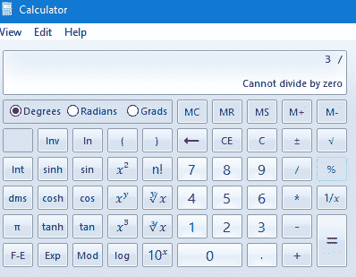

# 理解操作系统(第三部分)

> 原文：<https://medium.com/codex/understanding-operating-system-part-3-7df85242cce5?source=collection_archive---------13----------------------->

从，我们理解的操作系统系列再回来。在上一篇文章中，我们详细介绍了计算机系统是如何构造和分层的，并简要介绍了 Linux 操作系统。在今天的节目中，我将讲述计算机系统的物理状态和内核的概念，它们是如何工作的，以及为什么它们是操作系统的重要组成部分。

图片 bypixabay

## **概述**

*   **多道程序设计&硬件要求**
*   **CPU 特权模式**
*   **X86 保护环**
*   **模式开关**
*   **中断**

## **多道程序和硬件要求**

图片由 pixabay 提供

多道程序设计是同时运行多个进程。多道程序的工作原理是 CPU 在进程间切换的速度足够快，以使所有进程同时运行。从技术上讲，一个系统中的 CPU 一次只能运行一个程序(进程)。过去，CPU 只能处理一个进程，但技术进步使 CPU 的处理速度变得非常快，这就造成了所有进程同时运行的错觉。然而，也有一些现代的 CPU 被编程为一次只运行一个进程。

功能齐全的操作系统也需要硬件才能正常运行。操作系统需要 CPU 内部的某些硬件要求，如中断机制、时钟和 CPU 特权模式。

## 中断机制

CPU 中需要一种中断机制，以便在事件发生时能够抢占正在运行的进程。

## 时钟

时钟用于确定程序已经运行了多长时间。

## CPU 特权模式

CPU 也有隔离内核和用户的壁垒，所以非特权用户无法访问操作系统的内核。该模块中有两种模式:管理员模式和用户模式。

**管理员模式(内核模式)**

管理模式也称为内核模式，因为它有权直接访问内核来修改、编辑、删除和安装各种功能和进程。在这种模式下，CPU 启用所有可用的指令，并赋予操作系统内核访问系统上所有内存的能力。通过给操作系统内核更多的指令和特权，内核现在可以控制整个系统的内存。

**用户模式**

用户模式受到很大的限制，因为在计算机系统上有特权。用户模式与管理员模式相反，用户模式是为非管理员用户或只是临时访问计算机的客人设计的。与管理模式不同，CPU 禁用所有特权指令，并且大多数直接访问系统内存的操作都受到限制。用户正在使用的程序必须对操作系统执行系统调用(SCI ),以请求内存和其他所需的系统资源。CPU 内部的这个特性可以有效地隔离用户进程，防止它们干扰内核。

## X86 保护环

维基百科在 CC 许可下提供的图片

X86 保护环也是由操作系统实施的另一组保护层，用于限制对内核内部的访问。从环 0 到环 3 总共有 4 个环。从图中可以看出，ring 0 拥有最多的特权，从技术上来说，它位于内核级。Ring 0 可以访问所有的内存，执行所有的 CPU 指令。环 3 是用户空间层，在这些限制访问的环中，它的特权最少。实际上，大多数操作系统只使用环 0 和环 3。但是 OS/2 操作系统有一个例外。

**管理程序模式**

作者图片

随着虚拟机的日益普及，虚拟机管理程序模式的使用比过去更多。管理程序模式是低于环 0 的额外特权级别，管理程序模式也称为环 1。管理程序模式支持允许多个操作系统共享同一处理器的指令。这给我们带来了在一台计算机运行时使用多个操作系统的能力。启用虚拟机管理程序模式需要虚拟机管理程序软件。一些流行的虚拟机管理程序软件实例是 Vmware 和 Oracle VirtualBox。

**模式开关**

CPU 根据控制计算机的用户切换用户、内核或管理程序模式。如果 CPU 从内核得到一个需要模式切换来执行某个进程的信号，它将执行模式切换，但是与其他 CPU 功能相比，模式切换功能可能是一个较慢的操作，但是这也取决于您的硬件的能力。系统中发生模式切换的另一种情况也是执行中断的结果。中断可以分为两组:

## 非自愿的

非自愿中断是由操作系统之外的外部进程引起的。有两种非自愿中断:I/O 中断和时钟中断。I/O 中断是来自键盘或鼠标等输入/输出设备的中断信号。当一个进程正在运行时，如果用户移动/按下鼠标或在键盘上键入一个单词，就会发生 I/O 中断。时钟中断是基于时间的中断信号，来自主板上的定时器。如果某个进程被编程为在特定时间运行 X 操作，则可能发生时钟中断。

## 自愿的

自愿中断只存在于软件(进程)内部，与非自愿中断不同，它不是来自硬件。两种类型的自愿中断包括系统调用和异常。系统调用也称为系统调用接口(SCI)，这是一种用户空间与内核通信的协议。在这种情况下，系统调用被当作中断。异常也是由正在运行的进程产生的中断。如果存在 segfault(一种分段错误),则会触发异常，seg fault 是一种保护功能，如果软件试图通过实现代码来访问内核，这可能是进程内部的错误或程序本身的恶意活动的结果。异常中的另一个事件也可能发生，如果一个程序试图执行一个非法操作，在这种情况下被零除错误。如果硬件与计算机内存冲突，或者用户试图执行非法操作(如用 0 除一个数),就会发生被零除错误。

作者图片

这些是关于中断与计算机系统关系的一切。CPU 为检测中断请求和处理中断提供硬件机制和逻辑支持。

这就是我们理解操作系统系列的一切。我希望我们解释操作系统的连载文章确实帮助了您理解操作系统一般是如何工作的。这是我们这个系列的最后一篇文章。感谢你的朗读！

**参考:**

*   SILBERSCHATZ，a .，GALVIN，P.B .和 GAGNE，G. (2012) *操作系统概念，第 10 版*。
*   维基百科贡献者(2021) *CPU 模式*。可用地点:[https://en.wikipedia.org/wiki/CPU_modes](https://en.wikipedia.org/wiki/CPU_modes)。
*   维基百科投稿人(2022) *保护环*。可在:[https://en.wikipedia.org/wiki/Protection_ring](https://en.wikipedia.org/wiki/Protection_ring)买到。
*   GeeksforGeeks (2020) *中断和异常*。可在:[https://www.geeksforgeeks.org/interrupts-and-exceptions/](https://www.geeksforgeeks.org/interrupts-and-exceptions/)买到。
*   计算机希望(2020) *如何修复一个除数或被零除的错误*。地点:【https://www.computerhope.com/issues/ch000396.htm. 