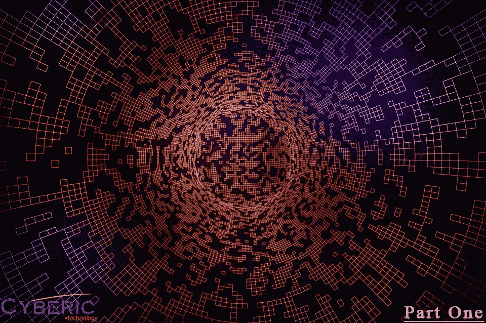
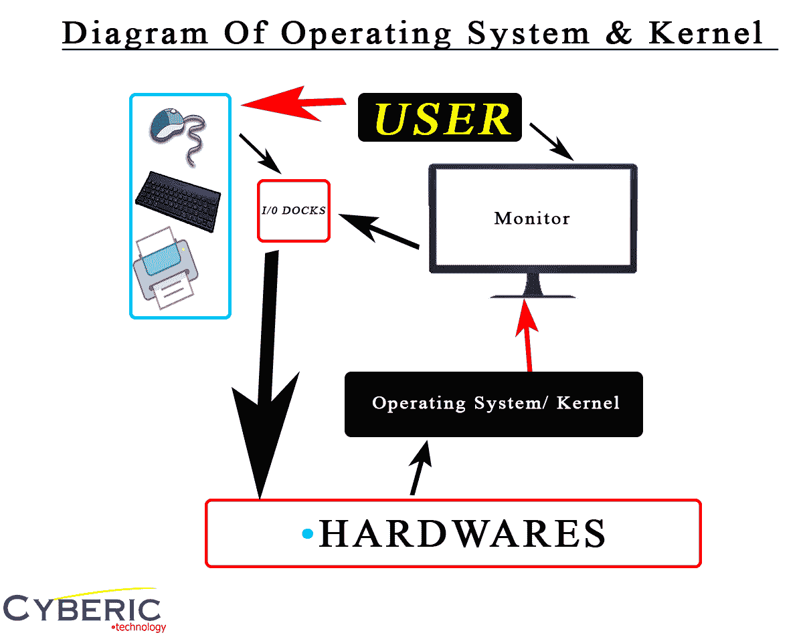

# 理解操作系统(第一部分)

> 原文：<https://medium.com/codex/understanding-operating-systems-part-1-d1f8d5c7dce8?source=collection_archive---------9----------------------->

图片由 pixabay.com 拍摄

今天我们做的有点不同于我们通常的网络安全文章，而是一些极客计算机科学，带给你你需要知道的关于操作系统概念的一切。

*(本文基于 Mike Murphy 博士在 youtube 和外部资源上的计算机科学讲座。)*

**什么是操作系统？**

嗯，维基百科上说“一个**操作系统** ( **OS** )是管理计算机硬件、软件资源，为计算机程序提供通用服务的系统软件。”也就是说，解释操作系统的一个愚蠢的方式是用户和计算机的语言翻译器。谁来翻译计算机用人类语言对用户说的一切。但是操作系统的概念和机制比调用翻译器更复杂。所以，让我们深入操作系统的兔子洞。

作者图片

## **电脑到底是什么？**

**电脑是一台** [**数字电子**](https://en.wikipedia.org/wiki/Digital_electronics) [**机器**](https://en.wikipedia.org/wiki/Machine) **可以被编程为** [**执行**](https://en.wikipedia.org/wiki/Execution_(computing)) [**序列**](https://en.wikipedia.org/wiki/Sequence)[**算术**](https://en.wikipedia.org/wiki/Arithmetic) **或** [**逻辑运算**](https://en.wikipedia.org/wiki/Logical_operations)

***-*** *百科*

电脑基本上只是一个高级计算器，也就是说，电脑在开机时不会停止计算，如果你打开 youtube.com，电脑只会计算更多，以显示你正在观看的视频。那么，让我们来看看计算机的组成部分，我们可以将它们分为硬件、操作系统和软件。硬件是计算机计算最基本的驱动因素:CPU、GPU、存储、主板和 Ram 都是裸机硬件。同时，鼠标、键盘、扬声器和打印机也可以被称为硬件，但它们属于被称为输入和输出设备的 I/O 设备的子类。现在，在硬件和软件之间出现了操作系统，操作系统将硬件计算翻译给用户，并将用户的命令翻译给硬件进行计算。软件是计算机的顶层，像浏览器、视频播放器和视频游戏

## **抽象**

抽象是一种技术，或者我更愿意说是一种功能，让操作系统能够理解主板内部的任何硬件，以便您正在使用的软件能够理解您正在使用的硬件。在现代，将一个未知的 cpu 或 ram 放入主板不再是一个问题，只要你可以将其插入主板或它能够处理你正在使用的软件。早在 20 世纪 90 年代，某些计算机游戏需要您配置 cpu 和 gpu 才能运行，因为操作系统缺乏抽象性，因此导致软件不知道您使用的是哪种硬件。

## **仲裁**

仲裁和抽象是操纵计算机硬件给用户带来更好的体验和效率的两兄弟。仲裁起到控制器的作用，将硬件资源分配给各个正在运行的进程或应用。仲裁不仅在操作系统中带来了更有效和更充分的多任务环境，而且还实施了系统和安全策略，以隔离应用程序之间的相互干扰。在这种情况下，仲裁保护一个运行崩溃的软件不影响其它运行的软件，防止它们相互冲突。

## **内核&用户空间**

根据韦氏词典，kernel 一词是从古英语 cyrnel 演变而来，意思是“种子、果核或坚果内部较软的部分”。

内核是操作系统的核心，隐藏在操作系统的底层，是操作系统与硬件交互的地方。内核运行它的主要四个任务是:

1.  ***内存管理:*** *记录有多少内存用于存储什么，以及存储在哪里*
2.  ***进程管理:*** *确定哪些进程可以使用中央处理器(CPU)，何时使用，使用多长时间*
3.  ***设备驱动:*** *在硬件和进程之间充当中介/解释器*
4.  ***系统调用和安全:*** *接收来自进程的服务请求*

*(鸣谢:RHEL)*

简而言之，内核是硬件和软件(即操作系统)之间的主要驱动程序，类似于仲裁的功能。

内核和用户空间有着有趣的关系，这两层通过一个叫做 SCI(系统调用接口)的过程相互作用。用户空间包含两个类别，即“应用程序”和“库和实用程序”。因此，基本上用户空间是计算机系统的可见层，SCI 也是操作系统的一个重要机制，因为它能够将用户空间与系统资源进行交互。

非常感谢您的阅读。这篇文章有点短，但我希望大家喜欢今天的文章，并继续关注第 2 部分。

***在 Twitter 上关注我们:***[***https://twitter.com/CybericTech***](https://twitter.com/CybericTech)

*[***https://www.facebook.com/profile.php?id=100087224795789***](https://www.facebook.com/profile.php?id=100087224795789)*

***参考文献***

*   ****学术课。(2019 年 8 月 30 日)。操作系统全教程|新手操作系统教程。YouTube。***【https://www.youtube.com/watch?v=mXw9ruZaxzQ】*
*   ****操作系统的*组件。(未注明)。检索 2022 年 11 月 2 日，来自***[***https://www . tutorialspoint . com/operating _ system/OS _ components . htm***](https://www.tutorialspoint.com/operating_system/os_components.htm)**
*   *****西尔伯沙茨，a .，高尔文，p . b .&加涅，g .(未注明)。操作系统概念(第 9 版。)[PDF]。约翰·威利&父子公司*****
*   *****维基百科贡献者。(2022 年 10 月 12 日)。操作系统。维基百科。***[***https://en.wikipedia.org/wiki/Operating_system***](https://en.wikipedia.org/wiki/Operating_system)**
*   *****维基百科贡献者。(2022b，10 月 23 日)。电脑。维基百科。【https://en.wikipedia.org/wiki/Computer】*****
*   ******什么是 Linux 内核？(未注明)。检索 2022 年 11 月 2 日，来自***[***https://www . red hat . com/en/topics/Linux/what-is-the-the-Linux-kernel***](https://www.redhat.com/en/topics/linux/what-is-the-linux-kernel)***
*   *****威廉·l .(2022 年 9 月 10 日)。OS(操作系统)中的系统调用:什么是，类型和例子。Guru99。***[***https://www.guru99.com/system-call-operating-system.html***](https://www.guru99.com/system-call-operating-system.html)**