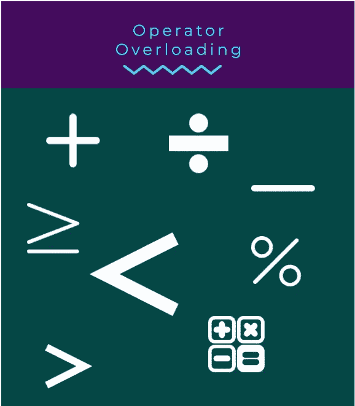

# 了解 Swift 中的运算符重载

> 原文：<https://medium.com/codex/understanding-operator-overloading-in-swift-1f2cad16243c?source=collection_archive---------3----------------------->

## 使用运算符重载来实现您的运算符，甚至调整现有的运算符



在开始之前，我们将通过重载`==`操作符来理解`Operator Overloading`。

我们都知道上面的代码的结果会是什么，对吗？`1`总是等于`1`从而印出`True`。现在我们将通过重载来修改`==`操作符。我们可以通过编写一个类似下面代码的小函数轻松做到这一点。

在这之后，现在每当我们运行我们的第一个代码片段时，它将总是打印`False`，因为我们已经修改了`==`操作符以总是返回`false`。

从上面的片段中，我们可以了解到函数的名字是操作符。`func ==`。就参数而言，我们有两个整数。`lhs`(左手侧)和`rhs`(右手侧)。该函数将返回一个`boolean`。

操作者还有`precedence`和`associativity`，两者都会影响操作的结果。Swift 首先使用优先级最高的操作员。就像我们的 BODMAS 法则一样。

现在我们来试着理解一下`precedence`和`associativity`。为此，我们将看到一个小数学题。

```
let num = 5 * 2 + 2 * 10
```

根据 BODMAS 法则，乘法应该先执行，所以先执行`5 * 2`，然后是`2 * 10`，最后是加法。`10 + 20` = `30`

同样的内容也被输入到 Swift 标准库中。

在这里你可以看到他们使用了`infix`。这些操作符被称为`infix`，因为这些操作符被放置在两个操作数之间。`1 + 2`举个例子。

和`infix`一样，还有其他的符号也叫做`prefix`和`postfix`

```
**infix - ** operators are placed between two operands **prefix -** operators are placed before operands **postfix -** operators are placed after operands
```

## 优先级和结合性

`**Precedence**`优先是设置运算符优先级的一种方式。优先级值越高，运算符的优先级越高。优先级值的范围可以是 0..255.

让我们试着改变`*` an 操作符的优先级值，如下所示。

现在让我们看看我们最初的问题会发生什么。

```
let num = 5 * 2 + 2 * 10
```

因为优先值`*`被设置为小于`+`运算符的值。这里`+`操作员将优先。因此，结果将是`200`。

`**Associativity**`结合性是指相同优先级的运算符如何分组——从左或从右。

让我们尝试改变`+`操作符的结合值，如下所示。

让我们看看下面的问题。

```
let num = 8 - 4 - 2
```

在典型情况下，计算将导致`2`。但是随着`associativity`值改为`right`，现在将解释为`8 — (4 — 2)`，结果为`6`。

我们已经到了这个故事的结尾。我希望您已经理解了运算符重载的概念。

如果你喜欢这个故事，请分享并关注我的帐户，以获得更多类似的故事。如果你有任何疑问或建议，请告诉我。感谢阅读。