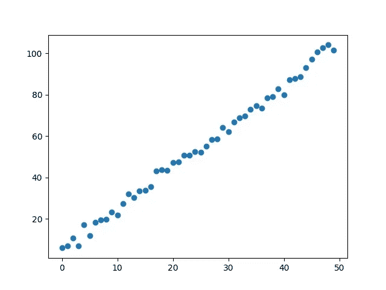
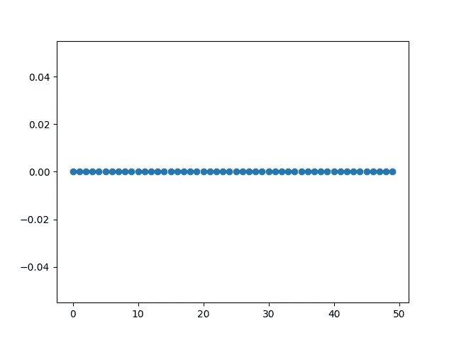
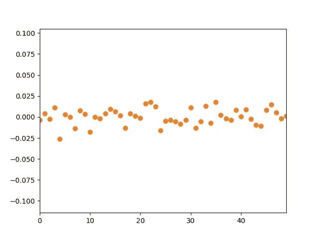
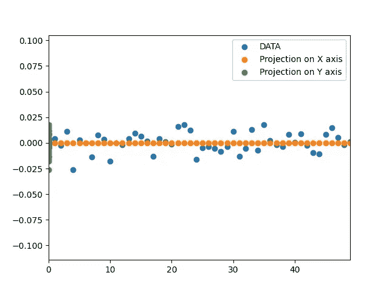

# 理解主成分分析

> 原文：<https://medium.com/codex/understanding-principal-component-analysis-533a78150907?source=collection_archive---------19----------------------->

这篇博客的主要目的是强调这样一个事实，即学习新事物时遇到的障碍应该是学习更多先决条件的借口，而不是逃避你首先想学的东西的借口。我想做的是通过问一些自然的问题来建立一种自然的主成分分析方法，这将引导我们对这个话题的理解不需要微积分。然而，线性代数将被大量使用；我会尽我所能涵盖一切。首先，我们从目标开始。我们给出一些数据" **X"** 也就是a *f x m(特征 X 实例)*矩阵；为了简单起见，假设我们有两个特性。为了向前推进，让我定义一些我将使用的符号:@是矩阵乘法(它在一些矩阵乘法不言而喻的地方被跳过，这只是使方程简洁)，一个点(。)用于点积。我们想要开发的是帮助我们更好地表达数据的工具。我这么说是什么意思？看看下面绘制的数据:

这是一条线。对于一个清晰的一维数据使用二维难道不是多余的吗？这本身并不是一个特别好的表现。因为有很多冗余。数据可能只是在 x 轴上，不会有太大的不同。为什么我们想要数据的低维表示？在机器学习的背景下，较少的特征有助于加快训练。但总的来说，这可能是对数据去噪的一个典型主题:如果首先生成这个的函数实际上是一条线的方程，而数据点与这条线的偏差是随机噪声，那会怎样？将数据转换到较低的维度，即将其投影到 x 轴上，然后通过旋转 x 轴将其转换回 2d，以匹配原始线的斜率，这将消除噪声。记住用途，让我们从目标开始:我们想要做的是去除多余的维度。我们如何做到这一点？在这种情况下，答案似乎很明显:首先我们旋转我们的轴，使 x 轴与数据所在的线对齐，然后我们移除每个数据点的 y 分量，因为旋转后每个数据点的 y 分量几乎为 0。

首先旋转轴，然后将数据点投影到 x 轴上。

现在的问题是，我们想用数学来描述它，所以我们需要一些数学上可定义的目标。首先，很明显，我们希望从数据中删除冗余，这涉及到数据在 2d 中位于一条线上，在 3d 中位于一个平面上，等等(我们稍后会考虑丢弃额外的维度，这里我们只考虑线性低维可提取表面)。我们考虑这些低维线性表面的原因是，比方说，数据在 2d 中的一条线上，那么我们可以将 x 轴旋转到这条线上，并放弃其他维度；如果它在 3d 平面上，那么我们可以旋转 x，y 平面以匹配数据平面，并丢弃其他维度。这是 PCA 做出的一个假设:重要数据位于一个较低维度的**线性**表面；在更实际的情况下，例如图像，这种假设不一定是正确的，并且开发了更复杂的工具和算法来解决这些问题。现在坚持使用 PCA，让我们试着想出一个更数学的方法。如果数据在 2d 中的一条线上，这意味着数据的协方差不为零，对吗？这来自协方差的定义:它测量数据的趋势。现在，这是一个特别伟大的观察，因为我们有测量协方差的方法。本质上计算起来很简单，如果你想回忆起这些概念，我推荐你看[这个视频](https://www.youtube.com/watch?v=WBlnwvjfMtQ&ab_channel=LuisSerrano)，因为它比我能更好地解释这个话题。如果我的意思是将数据 **X** 沿每个特征维度居中，并将其称为 **Xbar，**，那么协方差就是 **(1/m)(Xbar@Xbar^T)** 的非对角元素(对 2d 数据执行矩阵乘法如果这让你感到困惑，我还会跳过 1/m 因子，以避免在进一步提及协方差矩阵时出现混乱。)现在我们要的是 0 协方差，为什么？我们知道协方差是我们对冗余的度量(记住我们所说的冗余是指位于低维线性表面上的数据:2d 中的一条线，3d 中的一个平面，3d 中的一条线，等等)。)，并且开发建模数据的方法以使其具有 0 协方差，这将迫使数据所在的线或通常的超平面变平(首先我们移除冗余，然后我们移除额外的维度，在上面的示例中，移除冗余是轴的旋转，移除冗余维度将在稍后解释)。现在，这给了我们一个数学上可定义的目标:我们想要的是一个变换 **P** ，它将 **Xbar** 变换到一个新的空间，称之为**“y”**，**，使得 Y@Y^T 的非对角元素(协方差)为 0**；这一切只是来自于我们所定义的目标。所以让我们把它写下来: **Y=P@Xbar** 这样**y@y^t =(p@xbar)@(p@xbar)^t**就是一个对角矩阵；简化:

**(pxbar)(xbar)^t(p^t)**=**p(xbar)(xbar)^t(p)^t**

let’s write **(Xbar)(Xbar)^T as S**, we find that **P(S)P^T must be a diagonal matrix;** if you have some knowledge of the concept of diagonalization in linear algebra this equation might have ringed some bells; because you must have seen that **P^(-1)SP** , where P is a matrix containing the eigenvectors of S, gives us a diagonal matrix where the diagonal entries are the eigenvalues of S. Again if you’re not familiar with the topic, or if you want to review it, I recommend checking out 3Blue1Brown’s [awesome series](https://www.youtube.com/watch?v=fNk_zzaMoSs&list=PLZHQObOWTQDPD3MizzM2xVFitgF8hE_ab&ab_channel=3Blue1Brown) on Linear Algebra. We have **P(S)P^T** instead of the other way around(kind of ignoring the fact that we have a transpose in place of an inverse at the moment, this will be explained in a bit); this can be circumvented: just use **Y=(P^T)Xbar** which gives us **YY^T = (P^TXbar)(P^TXbar)^T** which is **P^T(Xbar.Xbar^T)P** or **P^T(S)P**. Moving on, this is where we hit our first hurdle: there’s a P^(T) instead of P^(-1). What I want do first is figure out for which matrices P, P^T = P^(-1). We’ll then move forward with our analysis. To do so I want to delve deeper into what transposes do, which will make this a bit easier to understand: When we imagine a linear transformation **“A”** we imagine taking the linear combinations of the vectors in its columns; so for instance, if we have a 3x2 transformation you may imagine it as taking the linear combination of 2 vectors in 3d, which gives us a plane. To visualize transposes, first let’s give names to some stuff; **A** has two 3d vectors let’s call them **v** and **w**. Now, for A^T, we imagine the same two vectors but this time to see where a 3d vector **z** lands after A^T has been applied to it (A^T is now a transformation from 3 to 2 dimensions) we imagine dotting the vector **z** with **v** to get the x component of the transformed vector, and we dot **z** with **w** to get the y component of the transformed vector(If this is not obvious, write it on a piece of paper and think about what the matrix multiplication is doing). This, by the way, is also a way of understanding why the column space of A must be perpendicular(orthogonal) to the null space of A^T; I suggest you think about it a bit, if you want to. (if you’re not familiar with these concepts of column spaces, just forget about what I said.) Say z has components **z_x, z_y** and, say,we applied **A** to **z** to get the the transformed vector **Az**,call it **z_t.** Recall that **v** is where the unit vector **ihat** lands after **A** is applied to it and **w** is where **jhat** lands if **A** is applied to it; Now if A^T = A^-1 this means that dotting **z_t** with **v** gives us **z_x** and dotting **z_t** with **w** gives is **z_y**; this should be obvious given the above explanation of the transpose. Note that **z** dotted with **ihat** is **z_x** too. What we now have is **z . ihat = z_x** and, if we say **v = ihat_t = A.ihat**(remember v is where ihat lands when A is applied to z), then **z_t . ihat_t= z_x.** This means than A preserves dot products because **z** before or after the transformation dotted with ihat(pristine and transformed) gives its x component. Preserving dot products means 2 things: angles b/w vectors are preserved and the lengths of the vectors are preserved. This suggests the transformations to be rotations. So for rotation matrices A^T = A^-1\. Now for a rotational matrix **“R”** all the vectors in it are orthogonal to each other, for they are the rotated basis vectors which were orthogonal to each other. Moreover they are of unit length(perpendicular normalized vectors are called orthonormal vectors). In our case we have the matrix S and its eigenvectors are in the matrix P; what we wanted to show was that P^T = P^-1, because if that is true then we can almost diagonalize, there’s more stuff left to prove. This asks the question: **Are the eigenvectors of S orthonormal?** S is xbar.xbar^T, the only algebraic property noticeable should be that it is symmetric **S^T = S**. **Do symmetric matrices have orthogonal eigenvectors?** S also needs to have a full set of eigenvectors for us to be able to decompose it like that. **Does it fulfill that requirement ?** We also do not want complex eigenvectors, so **are the eigenvectors of symmetric matrices real?** These, to the best of my knowledge, can be answered algebraically. I, sadly, lack a convincing geometrical argument. I encourage you to stop and look these things up; this was the primary theme of the blog, remember? A symmetric matrix does, as a matter of fact, satisfy all of these properties. Isn’t it surprising that having just this one symmetric property translates into having a bunch of other very useful properties? So there we go, we have our matrix P that will remove any redundancy in the data for us. The matrix is the eigenvectors of **xbar.xbar^T** stacked horizontally. We now come to the topic of dimensionality reduction which is a just a little addition on top of this. Take a look at this picture below.

你不认为 y 轴有点多余吗？你是如何着手解决这个问题的？我们如何从数学上确定维度的重要性？也许暂时停止浏览博客，看看你能否得出一个合理的结论。如果你仔细看看上面的图片，你应该可以看到数据在 x 轴上更加分散，而在 y 轴上被压缩。

因此，衡量一个维度的重要性的问题的一个自然结论是衡量数据在该维度上的分布，对吗？即数据在该维度上的方差(为什么我们不测量平均值呢？).如果你对所做的声明有疑问，考虑几个案例。现在我们也知道协方差矩阵已经包含了每个维度上的方差: **xbar@xbar^T** 的对角线值代表了每个轴上的方差。现在，既然我们已经将**“x”**转换为**“y”，**我们想要查看 **YY^T** 的对角线条目，每个条目都给出了每个维度的方差，这是我们对该维度重要性的度量。 **YY^T** 是 **P^TSP** ，(s 是 Xbar。Xbar^T)和 P^TSP 的对角线条目是 s 的特征值，因此 s 的特征值给我们每个维度的重要性，即沿着每个维度的方差。现在通常是这样做的:我们需要把 x 转换成 y，通过对 x 应用 P^T，p 是 X.X^T 的特征向量的矩阵，我们能做的是得到 X.X^T 的特征值；如上所述，每个维度的重要性是什么，这意味着什么？这意味着，如果我们，比方说，在将 P^T 应用于 x 并得到 y 之后，从 p 中取两个具有特征值 e1 和 e2 的向量，( **Y=P^TX** )沿每个变换轴的方差将等于 e1 和 e2。如果 e2 足够低，我们可以用 X 乘以 P 的第一个本征向量和本征值 e1，这样我们就不会得到多余的维数。如果 **XX^T** 具有带 f 个特征值的 f 个特征向量，那么我们丢弃具有低特征值的特征向量，然后将特征向量堆叠到矩阵 p 中，并将其应用于 x，从而获得不相关的、维数减少的数据。通过将 P 应用于 Y，数据被转换回原始空间；X_t = PY。井 P 是非方阵；理想情况下，我们会想要应用(P^T)^(-1)Y 是(P^T)^T(Y)或者只是 PY(如果 p 是一个旋转矩阵，那么 P^T 也是一个旋转矩阵，当然因为 P^T 是 P^(-1)这只是对角的旋转)；但是对于非方阵，没有定义逆矩阵。仍然使用 P 进行逆变换的正当性来自于矩阵的奇异值分解；我现在不会深入探讨这个问题。当我们在已经转换到较低维度空间之后转换回原始空间时，数据的一些变化将会丢失；这个方差是我们丢弃的特征向量的特征值之和，因为它们太低了。如果我们假设这个额外的方差是噪声，这对于一些数据集来说是正确的，那么在执行这些步骤并转换回原始空间之后，事实上，为我们提供了无噪声的数据。这些仅保留高方差维度的想法本身就很重要，如果你在机器学习中学习自动编码器，它模糊地建立在 PCA 提供的脚手架上。