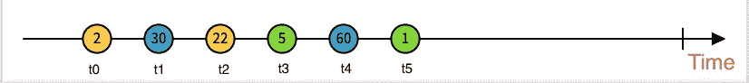
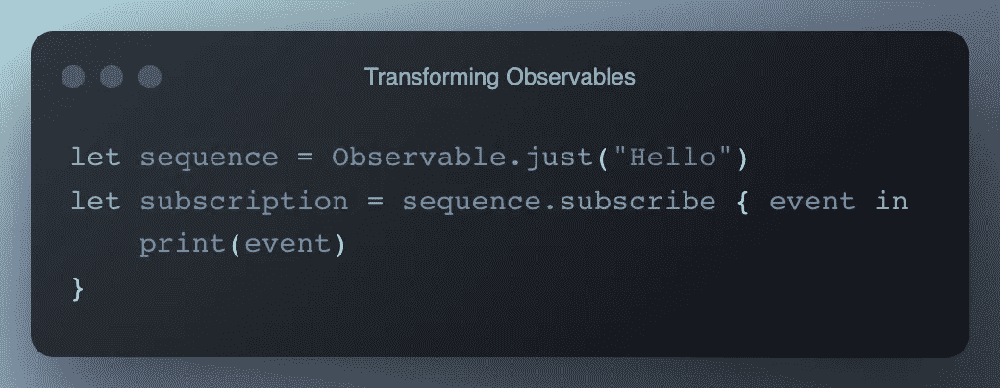

# 终极 RxSwift 指南

> 原文：<https://medium.com/codex/understanding-rxswift-basics-in-the-simplest-way-6206c78f111d?source=collection_archive---------4----------------------->

看得见的..看得见的..可观察到的是，我们都从第一个词开始学习 RxSwift，我相信至少 90%的人结束他们的学习没有任何进展。没问题，我们都在同一条船上。在本文中，我将尽我最大的努力让大家以一种基本的方式理解 RxSwift。

## 什么是可观察的？

可观测值只是 Swift 中序列的一种等价形式。让我帮助你想象一个可观察的。
想一个`array`。使用数组，您可以做哪些事情？
你可以做很多序列变换运算、计算运算以及很多其他的操作，对吗？此外，您还可以使用`map`、`filter`、`reduce`等高阶函数。所有这些优势在你的`Observable`
中也是可行的。我们将一个字符串元素数组转换成一个整数数组，对吗？同样地，我们可以把一个可观察的转化成相当多的其他形式。

## 等等，有区别的！！

`array`和`Observable`之间有区别，那就是`time`。
我将帮助您想象`time`在这里是一个怎样的不同因素。
考虑一个有六个元素的数组。这六个元素都可以访问，并且可以同时访问。但是在`Observable`的情况下，每个元素都将与一个特殊的时间相关联，如下所示。

因此，从上面的图像中，我们可以清楚地理解，两个元素仅在 t0 时间可用。30 元素仅在 t1 时间可用。等等。
希望你现在已经得到了差异因子。

> ***注*** :
> 可观察的整体思想是，你可以订阅它，你就可以得到那些事件。

## 创建可观察对象

要创建一个可观察的对象，我们只需要使用可观察类称它为可观察的，并使用您想要观察的序列调用可观察类中的一个函数。我将展示一些可观察对象的例子，以及它是如何创建的，并熟悉可观察类中的一些常见函数。

`Just`

这一个将创建一个只有一个特定元素的可观察。

`Of`

这种可观察性允许您创建一个包含各种元素的可观察性。此外，它还意味着元素集的这些可观察函数在其中被指定。也就是说，如果您将`[1,2,3]`指定为一个数组，而不是一个不同的元素，那么可观测量会将其视为一个整数数组类型。

`from`

默认情况下，这个可观察对象接受一个元素数组，但是可观察对象将对指定数组中的单个元素起作用。

## 由 Observables 发出的事件。

在此之前，我们将再次回到数组的概念。我们将想象访问元素。正如我所说的，数组只不过是一系列元素。现在 swift 中的一个序列通常在`Iterator Protocol`上工作

上图来自苹果开发者文档。`IteratorProtocol`你可以清楚地看到 Swift 将`IteratorProtocol`分配给所有序列。所以封装开发者文档里写的关于 IteratorProtocol 的东西就是它只有一个功能，那就是`next()`。

`**Next**` 在`for-loop`中，`next()`函数在每次迭代中被调用，直到`next()`函数返回零。我为什么这么说是因为，在开始，我提到了`Observables`也就是`Sequences`。所以我们现在知道一个可观察对象可以访问名为`next()`的属性。我们还知道`Time`维度，也就是这里的微分，对吧？所以我们可以说，可观察的可以听`next()`事件。
所以如果你有一个`Observable<String>`，那么每个`next`事件都会带有一个`String`。

`**onError**`至此我相信你应该对`next`有了一个清晰的认识。正如我之前说过的，Observables 工作在迭代器和观察者模式上。考虑到`for-loop`我们总是可以在满足功能需求的情况下失败/中断/从`for-loop`返回。现在，同样的功能或用户错误警报也已经提供给了 Observables，它还可以监听一个名为`onError`的特殊事件，告诉我们发生了错误。

多与`onError`事件相同或相似。唯一的不同是，当它想要它的观察者知道它已经完成了这个过程时，它被可观察到的事物触发。

## 捐款

无论发出的是什么，我们都必须捕获发出的事件，因为这是 RxSwift 的全部目的。我们可以使用`subscribe(on: (Event<T>) -> Void)`方法捕捉/监听来自`Observables`的事件。

上面的代码产生了下面的 o/p
`Output: next(Hello)
Output: completed`

上述函数中的`event`为`enum`值，可以是我们之前提到的以下值之一:`**Next**` **、** `**onError**` **、** `**onCompleted**` 等。
如果您想订阅不同种类的活动，您可以使用
`**func** **subscribe**(onNext: ((**T**) **->** **Void**)?, onError: ((**Error**) **->** **Void**)?, onCompleted: (() **->** **Void**)?, onDisposed: (() **->** **Void**)?) **->** **Disposable**`

## 把剩菜扔掉！

内存泄漏是一件非常痛苦的事情。使用观察者模式会增加两倍的内存泄漏风险。但是在 RxSwift 中，有一个简单的方法来处理内存泄漏，一个更软的方法是在使用结束后处理所有订户，这是通过调用订阅上的`dispose()`函数来完成的。因此通过调用`dispose()`函数，订阅将被立即处理掉。

还有另一种简单的方法来实现这一点，那就是将它添加到一个`DisposeBag`中。通过在 Disposebag 中添加订阅，当父类被取消初始化时，订阅将被释放。

我希望这篇文章已经帮助你理解了 RxSwift 的核心概念，并且我期望你们所有人在你们的项目中尝试一次。