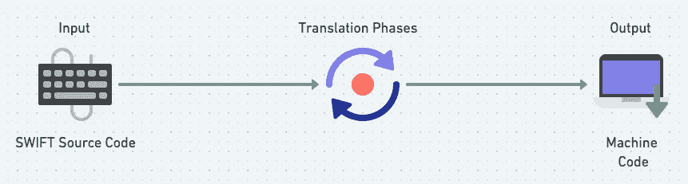
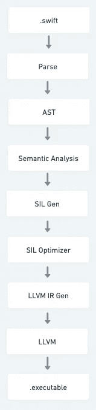

# 了解 Swift 编译器

> 原文：<https://medium.com/codex/understanding-swift-compiler-862f0a291db6?source=collection_archive---------1----------------------->

## 揭秘 Swift 源代码如何转换为可链接到可执行文件的目标代码

[Zan](https://unsplash.com/@zanilic?utm_source=medium&utm_medium=referral) 在 [Unsplash](https://unsplash.com?utm_source=medium&utm_medium=referral) 上的照片

在深入了解 Swift 编译器之前，我们将尝试理解什么是编译器和解释器编程语言。

编译器
编译器和解释器都将高级语言翻译成低级语言。

我们通常使用高级语言编写计算机程序。高级语言是我们人类可以理解的语言。这个叫做**源代码**。例如 Swift、Java、C、C++等。另一方面，低级语言更多的是机器语言。这些需要汇编程序来翻译指令。然而，计算机不理解高级语言。它只懂二进制的 0 和 1 写的程序，叫做**机器码**。

*   编译器扫描整个程序，并把它作为一个整体翻译成机器代码。
*   编译器还会找出程序编译过程中遇到的各种错误。
*   编译器使用各种阶段将高级语言转换成低级语言。(关于这一点的更多信息在后面的部分)

口译员一步一步地翻译。解释器是一个直接执行程序代码的程序，而不仅仅是把它翻译成另一种格式。解释程序解释源程序所需的时间比编译器少。

*   没有用解释器生成的目标代码，因此内存效率高。
*   像 JavaScript、Python 和 Ruby 这样的编程语言使用解释器。

## Swift 编译器

Swift 编译器主要负责将 Swift 源代码翻译成高效、可执行的机器代码。正如我之前说过的，将源代码翻译成机器码可以分多个阶段实现。我将解释**降低的每个阶段(**获取高级语言(Swift)并将其转换为可以在实际硬件上高效运行的机器代码的过程 **)** 过程。

Swift 编译器基础版

**翻译阶段**

*   **解析** :将输入的源代码解析成令牌，放入抽象语法树中。在抽象树中，每个表达式都是一个节点。该节点保存源位置信息。解析器检查语法错误，并为输入源生成相同的警告或错误。在抽象树节点的帮助下，很容易判断问题发生在哪里。
*   **语义分析:** 如果在解析阶段没有任何错误，我们将进入下一阶段，即语义分析阶段。在语义分析阶段，我们使用 AST 将其转换成一个更具类型检查的 AST。
*   **铿锵导入:**
    一旦生成了经过类型检查的 AST。它被传递到 Clang Importer 阶段，在此导入 Clang 模块，并将 C 或 Objective-C API 映射到 Swift APIs。
*   **SILGen (Swift 中间语言):**
    Swift 代码的优化就发生在这里。在这里，它将经过类型检查的 AST 降低到所谓的原始 SIL 中
*   **SIL 保证转换:** 这里它执行影响程序正确性的额外数据流诊断(比如使用未初始化的变量)。这种转换的最终结果导致了规范的 SIL。
*   **SIL Optimizer :** 在这里，它对程序执行额外的高级 SWIFT 特定优化，包括(例如)自动引用计数优化、调度规则、Swift 类型和通用专门化。
*   **LLVM IR 发生器:** SIL 降低到 LLVL 的中间表示在这里发生。这里的说明不再与 Swift 相关，或者是 Swift 特定说明。
*   **LLVM :** 在这里，IR 被优化并降低为特定平台的机器指令。

Swift 编译器管道

我希望你明白 Swift 编译器是如何工作的。请**关注**获取更多类似的帖子。祝你有美好的一天，❤️！！！