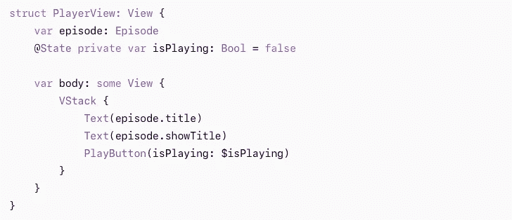

# 了解 SwiftUI 属性包装

> 原文：<https://medium.com/codex/understanding-swiftui-property-wrappers-f9b75b4790a8?source=collection_archive---------12----------------------->

萨姆·穆卡达姆在 [Unsplash](https://unsplash.com/s/photos/head-spin?utm_source=unsplash&utm_medium=referral&utm_content=creditCopyText) 上拍摄的照片

如果你是 SwiftUI 的新手，你可能会大吃一惊。这是一个全新的世界！虽然设置 UI 相当简单，也很容易实现，但是当您试图在视图之间共享数据时，就会停下来挠头。

没有 IBActions 或 IBOutlets，没有故事板来控制从一个片段到另一个片段的拖动，prepareForSegue 和 performSegue 方法不再是一个东西。那怎么办呢？别担心，苹果已经开发出一些方便的属性包装器来满足你的所有需求。

那么这些属性包装器是什么，它们做什么？

在本文中，我们将讨论用于存储临时数据的内存:

@State、@Binding、@StateObject、@ObservedObject、@Published 和@EnvironmentObject。

我不得不说，当我第一次被介绍到这些的时候，我的头有点晕。我一直跟着教程走，这有点道理，但当我去构建自己的应用程序时，我不太确定什么时候用什么。希望这个概述将帮助您区分何时使用每个属性包装器。

先说**@状态**。

**苹果实际上说它应该写成 **@State private** ，因为它只能在那个视图中使用。

您将希望使用 **@State** 来存储视图本地使用的值类型。当视图中的属性将发生变化时，您将需要使用它。

等一下…💡你可能会对自己说，SwiftUI 中的视图是结构，这意味着它们是不可变的，你不能改变它们的属性。这就是为什么苹果公司创建了 **@State** 属性包装器，以允许我们修改结构中的值。

将我们带到 **@Binding** 属性包装器。与 **@State** 齐头并进。

这里是苹果的定义:***@ Binding****是一个属性包装器类型，可以读写一个真实来源所拥有的值。使用绑定在存储数据的属性和显示并更改数据的视图之间创建双向连接。绑定将属性连接到其他地方的真实源，而不是直接存储数据。*

*例如，在播放和暂停之间切换的按钮可以使用绑定属性包装器创建到其父视图的属性的绑定。*

每当用户点击播放按钮时，PlayerView 将更新正在播放的状态。

现在，当谈到跨许多视图共享数据时，苹果给了我们一些属性包装器来使用。

先说 **@StateObject** 和 **@ObservedObject** ，两者都有很多相似的功能但是用途不同。

简而言之， **@StateObject** 应该用于初始化对象，而 **@ObservedObject** 则用于从先前的视图中传递对象。它依赖于来自父视图的数据。

一个帮助你记住区别的小提示，每当你看到 **@State** 或者 **@StateObject** ，就意味着当前视图拥有这个数据。永远不要使用 **@ObservedObject** 来创建你的对象的实例，这就是 **@StateObject** 的用途。 **@ObservedObject** 用于当您从另一个视图传递数据，并且您需要来自那个视图的数据时。

接下来我们有了 **@EnvironmentObject** 属性包装器，它允许我们在任何需要的地方共享模型数据，同时也确保我们的视图在数据改变时自动保持更新。

使用 **@ObservedObject** 你必须将它从一个视图传递到下一个视图，才能访问它，比如说，两个视图。有了 **@EnvironmentObject** ，所有的视图都会自动访问它。

同样像 **@ObservedObject** 一样，您永远不会给 **@EnvironmentObject** 属性赋值。该值应该从其他地方传入，很可能是由某个地方的 **@StateObject** 创建的。

很重要的一点要注意: **@StateObject** 、 **@ObservedObject** 、 **@EnvironmentObject** 必须引用符合 **ObservableObject** 协议的类。

**ObservableObject** 是一个方便的协议，它将类实例转化为发布者，发布者可以向订阅它们的任何人发送值。为此，必须使用 **@Published** 属性包装器声明类中的属性。

**@Published** 属性包装器向 SwiftUI 广播更改已经发生，它应该触发视图重载。与必须告诉 tableview 重新加载的时代相比，这无疑是一次升级。

快速回顾一下，尽量让它保持清晰:记住，无论何时看到 State，不管它是 **@State** 还是 **@StateObject** ，它都是用来在内存中保存状态的。

对于在本地创建和管理的简单值类型数据，使用 **@State** 。 **@Binding** 指的是在不同视图上拥有的值类型数据，在本地改变绑定也会改变远程数据。

**@StateObject** 用于在本地创建和管理引用类型数据，并且可以使用 **@ObservedObject** 在其他视图之间共享。但是不要忘记，为了更新你的视图，你需要设置你的类来符合 **ObservableObject** 协议，并且你需要设置你的属性为 **@Published** ，这样当有变化时它们会广播，这样视图就可以刷新。

这只是属性包装器的冰山一角。我们只触及了其中六个的表面。查看 Paul Hudson 的这篇[好文章](https://www.hackingwithswift.com/quick-start/swiftui/all-swiftui-property-wrappers-explained-and-compared)，它讨论了 iOS 14 中目前可用的所有 17 个属性包装器。

编码快乐！