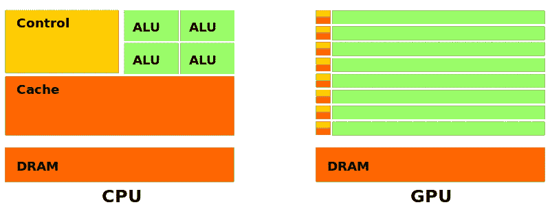
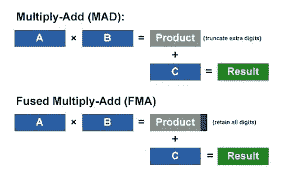
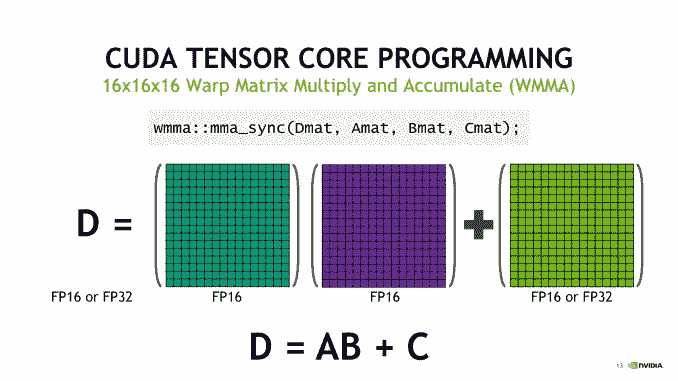
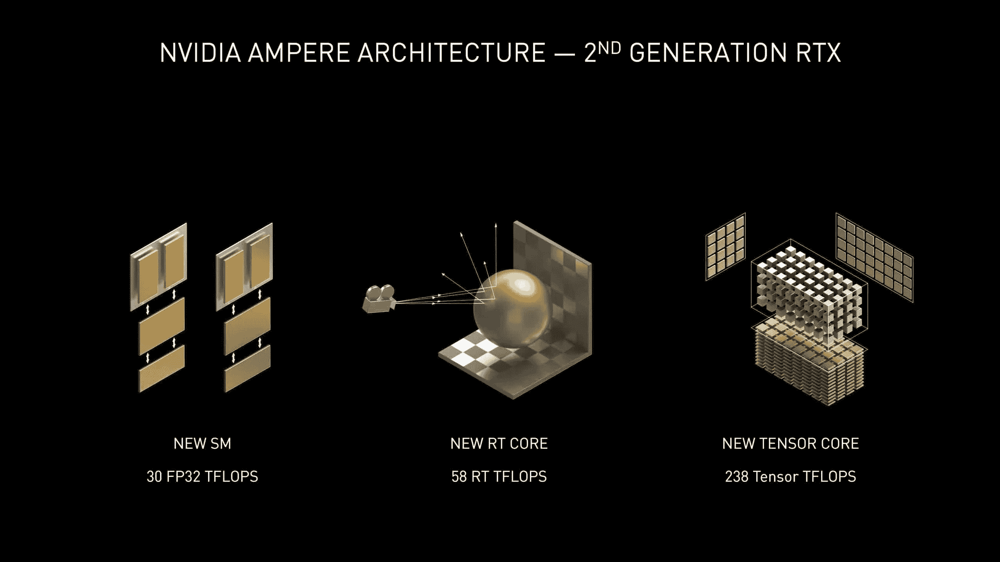
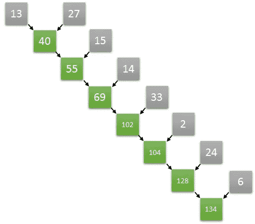
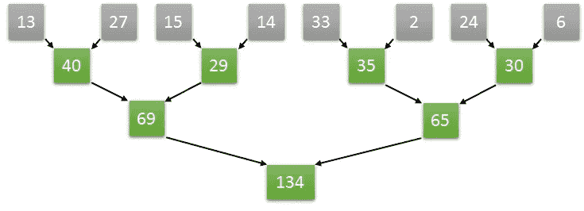
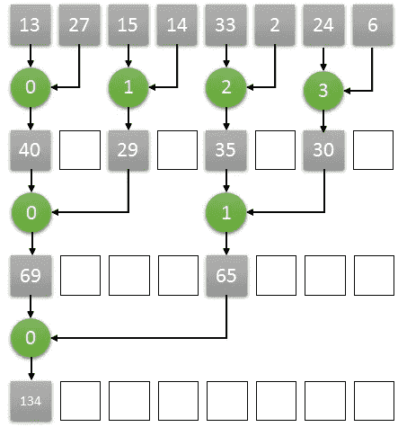
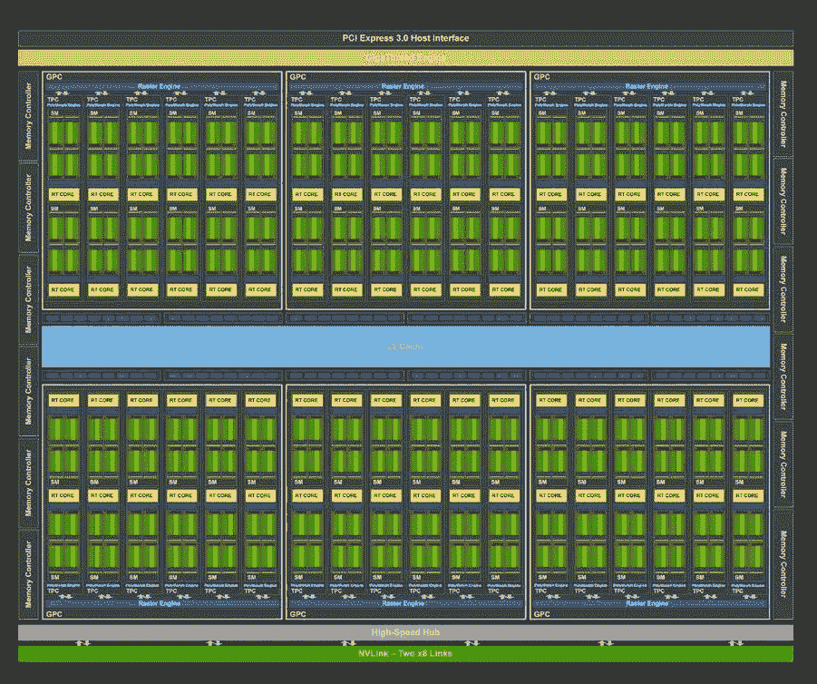
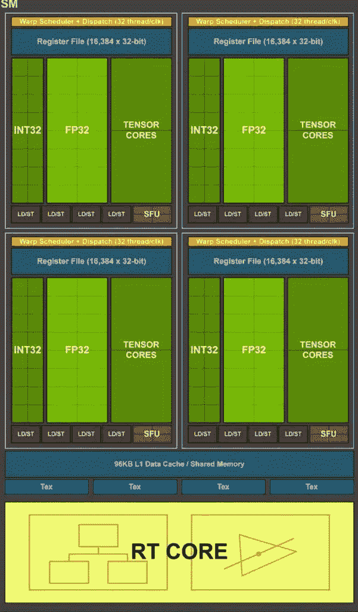

# 了解 GPU 的架构

> 原文：<https://medium.com/codex/understanding-the-architecture-of-a-gpu-d5d2d2e8978b?source=collection_archive---------4----------------------->

## [法典](http://medium.com/codex)

最近，在故事[GPU 的演变:从游戏到计算](https://vitalitylearning.medium.com/the-evolution-of-a-gpu-from-gaming-to-computing-ff183a1eea4f)中，讨论了 CPU 和 GPU 的滞后演变，并强调了 GPU 如何能够比商用 CPU 强大得多。我们现在问自己，为什么个人电脑仍然是基于中央处理器，而不是完全由图形处理器。

答案是 CPU 的工作方式与 GPU 完全不同，下图有助于我们理解主要区别。

左:CPU 架构；右图:GPU 架构。来源:https://www.omnisci.com/technical-glossary/cpu-vs-gpu[。](https://commons.wikimedia.org/wiki/File:Cpu-gpu.svg)

颜色惯例是*绿色*代表*计算单元*，或*核心*，*橙色*内存*内存*，*黄色*控制单元。

**计算单位(核心)**

乍一看，在 CPU 中，计算单元“更大”，但数量很少，而在 GPU 中，计算单元“更小”，但数量很多。大小和数量让人联想到 CPU 或 GPU 核心的能力以及它们在设备中的数量。

CPU 内核比 GPU 内核更快、更“智能”。

随着时间的推移，CPU 内核受益于时钟速度的逐步提高，从而提高了性能([GPU 的演变:从游戏到计算](https://vitalitylearning.medium.com/the-evolution-of-a-gpu-from-gaming-to-computing-ff183a1eea4f))。与此相反，GPU 经历了时钟减速，以限制功耗并适应移动或嵌入式设备中的安装。安装在机器人上用于室内绘图和导航的 Jetson NANO 就是一个需要保持最低功耗以延长电池寿命的相关例子。(参见，[使用 ROS 和 Nvidia Jetson Nano 构建室内地图和导航机器人](https://www.youtube.com/watch?v=u9l-8LZC2Dc)):

CPU 内核“聪明”的一个证明是能够执行*无序执行*。为了优化，CPU 可以以不同于指令进来的顺序执行指令，或者当进入分支时，它可以预测在不久的将来最可能需要的指令(*多分支预测*)。这样就可以提前准备好操作数并执行这些操作数(*推测执行*)，从而节省时间。

相反，GPU 核心不会做任何复杂的事情，无论如何，它不会在无序执行方面做太多事情。粗略地说，GPU 核心的专长是执行浮点运算，如*乘加* (MAD)或*融合乘加* (FMA)。

乘加(MAD)和融合乘加(FMA)运算。来源:[http://www . net lib . org/utk/people/JackDongarra/WEB-PAGES/SPRING-2011/lect 03 . pdf](http://www.netlib.org/utk/people/JackDongarra/WEB-PAGES/SPRING-2011/Lect03.pdf)。

事实上，最近的 GPU 架构的核心并不局限于 FMA，而是执行更复杂的操作，如张量(*张量核心*)或光线跟踪(*光线跟踪核心*)操作。

张量核。来源:[https://www . Anand tech . com/show/12673/titan-v-deep-learning-deep-dive/3](https://www.anandtech.com/show/12673/titan-v-deep-learning-deep-dive/3)。

光线跟踪核心。来源:[https://www . techspot . com/article/2109-NVIDIA-RTX-3080-ray-tracing-dlss/](https://www.techspot.com/article/2109-nvidia-rtx-3080-ray-tracing-dlss/)。

张量核旨在服务于人工智能中的张量运算，而光线跟踪核旨在服务于超逼真的实时渲染。

无论简单与否，GPU 核心都达不到 CPU 核心那样的灵活性。值得一提的是，GPU 编程模型是 SIMD ( *单指令多数据*)，这意味着所有内核执行*完全相同的*操作，但处理不同的数据。显然，GPU 的优势不在于内核的处理能力，而在于它们巨大的并行性。

以战斗的速度划桨的人。来源:[https://247 sports . com/college/Kansas/Board/103726/Contents/bing-Hur-is-getting-a-remake-71260436/](https://247sports.com/college/kansas/Board/103726/Contents/Ben-Hur-is-getting-a-remake-71260436/)。

核心的作用有点像罗马 Galea 中的划手:鼓手设定和平(*时钟*)，划手以战斗的速度平行划桨(*计算*)。

SIMD 编程模型允许加速一大类应用程序。缩放图像的所有像素就是一个例子。在这种情况下，在将每个像素映射到不同的核(假设有足够的核)时，每个核必须简单地缩放一个像素，这可以以大规模并行的方式发生。虽然顺序机器可以解决 *N* 个时钟脉冲中的问题，其中 *N* 是像素的数量，但假设有足够的内核来覆盖整个计算负载，手头的 GPU 只需一个时钟脉冲就可以解决问题。像图像缩放这样的问题是一个令人尴尬的*并行*问题，也就是说，在这个问题中，人们不需要努力将它分成许多并行任务。实际上，单个像素的缩放完全独立于其他像素的缩放。然而，要在 GPU 上运行，问题不需要令人尴尬的并行，但它与 SIMD 计算方案匹配就足够了，即，它可以通过在每个时刻对不同数据重复相同的操作来分解。

显然，不是每个问题都符合 SIMD 模型。这尤其发生在*异步*问题中，即，对于没有同步结构的问题，其中处理器需要在任何时候相互通信，并且对于这些问题，计算结构可能非常不规则并且负载不均衡。

**回忆**

从这个故事的第一张图片，我们还可以讨论 CPU 和 GPU 在内存方面的差异。

CPU 存储器系统基于动态随机存取存储器(DRAM ),在台式 PC 中，它可以是几(例如，8)千兆字节，但是在服务器中可以达到几百(例如，256)千兆字节。

CPU 内存系统的另一个支柱是高速缓存，用于减少从 DRAM 访问数据的时间。高速缓存是更小(例如，每核千字节)、更快的存储器，位于更靠近处理器核的位置，其存储在 DRAM 中分配的数据的副本。高速缓存可以有层次结构，通常分为三级:L1 高速缓存、L2 高速缓存和 L3 高速缓存。高速缓存离内核越近，越小，但速度越快。例如，L1 缓存可以是每核 64kb，L2 缓存可以是每核 256 kb，L3 缓存可以是每核 4m。

假设获取存储在 DRAM 中 i100 地址的数据。它将与其相邻元素(例如，存储在 i98、i99、i101 和 i102 地址的数据)一起从 DRAM 移至高速缓存。这是因为假设，如果在某个时间需要地址 i100，对于接下来的计算，也将需要 i101 和 i102 的内容(想象一个*用于连续扫描数组元素的*循环)。多亏了缓存，当需要一个数据时，它首先在 L1 缓存中被搜索。如果找到了，就以最大速度移动到 CPU。如果没有，则在 L2 缓存中进行搜索。如果找到了，它会被高速提取，尽管比 L1 慢。如果没有，则在 L3 缓存中寻找数据。最终，如果 L3 缓存未命中数据，将从 DRAM 中进行提取。图中橙色区域的数量是衡量 DRAM 和高速缓存对 CPU 重要性的一个指标。

从图上看，GPU 配备了一个 DRAM，命名为*全局内存*或 GMEM。GMEM 比中央处理器的 DRAM 还小。在最便宜的卡中，有几千兆字节可用，而在性能最好的卡中，GMEM 可以高达 24 千兆字节。GMEM 的有限规模是对科学计算中使用 GPU 的第一个主要批评。十年前，显卡只有 512 兆字节，这个问题现在已经完全解决了。

关于缓存，从图 ontop 我们可以推断出缓存机制是由于内核左侧的所有橙色小矩形。但是，缓存在 CPU 方面存在差异，这一点很快就会得到证明。

**了解 GPU 架构**

为了充分理解 GPU 架构，让我们借此机会再次看看第一张图片，其中显卡显示为计算核心的“海洋”。

在图像缩放示例中，内核不需要协作，因为它们的任务是完全独立的。然而，可以用 GPU 解决的问题不一定那么简单。让我们用一个例子来说服自己。

假设对一个数组的元素求和。这样的操作属于*归约*系列，因为它相当于将一个序列“归约”成一个数。对数组元素求和初看起来本质上是连续的。我们需要获取第一个元素，对第二个元素求和，得到结果，对第三个元素求和，再次得到新的结果，对第四个元素求和，等等。

顺序还原。来源:[https://www . eximiaco . tech/en/2019/06/10/implementing-parallel-reduction-in-cuda/](https://www.eximiaco.tech/en/2019/06/10/implementing-parallel-reduction-in-cuda/)。

令人惊讶的是，看似内在有序的东西可以在并行算法中进行转换。假设数组长度为 8，在第一步中，并行执行两两求和就足够了，因此获得 4 个部分结果。在第二步中，将对部分结果进行求和，再次以两两的方式进行。最后，将最后 2 个部分结果相加得到最终结果。所描述的分层方案如下所示:

平行缩减。来源:[https://www . eximiaco . tech/en/2019/06/10/implementing-parallel-reduction-in-cuda/](https://www.eximiaco.tech/en/2019/06/10/implementing-parallel-reduction-in-cuda/)

因此，8 个数的和只需要三个步骤，不同于需要 8 个数的顺序情况。一般来说，用 2 的 *N* 次方( *N* =2 *ⁿ* )对 *N* 个数求和， *n* 步就足够了，或者等价地，log₂( *N* 。

从 GPU 的角度来看，假设在第一个时钟拍摄中从 0 到 3 编号内核，即 c0、c1、c2 和 c3，将使用所有四个内核，见下图。在第二个时钟快照中，内核 c0 和 c2 将利用之前由四个内核绘制的部分结果。c0 和 c2 操作的部分结果应存储在可由相关内核访问的存储器中。在第三个时钟快照中，只有核心 c0 处于活动状态:它将对核心 c0 和 c2 在前面步骤中计算出的结果进行求和。这样的部分结果也应该存储在 c0 可访问的某个存储器中。

用 GPU 并行化简。来源:[https://www . eximiaco . tech/en/2019/06/10/implementing-parallel-reduction-in-cuda/](https://www.eximiaco.tech/en/2019/06/10/implementing-parallel-reduction-in-cuda/)

这种推理的结果是内核必须能够使用共享的*存储空间来协作，在该存储空间上存储/获取部分结果。不幸的是，一个 GPU 可以托管数千个内核，让每个内核与所有其他内核协作将非常困难和昂贵。出于这个原因，GPU 核心被组织成组，形成*流多处理器*或 SMs。*

**终极 GPU 架构**

图灵家族的 GPU 架构如下图所示:

图灵架构。来源:[https://bit-tech . net/features/tech/graphics/nvidias-turing-architecture-explained/2/](https://developer.nvidia.com/blog/nvidia-turing-architecture-in-depth/)。

绿色部分也是计算单位。绿色模块是 SMs，黄色 *RT 内核*靠近它们。图灵体系结构的 SM 结构如下所示:

图灵 SM。来源:[https://developer . NVIDIA . com/blog/NVIDIA-turing-architecture-in-depth/](https://developer.nvidia.com/blog/nvidia-turing-architecture-in-depth/)。

在图灵 SM 中，在绿色部分中，我们区分不同种类的内核。

*FP32 核心*。它们执行单精度浮点运算。考虑到 TU102 卡，它每个 SM 有 64 个 FP32 内核。既然我们有 72 条短信，那么卡里 FP32s 的总数就是 4608 条。

*FP64 核心*。实际上，在浮点内核中，应该提到每个 SM 有 2 个 FP64 内核执行双精度浮点运算，尽管 FP64 内核没有包括在上面的图像中。

*整数核心*。这些内核对整数执行操作(例如，地址计算)，并且可以与浮点数学数据路径同时执行指令。在前几代 GPU 中，只要需要非浮点运算，执行这些指令就会使浮点流水线停滞不前。在 TU102 中，有 4608 个整数核心，每个 SM 64 个。

*张量核*。张量核心是 FP16 单元的分组，即半精度单元，专用于加速常见深度学习操作的张量计算。图灵张量内核还可以执行 INT8 和 INT4 精度运算，用于可以容忍量化且不需要 FP16 精度的工作负载。在 TU102 中，每个 SM 有 8 个张量内核，卡上总共有 576 个。

在大致描述了 GPU 的执行部分之后，让我们来看看上面提出的关于协作的问题。

在 SM 的底部，有一个 L1 缓存/共享内存。这是内核可以工作的内存。每个 SM 都有一个专用的 L1 缓存/共享内存。作为片上 L1 缓存/共享内存，它的大小有限(图灵架构为 96k 字节)，但它非常快，肯定比 GMEM 快得多。

实际上，L1 缓存/共享内存具有 GMEM 访问的缓存和共享内存的双重功能。当内核需要协同工作并交换部分结果时，编码器会对线程进行编程，将部分结果存储在共享内存中，以便随后可以读取它们。这个内存的另一个作用域是缓存。当内核需要访问 GMEM 时，首先在 L1 缓存中搜索数据。如果没有找到，则在 L2 缓存中搜索它们，该缓存是所有 SMs 的横向缓存。L2 缓存比 L1 缓存大，但速度慢。如果数据在 L2 找不到，那就从 GMEM 取来。缓存中的数据会持续存在，除非它们被“更新”的数据驱逐。从这个角度来看，如果需要从 GMEM 多次访问数据，程序员有权将它们绑定在共享内存中，以加快读取速度。共享内存可以被认为是由*控制的缓存*。事实上，L1 缓存和共享内存是从同一个电路获得的，程序员有权决定卡是否必须将更多的内存用于缓存或共享内存。

最后但并非最不重要的是，可用于存储部分结果的存储器不限于共享存储器。事实上，寄存器代表了离内核最近、最快但最小的内存(见上图中的*寄存器文件*)。基本思想是每个线程都可以有一个寄存器来存储临时结果。每个寄存器只能被单条线或同一*经纱*或 32 条连续线的组中的线看到。