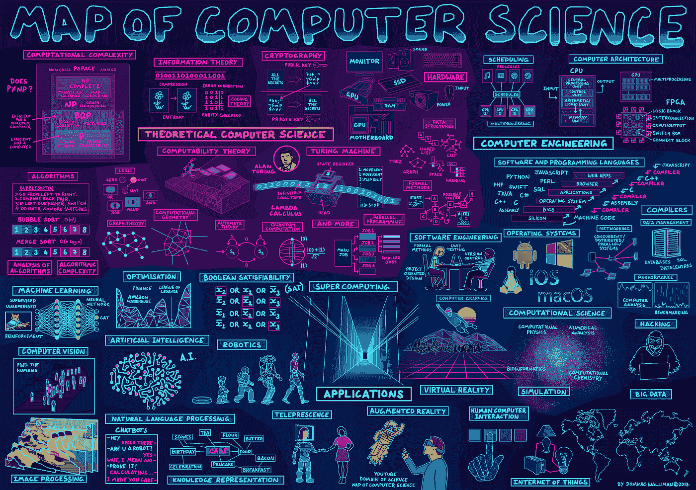

# 理解计算机科学和工程之间的区别

> 原文：<https://medium.com/codex/understanding-the-difference-between-computer-science-and-engineering-5fb966be6f5f?source=collection_archive---------3----------------------->

[https://www . informationisbeautifulawards . com/showcase/2333-map-of-computer-science](https://www.informationisbeautifulawards.com/showcase/2333-map-of-computer-science)

当我在计算机工程系开始我的大学教育时，我的一个朋友在另一所大学学习同样的东西。至少，我是这么认为的，因为他是计算机科学系的。我对名差没有给予足够的重视，不知道有区别。虽然这两所学校开设的课程…