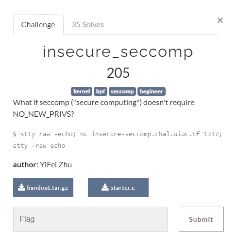

# 通过 CTF 挑战了解 Linux 内核

> 原文：<https://medium.com/codex/understanding-the-linux-kernel-through-ctf-challenges-seccomp-be6ed553a97?source=collection_archive---------5----------------------->

来自:[https://meme generator . net/instance/73974722/SNL-stefon-new-yorks-hotest-club-is-Linux-this-place-has-everything-apparmor-sec comp-cgroups-preven](https://memegenerator.net/instance/73974722/snl-stefon-new-yorks-hottest-club-is-linux-this-place-has-everything-apparmor-seccomp-cgroups-preven)

我是威森德，拉格纳安全公司的创始人。今天，我们将探讨 Seccomp，一个 Linux 内核安全特性。我们将通过来自 **UIUCTF 的挑战**不安全 _ 秒竞争**来探索这一点。**我们将讨论的一些事情是:

*   什么是 Seccomp？
*   为什么有用？
*   当您配置错误并且实例有漏洞时会发生什么。

如果您还没有，请继续关注我们:

*   推特: [@RagnarSecurity](https://twitter.com/ragnarsecurity)
*   https://www.reddit.com/user/ragnarsecurity
*   中:[拉格纳安全](https://medium.com/u/ba9e8c03464e?source=post_page-----be6ed553a97--------------------------------)。

## 什么是 Seccomp？

Seccomp 是 Linux 内核中的一个系统调用，它限制用户可以执行的其他系统调用(Seccomp 在用户进行无效系统调用时使用的消息之一是**“错误系统调用”**)。它通常与 Docker 容器一起使用来保护实例(尤其是在 Linux 服务器上)。Seccomp 可以在两个范围内实现:在整个机器上或在运行的程序中。我们将重点关注在应用程序级别实现 Seccomp，因为这是实现**secure _ sec comp**的范围。顺便说一句:Docker 提供了一种在运行时传递配置文件的方法，这样容器也有 Seccomp。你可以在这里了解他们更多:[https://docs.docker.com/engine/security/seccomp](https://docs.docker.com/engine/security/seccomp/)/。

Seccomp 有三种主要模式:

*   SECCOMP_MODE_STRICT —打开 SECCOMP 提供的所有安全措施
*   SECCOMP_MODE_FILTER —允许开发人员/用户通过过滤器限制某些操作
*   SECCOMP_MODE_DISABLED —禁用机器上的 SECCOMP

今天，我们将主要讨论 SECCOMP_MODE_FILTER。这种模式允许程序员/管理员使用某种过滤机制来决定允许什么系统调用。有多种方法来实现过滤器，但我们将重点放在伯克利数据包过滤器。

Berkeley 包过滤是操作系统过滤数据的一种方式(主要是为网络流量创建的)。我们可以使用几个函数来建立一些 Seccomp 规则:

*   STMT BPF——这是我们将设定具体规则的功能。
*   BPF _ 跳转——这将用于指示规则在哪个场景(或什么功能)中有效。

下面是一个 Seccomp 实现的示例:

在这个实现中，我们可以看到一些东西。首先，在 **configure_seccomp** 中设置的规则允许执行 write 和 open 系统调用。所有其他的系统调用都会杀死这个程序。BPF _ 跳转包含我们想要处理的系统调用，而下面的 BPF_STMT 决定如何处理这个系统调用。需要注意的是，这个 Seccomp 配置只允许用读权限调用 open。如果用写或执行权限调用 open，那么它将被终止。

另一个重要的 Seccomp 配置是这些行:

PR_SET_NO_NEW_PRIVS 告诉 kernrel/running 应用程序不应该设置新的 Seccomp 配置。例如，如果攻击者试图在正在运行的程序中添加**系统**作为有效的系统调用，内核将不会允许。

现在我们知道了如何使用基本的 Seccomp 过滤器，是时候开始解决不安全的 seccomp 了！

## 解决不安全问题 _seccomp

以下是 UIUCTF 提供给我们的挑战描述:

通过阅读挑战描述，我们获得了以下信息:

*   挑战在于以某种方式向应用程序或机器的范围添加更多特权，以便我们可以访问该标志。
*   NO_NEW_PRIVS 被禁用或从不设置。这意味着我们可以更改 Seccomp 设置/过滤器来授予自己更多的特权。

我们还得到了两份讲义:一个模拟整个环境的 docker 实例和一个 starter 文件。docker 实例是一个 busybox 实例，有三个可执行文件: **exploit_me、jail 和 seccomp_loader** 。seccomp_loader 接受一个命令的参数，并接受一个过滤器作为 stddin。因此，这样做的想法是通过 seccomp 加载程序调用 exploit_me，以便它给我们提供标志。代码如下:

利用我的代码

seccomp_loader 的代码

starter 文件让我们打印一个包含我们想要的规则的 BPF 过滤器。

根据对代码的阅读，很明显我们的目标是通过 seccomp_loader 调用 exploit_me，从而生成一个根 shell。之后，我们就能拿到旗子了！

在我尝试任何剥削之前，我尝试直接阅读旗帜；但是我没有权限。从读取 Dockerfile 文件来看，这个标志似乎在文件系统的根目录下，所以我去了那里并尝试对文件进行 cat。不出所料，没有权限:

挑战档案

试图在不被利用的情况下读取标志

似乎监狱很坚固。读取该文件的唯一方法就是利用漏洞！去工作:

最初，我认为如果我能够授予自己能够执行 **execve** 的特权，那么我就能够获得这个标志；然而，事情似乎比这更复杂。下面你可以看到我为 execve 创建了一个过滤器，并将其传递给 **seccomp_loader** ，但是当 **seccomp_loader** 试图执行 **exploit_me** 时，我得到了一个错误。

基于此，我意识到在 **exploit_me** 中可能有一个需要限制或允许的系统调用，以便我们可以生成 shell。为了弄清楚这一点，我花了一些时间分析 **exploit_me** 的代码(特别是查看系统调用如何影响程序的执行流)。

利用我的代码

总共有三个: **faccessat、setuid 和 getuid** 。Setuid 和 getuid 是我们需要执行的系统调用；但是，我们需要拒绝执行 faccessat。由于我们不是 root，faccessat 会返回一个错误(也就是说 **if(！faccessat(…)**将为真条件。通过输入 if 语句，我们将退出程序。

现在是时候构建一个新的过滤器来设置这些权限了。为了找到 faccessat 要传递给 Berkley 包过滤器的值，我查看了 unistd_64.h 的内部。

来自 unistd_64.h

找到它后，我创建了一个过滤器，允许除 faccessat 之外的所有系统调用，并将它传递到程序中。然后，我试图再次阅读国旗。这一次，我有了更好的结果！

用于创建过滤器的代码

起动机的输出

在 CTF 环境下运行过滤器的输出！

利润！我们能够生成一个根 shell 并访问旗帜！

这就结束了对 secure_seccomp 的演练。在我们开始之前，让我们回顾一下我们所学的内容:

*   我们学习了什么是 seccomp 以及通过 Berkley 数据包过滤器实现过滤器的方法。
*   我们了解了当有人在应用程序或机器中错误地配置 seccomp 时会发生什么。
*   我们利用了来自 UIUCTF 的不安全 _seccomp 挑战！

如果你喜欢阅读这篇文章，请继续关注我们:

*   推特: [@RagnarSecurity](https://twitter.com/ragnarsecurity)
*   https://www.reddit.com/user/ragnarsecurity
*   这里是媒体:[拉格纳安全](https://medium.com/u/ba9e8c03464e?source=post_page-----be6ed553a97--------------------------------)

我们将很快回来，带来更多的报道！