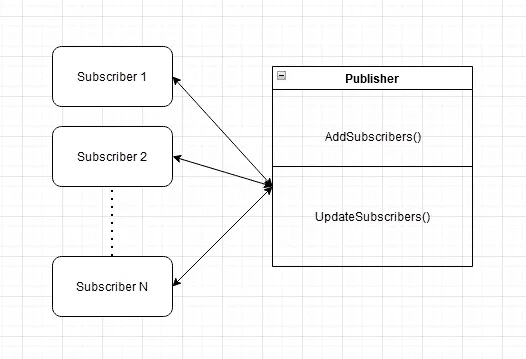
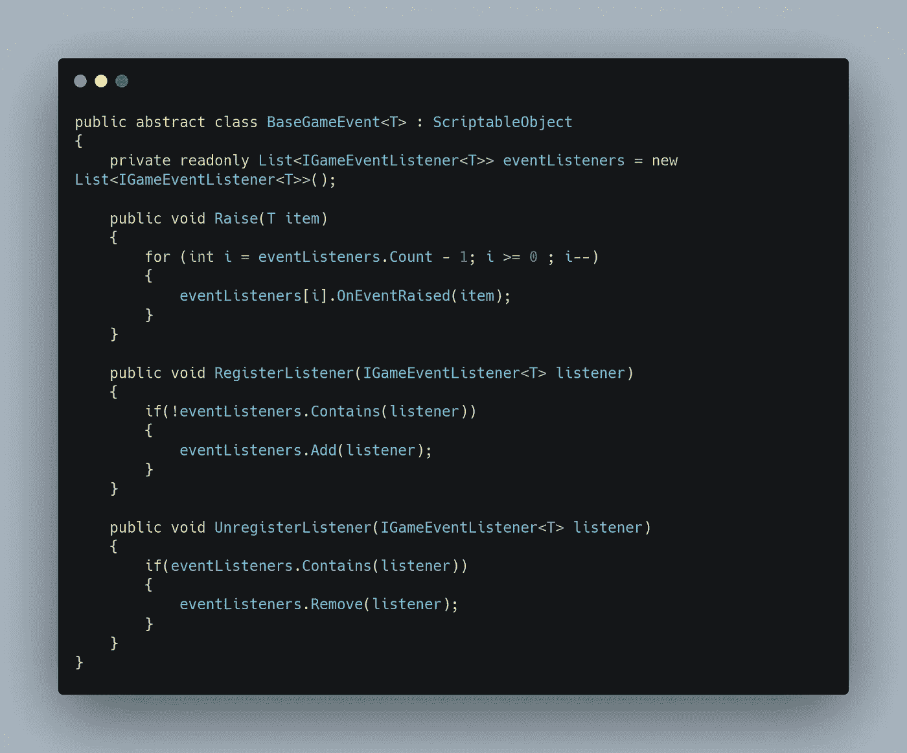
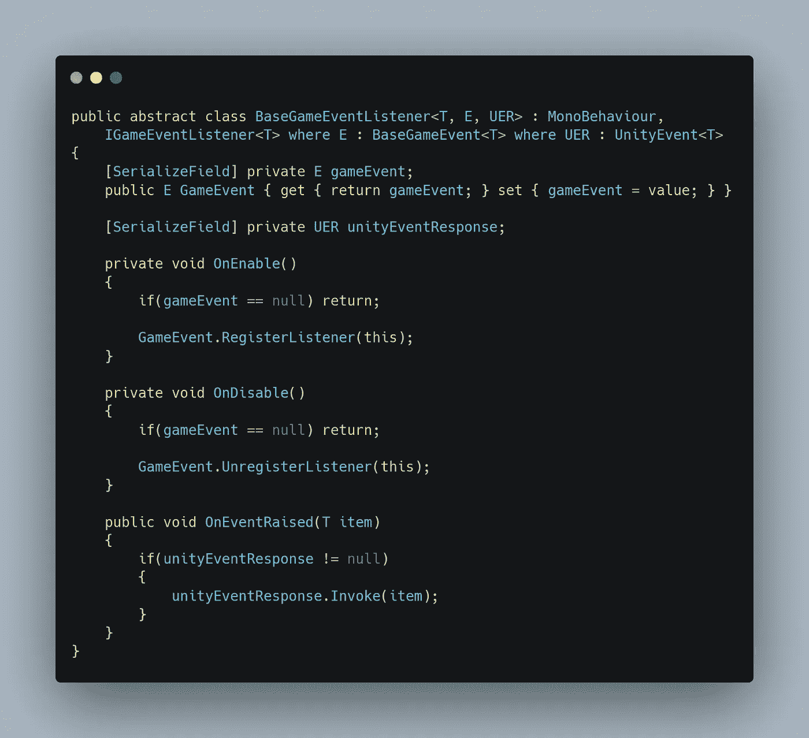
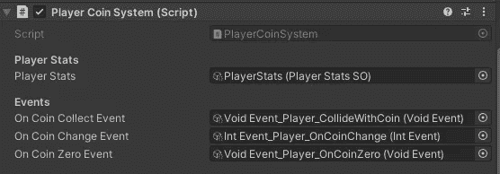
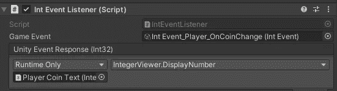

# 理解观察者模式 Unity 中的事件系统

> 原文：<https://medium.com/codex/understanding-the-observer-pattern-event-systems-in-unity-a92cdec26d7f?source=collection_archive---------1----------------------->

## 我就是喜欢用事件系统！

自从我进入游戏开发以来，有大量的主题需要学习，无论是 2D 艺术、动画、3D 建模、C#编程，还是熟悉 Unity 引擎等等——这简直让人应接不暇。但尽管看起来势不可挡，学习部分绝对是我最喜欢的部分，因为我来自编程背景，我一头扎进挑选必要的主题，为我在小丑村建立我的游戏之夜。今天，我想分享一个在 Unity 中常用的编程设计模式，因为它的简单性，我似乎总是会回去使用它。进入观察者模式。

谢尔盖·塞明在 [Unsplash](https://unsplash.com/s/photos/observer?utm_source=unsplash&utm_medium=referral&utm_content=creditCopyText) 上的照片

> 基本上，观察者模式是一种设计模式，允许您为主题配置订阅机制，以通知多个对象它们正在观察的对象发生的任何事件。

# 它是如何工作的

为了解释观察者模式，请考虑这个场景:假设您正在等待当地商店重新进货一些 ps5(我假设您仍然在等待您的 ps5)，并且您每天都要开车去商店查看产品。虽然你可能是任何一天中第一个拿到 PS5 的人，但是如果你不知道商店当天是否有这款产品，那么大多数旅行都是没有意义的。商店也可以给你发大量的电子邮件，通知你他们店内的其他索尼产品，但它们本质上不是你想要的产品。现在，这对商店和作为顾客的你都不利。

商店现在可以做的就是提供订阅服务，顾客可以订阅特定产品的供货通知，或者通常称为 ***事件*** 。在这里，商店将充当 ***发布者*** ，而顾客将充当 ***订阅者*** *。*显然，对 PS5s 不感兴趣的客户不会订阅此活动。因此，顾客不需要浪费宝贵的资源去商店，商店可以通过简化他们的生活来留住顾客。

当然，如果你生活在互联网上，你应该已经知道这整件事了。有史以来最大的视频平台 YouTube 会让你订阅创作者，当他们发布新视频时，你会收到通知。现在我们知道了这个东西是如何工作的，让我们看看如何在 Unity 中使用代码来实现它。

# 问题

是的，如果你想知道，你绝对猜对了——可能有多个发布者和无数的订阅者，如果订阅者-发布者网络维护不当，这将导致一场灾难。然后，您可能还拥有继续广播事件状态的发布者，但是没有订阅者收听它们。更糟糕的是，每个发布者也可能有不同类型的消息或信息要传达给他们的订户，因此以这种方式处理通信会很复杂。既然你理解了这个问题，让我们来看看解决方案是什么。

# 解决办法

我们想在 Unity 中编码的是一个游戏事件组件，它处理来自发行商的信息或消息的传递。还记得我们提到的每个发布者想要广播不同类型信息的问题吗？一种处理方法是创建一个特定的节点或消息类型，让订阅者知道这个节点广播这种特定类型的消息，如果他们愿意，可以订阅它。简而言之，想象一下 YouTube 有这样的订阅结构，你可以单独订阅创作者的视频、帖子或文章。理想情况下，你不会这样做，但只是想象一下，因为这在制作游戏中是有用的。

为了创建这个系统，我们需要 2 个组件:一个游戏事件和一个游戏事件监听器。游戏事件组件可以被任何游戏对象调用，并负责引发游戏事件。另一方面，游戏事件监听器可以连接到任何游戏对象，并负责监听由它订阅的游戏对象广播的任何游戏事件。为了使事情模块化，我们为游戏事件组件创建了一个抽象类，它可以接受一种通用类型的消息，如下所示:

如上所示， *Raise()* 方法将事件广播给订阅者。对事件的任何响应都将由游戏事件监听器组件——单一责任原则(SRP)来处理。当订户决定收听游戏事件时， *RegisterListener()* 和 *UnregisterListener()* 方法都会这样做。

对于游戏事件监听器，我们也想用一个抽象类使它模块化。

当带有这个游戏事件监听器组件的任何游戏对象注意到事件被引发时，它可以使用方法*oneventreased()调用一组特定的操作。Unity 为游戏开发者简化了这一点，因为我们只需要在 Unity 编辑器中传递一个函数作为事件发生时的响应。*

现在我们已经创建了一个基础模板，我们可以继续制作我们自己的特定类型的游戏事件消息！常见的游戏事件消息类型有*整数*、*浮点*甚至 Unity 的*碰撞器*类型。

# 例子

让我们看一个简单的例子，看看我是如何在我的游戏中使用这个事件系统的。假设我编写了一个 *PlayerCoinSystem* 来处理与游戏中硬币的交互。正如你在下面看到的，这个组件有 3 个事件，并且可以引发这 3 个事件中的任何一个*。*当收集到一枚硬币时，将引发一个特定的事件，您将获得其他事件的灵感！

另一方面，我将这个*整数*类型的事件监听器附加到 UI 组件上。它监听 *OnCoinChange* 的事件并相应地更新 UI！

我相信我不需要运行我的游戏来让你理解事件系统！亲自试试看，我相信你会爱上这种图案的！

我已经分享了我们如何使用 C#在 Unity 中编写我们自己的游戏事件和游戏事件监听器组件，以及如何在游戏中的任何地方使用它们。虽然《小丑之夜》的代码库目前是私有的，但我很想与任何有兴趣帮助我们改进当前代码库的人分享。有兴趣的给我发邮件！在那之前，编码快乐！

# 参考

 [## 观察者

### 也称为:事件订阅者、侦听器观察者是一种行为设计模式，它允许您定义订阅…

重构大师](https://refactoring.guru/design-patterns/observer)  [## 设计模式——观察者模式

### 观察者模式用于对象之间存在一对多关系的情况，比如一个对象被修改，它的…

www.tutorialspoint.com](https://www.tutorialspoint.com/design_pattern/observer_pattern.htm)  [## 事件系统

### 事件系统是一种基于输入向应用程序中的对象发送事件的方式，输入可以是键盘、鼠标、触摸…

docs.unity3d.com](https://docs.unity3d.com/Packages/com.unity.ugui@1.0/manual/EventSystem.html)