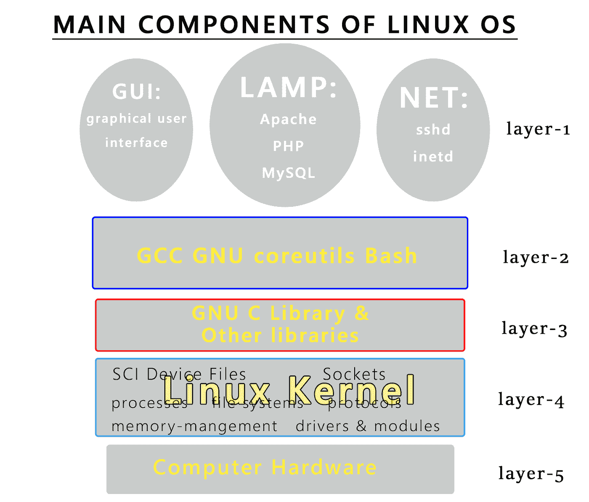

# 了解操作系统(第二部分)

> 原文：<https://medium.com/codex/understanding-the-operating-system-part-2-c97a925fe3cb?source=collection_archive---------13----------------------->

回到我们的“理解操作系统”文章，在上一篇文章中，我们解释了操作系统的基本概述和功能。今天，我们将深入探讨操作系统，并简要介绍计算机系统。

图片由 pixabay.com 拍摄

## **Linux 系统**

Linux 是地球上最著名的类 Unix 操作系统之一，因为它非常轻量级、免费和开源。Linux 是由 Linus Torvalds 在 1991 年 9 月 17 日发明的，作为一个开源操作系统的内核。Linux 通常被打包成一个 Linux 发行版(Distro)，Linux 发行版基本上有一个内核和 GNU 项目提供的软件、实用程序和库。下面是 Linux 系统的结构:

作者图片

实际上，并没有像上图那样精确的分层，但是为了给我们的读者带来一个简单的解释，我们把层放在右边。

## 第五层

计算机系统的最低层由计算机硬件组成，如主板、CPU、ram、GPU 和存储器。第五层是计算机系统中唯一的物理层，但在这种情况下是 Linux 系统。

## 第四层

它是 Linux 系统中最关键的一层，因为它是操作系统与硬件交互的地方。第四层也有基本的工具和协议，像内存管理、SCI、驱动和模块等等。Linux 内核还负责对存储执行 I/O 任务(输入/输出)。

## 第三层

这一层由 GNU C 库和其他必要的库组成，以保持您的操作系统正常运行。

## 第二层

第二层是第一层，你可以很容易地与之交互，它有 GCC(GNU 编译器集合)。GNU coreutiles 和 Bash。GCC 是 C 编程语言及其家族中其他语言的编译器。GNU coreutiles 是你的操作系统的重要软件包的集合，包括像 cat，man，ls，cd…..等等。Bash 是每个 Unix 系统的外壳和脚本语言。Bash 使您能够使用终端，并通过编写 Bash 脚本实现自动化。

## 第一层

这一层位于 Linux 系统之上，但在 Linux 操作系统中不一定需要，因为第一层主要由附加软件组成。构成第一层有三个主要类别:GUI、LAMP 和 NET，GUI(图形用户界面)是你可以通过点击图标和使用鼠标直观地使用计算机的地方。图形用户界面在 Linux 系统中是由图形用户界面软件如 Gnome、KDE 和 XFCE 实现的。GUI 软件通常有自己的应用程序，如计算器、照片浏览器和日历。

LAMP 代表 Linux、Apache、MySQL 和 PHP。LAMP 用于托管 web 服务器，是目前最著名的 web 服务器系统之一。NET 是网络软件集合的分类，包括 sshd 和 inetd。Sshd 帮助用户访问 ssh 和 Inetd 等服务，使用户能够通过网络访问 Pop3、FTP 和 Telnet 服务。

维基百科在通用创作许可下提供的图片

最后，操作系统有一个软件包管理器，允许用户管理、安装、删除和升级软件。Linux 发行版之间的主要区别在于名称和包管理器。每个发行版的软件包管理器都是不同的。RPM(RPM 包管理器)包管理器由 RHEL、Fedora 和 OpenSuse 使用。APT(高级包工具)被基于 Debian 的发行版使用，如 Debian、Ubuntu 和 Kali。其他的二进制格式包括 TGZ、PACMAN 和源代码格式，如 ebuilds、LFS(从零开始的 Linux)…等等。现代 Windows 系统使用 winget 包管理器来操作包。

## 文件系统

文件系统(FS)是数据在存储设备上的布局，确保数据可以可靠有效地检索。文件系统帮助用户轻松地探索，建立，删除或升级文件和目录(文件夹)。文件系统还具有抽象和仲裁功能。

## 磁盘空间的抽象

磁盘空间的抽象负责查询文件，打开和关闭文件。抽象不仅赋予文件人类可读的名称，而不是计算机理解的随机数字和字母，而且将文件组织到目录(文件夹)中。

## 磁盘空间仲裁器

磁盘空间仲裁提供了文件权限，并保护隐私，防止其他用户访问您的文件。仲裁还确保单个用户不会占用多用户计算机(例如，1+用户的家庭计算机)中的所有磁盘空间

## [计]元数据

文件系统按照以下顺序维护关于存储在存储驱动器中的文件的各种信息:

*   文件名
*   文件大小
*   物主
*   许可
*   时间戳(类 Unix 操作系统上的 ctime、mtime、atime。在这里阅读更多关于时间戳的内容:[https://www . geeks forgeeks . org/file-Timestamps-mtime-ctime-and-atime-in-Linux/](https://www.geeksforgeeks.org/file-timestamps-mtime-ctime-and-atime-in-linux/))

元数据也记录内部信息。它帮助指针通过存储器上的实际数据，并为文件的硬链接数量创建引用计数。

## 格式化

将文件系统结构放在磁盘分区上被称为格式化分区。

格式化通常会破坏先前安装在分区上的任何文件系统的结构。如果磁盘或分区被格式化，使用标准工具很难恢复内容(文件),但除非分区被安全擦除，否则仍然可以使用取证工具恢复内容。

对操作系统的理解到此结束(第二部分)。感谢您的关注和阅读，直到最后！请继续关注第三部分！

在这里阅读 Part-1:[https://medium . com/codex/understanding-operating-systems-Part-1-D1 F8 D5 C7 DCE 8](/codex/understanding-operating-systems-part-1-d1f8d5c7dce8)

## 参考

*ebuild — Gentoo Wiki* 。(未注明)。检索于 2022 年 11 月 7 日，发自 https://wiki.gentoo.org/wiki/Ebuild

普拉卡什，A. (2020 年 10 月 4 日)。 *Linux 行话克星:Linux 中的包管理器是什么？它是如何工作的？*是 FOSS。[https://itsfoss.com/package-manager/](https://itsfoss.com/package-manager/)

维基百科贡献者。(2001 年 11 月 20 日)。 *Linux* 。维基百科。[https://en.wikipedia.org/wiki/Linux](https://en.wikipedia.org/wiki/Linux)

维基百科贡献者。(2021 年 12 月 28 日)。 *Inetd* 。[https://en.wikipedia.org/wiki/Inetd](https://en.wikipedia.org/wiki/Inetd)

维基百科贡献者。(2022 年 11 月 4 日)。*灯(软件包)*。维基百科。[https://en . Wikipedia . org/wiki/LAMP _(software _ bundle)](https://en.wikipedia.org/wiki/LAMP_(software_bundle))

*Windows 包管理器*。(2022 年 2 月 22 日)。微软学习。[https://learn.microsoft.com/en-us/windows/package-manager/](https://learn.microsoft.com/en-us/windows/package-manager/)