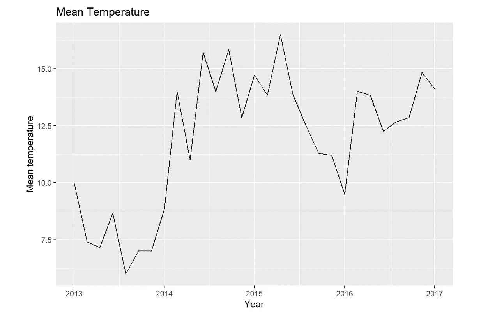
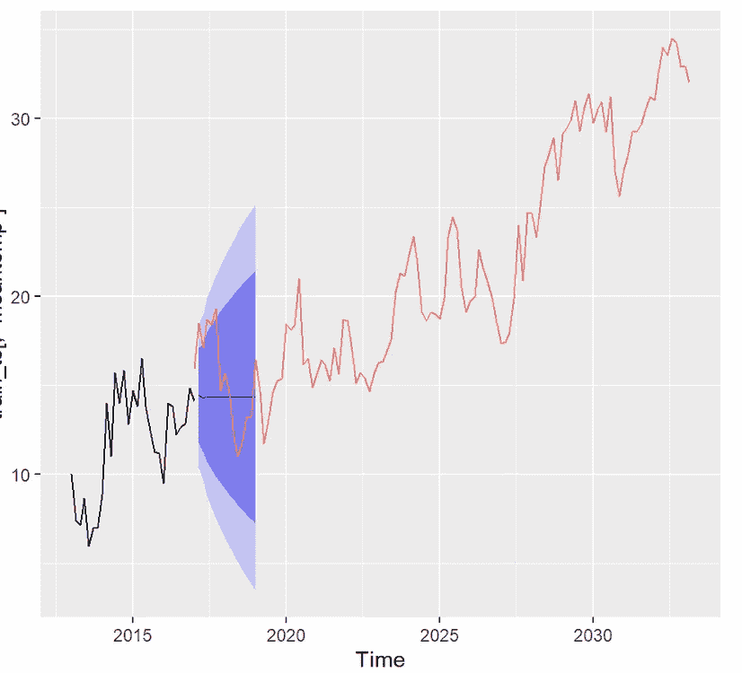
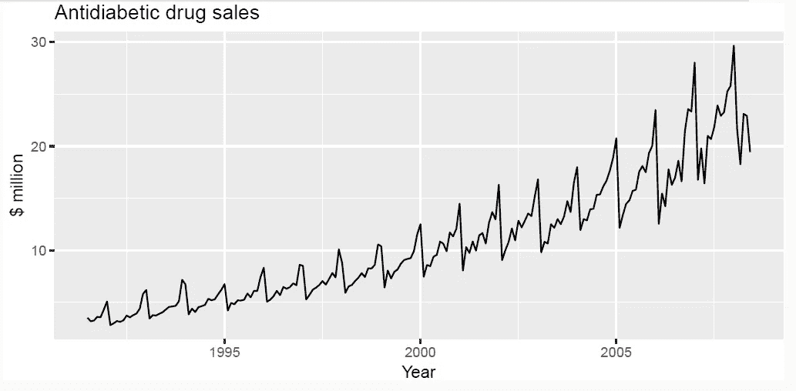
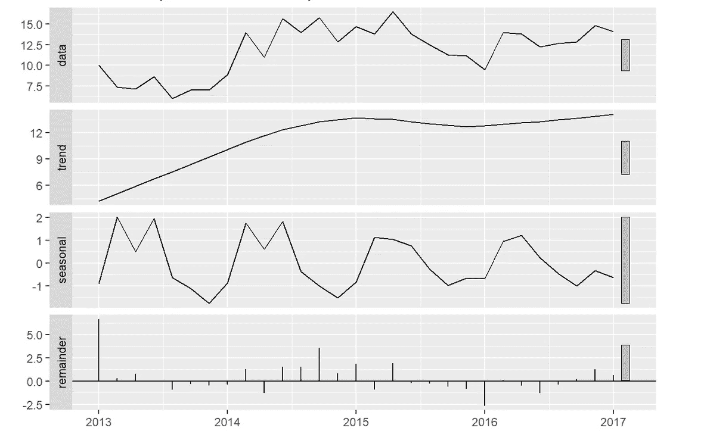
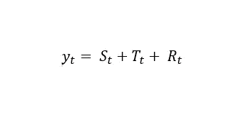
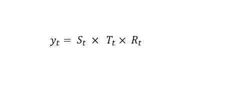

# 关于时间序列你不知道的是

> 原文：<https://medium.com/codex/understanding-time-series-components-61a02834270e?source=collection_archive---------3----------------------->

作者图片

# 什么是时间序列？

时间序列是由时间索引的观察值的集合，

时间可以是每小时、每周、每月或每年。

作者图片

时间序列数据的一个例子是特定国家的日平均温度，

记录从 2013 年到 2017 年。

时间序列分析是一种分析数据以预测未来事件的方法。

作者图片

如果我们想知道特定年份 2030 年的日平均温度，

我们进行时间序列分析，

来预测那一年的日平均温度。

由于时间序列表现出不同的模式，一个时间序列可以表现出三种模式。

*   ***趋势***
*   ***季节性***
*   ***循环***

## 趋势

当数据长期增加或减少时，我们说时间序列数据表现出一种趋势。

比如抗糖尿病药物的月销售额。

图片摘自 Rob J Hyndman 和 George *Athanasopoulos* 所著的《预测:原则和实践》

## 季节性的

当季节性因素影响数据时，时间序列会显示出季节性模式。

在抗糖尿病药物的月销售额中，

有一种季节性模式，这是由于在日历年年底药物费用的变化。

## 循环的

在时序图显示不具有固定频率的上升和下降的情况下。

然后我们说数据有一个循环模式。

你可以在上面的日平均温度时间序列图中看到这一点。

# 分解

分解是将时间序列图分解成不同的部分。

作者图片

时间序列可以分解为 3 个部分:

*   ***趋势或趋势-循环分量(趋势和循环模式的组合)***
*   ***季节性成分***
*   ***余数分量***

分解可以是加法或乘法。

这取决于季节模式的大小，

或围绕趋势循环模式的变化。

***添加剂分解***

***乘法分解***

*哪里*

***yt*** *是数据*

***St*** *是季节性成分*

***Tt*** *是趋势周期成分*

***Rt*** *是余数成分*

当季节或趋势循环模式的变化，

看起来与时间序列的水平成比例，

我们使用乘法分解。

# 参考

[**预测:原理与实践**](https://otexts.com/fpp3/) 作者*罗布·J·海曼和乔治·阿萨纳索普洛斯*

照片由 [Morvanic Lee](https://unsplash.com/@morvanic?utm_source=medium&utm_medium=referral) 在 [Unsplash](https://unsplash.com?utm_source=medium&utm_medium=referral) 上拍摄