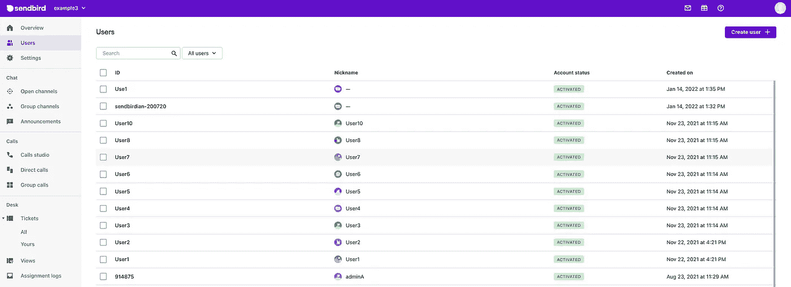
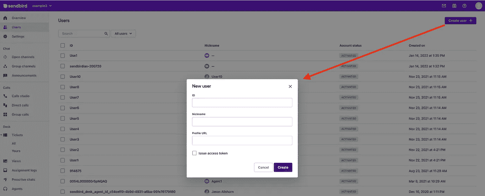
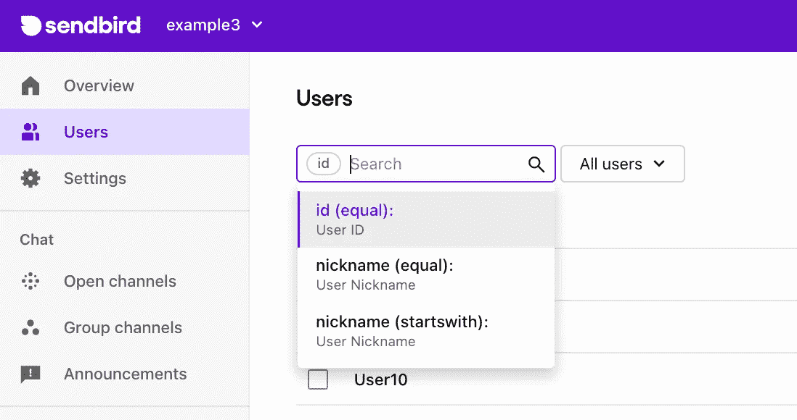
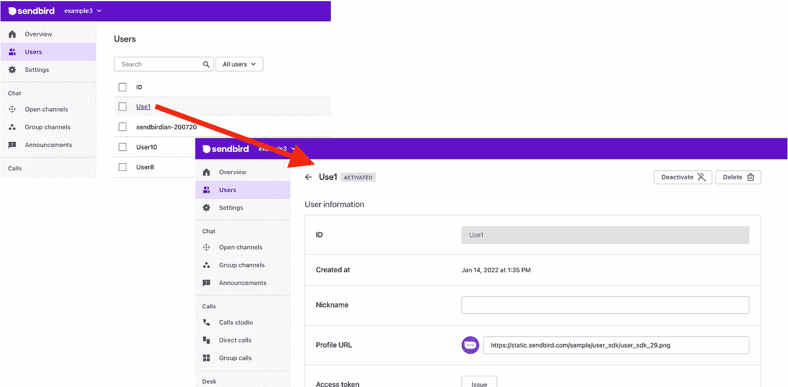

# 了解 Sendbird 聊天中的用户

> 原文：<https://medium.com/codex/understanding-users-in-sendbird-chat-94303f63e140?source=collection_archive---------17----------------------->

仙鸟 2022

## 使用 Sendbird SDK 和用户对象创建、更新和删除用户的指南

杰森·奥尔肖恩
解决方案工程师| [仙鸟](https://www.sendbird.com/)

*有关本教程材料的其他指导，请参见* [*文档*](https://sendbird.com/docs/chat) *。查看 Sendbird Chat 的* [*演示*](https://sendbird.com/demos/in-app-chat) *并访问我们的* [*网站*](https://sendbird.com/features/chat-messaging) *以了解更多关于 Sendbird Chat 的信息。*

> *成为第一个了解新教程、开发者相关聊天/电话发布以及其他重要更新的人，* [*注册*](https://get.sendbird.com/dev-newsletter-subscription.html) *我们的开发者简讯。*

# 介绍

本指南解释了 Sendbird 聊天中用户的核心 Sendbird 开发者概念。它将讨论如何使用 Sendbird SDK 和用户对象来创建、更新和删除用户。这些活动是 Sendbird 集成的基础，也是全面掌握 Sendbird 开发的敲门砖。

我们开始吧！

# Sendbird 聊天中的用户有哪些？

Sendbird 体验的中心是用户——通过 Sendbird 的客户端 SDK 连接到 Sendbird 聊天或呼叫的实体。

以下是创建用户时需要了解的一些重要事项:

*   首次开始开发时，您可以手动创建 Sendbird 应用程序用户。
*   在生产之前，我们建议通过平台 API 创建用户。在上线之前，考虑将大多数用户添加到 Sendbird。尽早开始这个项目是明智的，因为用户创建可能需要几个小时到几个星期，这取决于用户群的规模。没有额外的成本，添加一个用户对 MAU 没有贡献，除非用户连接到 Sendbird。
*   通过平台 API，您可以以编程方式执行用户仪表板操作。
*   您只能通过平台 API 向用户对象添加用户元数据。
*   用户使用 Sendbird SDK 连接到 Sendbird 应用程序。

记住这一点，在创建用户之前，让我们对 Sendbird SDK 和用户对象有更多的了解。

# SDK 和用户对象

在开始 Sendbird 开发时，用户可以不经过身份验证就登录。然而，在生产中，最佳实践是使用身份验证(访问或会话令牌)。对于最安全的设置，我们推荐合理的短期会话令牌。

您可以通过转到 Sendbird 仪表板>设置>安全性来控制用户访问权限。

请注意，在 SDK 中，默认情况下，用户可以更新:

*   昵称(通常用于用户的显示名称)
*   profile _url(图像 url)
*   元数据(通常用于对用户进行分组)
*   首选语言

Sendbird 还提供了限制上述首选项的能力，只允许来自平台 API 的更新。

准备创建用户了吗？继续读！

# 如何创建用户

## 仪表盘

*   点击“创建用户+”。
*   该 ID 需要唯一的标识符。它通常与运行 Sendbird SDK 的客户端应用程序使用的用户 ID 相同。
*   昵称是必需的，但是可以通过仪表板、平台 API 以及用户在 SDK 中进行编辑(SDK 编辑可以根据请求关闭)
*   配置文件 URL 是可选的，默认情况下是一个空字符串。(个人资料 URL send bird 的域过滤保护个人资料 URL，但不通过图像审核)
*   颁发访问令牌是可选的，但是强烈建议在生产中使用。会话令牌是 JWT 令牌，不存储在 Sendbird 的任何地方。

## 平台 API

参见 [**本指南**](https://sendbird.com/docs/chat/v3/platform-api/guides/user#2-create-a-user) 了解如何通过平台 API 调用创建用户。

## 软件开发工具包(Software Development Kit)

*   如果应用程序的安全设置设置为“读和写”，则可以通过 SDK 创建用户。(不建议在生产中使用)
*   要创建一个用户，连接到 Sendbird 并传入任何 user_id 和昵称。将自动创建一个新用户，或者返回一个现有用户。

> **专业提示:**开始时，在仪表板中手动创建 10 个用户，并使用连续的 id。用户昵称应该与用户 id 相同。

# 如何审核用户

## 用户表

用户按照从最新到最早创建的顺序列出。单击任意用户 ID 可深入了解更多详细信息。

## 用户搜索

您还可以使用 ID、昵称或昵称开头搜索用户。

> **Pro 提示:**默认情况下，您可以通过 SDK 一次获取 100 个应用程序用户。还可以通过用户的元数据对用户进行分类，然后用元数据过滤器获取分类后的用户。如果您的安全策略禁止用户获取所有其他用户，则可以关闭此默认操作。

# 如何更新用户

## 仪表盘

选择用户 ID 以查看和更新用户的配置文件。

## 软件开发工具包(Software Development Kit)

用户只能通过 Sendbird 的 SDK 更新个人资料图片和昵称。

## 平台 API

用户对象(配置文件)的所有方面都可以通过平台 API 进行更新，包括:

*   绰号
*   个人资料 URL
*   [计]元数据
*   访问令牌
*   会话令牌

# 如何删除用户

## 仪表盘

可以通过仪表板一次删除一个或多个用户。删除用户后，可以使用相同的用户 ID 创建另一个用户。

## 软件开发工具包(Software Development Kit)

Sendbird 的 SDK 不提供“删除用户”选项。

## 平台 API

通过平台 API 逐个删除用户也是可以的。

# 结论

本指南讨论了如何通过 Sendbird SDK 创建和使用用户。这些基础知识将为您的开发工作奠定坚实的基础。感谢您使用 Sendbird 创建出色的聊天应用程序，并帮助人们更好地联系！开心聊楼！👩‍💻