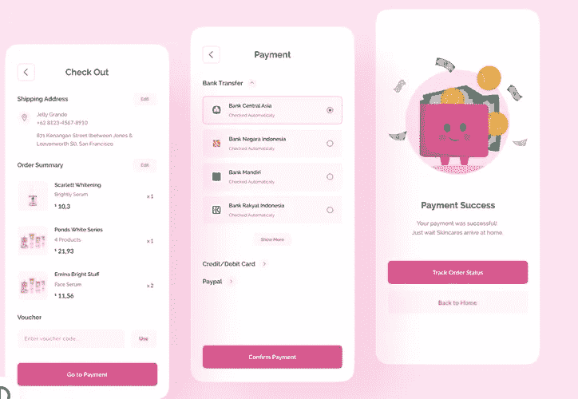

# 理解 UX 的写作

> 原文：<https://medium.com/codex/understanding-ux-writing-b6dc0fcbf393?source=collection_archive---------11----------------------->

理解 UX 的写作

想象一下，你第一次去一个地方，没有任何方向可以帮助你到达那里。强硬对吗？非常令人沮丧。

当你试图浏览一个没有文字来指导你行为的网站或移动应用程序时，就会发生这种情况。

这就是 UX 写作发挥作用的地方。

在产品设计的世界里，UX 的写作和产品的设计一样重要。这是因为它也是产品的组成部分。

仔细考虑人们的背景、需求和行为来撰写内容被称为“用户体验”(UX)写作。

UX 写作，就像 UI 设计一样，指导用户做什么，决定了体验的基调；它用文字而不是像素来引导。

约书亚·波特为这种类型的写作创造了一个名字，“缩微副本”这是用户界面中与用户执行的活动特别相关的文本或表达式:在他们行动之前，伴随行动的指令，当然，还有用户行动之后收到的反馈。

*见下图*

光信用:运球

缩微拷贝是必不可少的，因为它指引着用户在界面上的每一个动作。文案的质量可以决定一个产品的成败。

一位 UX 作家在应用程序、网站和其他数字产品中计划和编写微型副本，用户需要这些产品来导航。

我肯定你想知道这和其他写作形式有什么不同。别担心。继续读下去，我希望你随身带着笔记本。

# **缩微副本的特征**

1.  **它说用户的语言:**

可以这样想:你被委托为一个移动或网站应用程序设计一个微型副本，以满足企业主的需求。

企业主对销售感兴趣；你的文案应该说他们的语言，意思是，它应该让他们知道为什么采取行动将有助于他们的业务。

**2。它指导用户采取行动**:

当你查看一个网站的登陆页面时，通常有两种方法。主要操作和次要操作您的副本将引导用户采取适当的操作。在大多数情况下，我们希望他们执行主要的动作。

图片来源:BrandWithReina

**3。很简单理解:**

这不是展示你对语法掌握很强的时候。请记住，UX 是为了让用户体验无缝。除了你的听众熟悉的行业术语之外，不应该有任何术语。

**4。它使用了正确的音调:**

每个组织都有自己的基调，你的文案应该反映这一点。音调的范围从合作到友好，等等。

**5。结构良好:**

你的文案必须结构良好，便于浏览内容。注意信息呈现的方式很重要。互动元素的使用，如[锚链接](https://www.nngroup.com/articles/in-page-links/)和[手风琴](https://blog.hubspot.com/website/accordion-design)也很重要，因为它可以帮助用户快速找到他们需要的任何信息。

**缩微复制品的功能。**

1.  **为用户创造满意的体验:**

缩微拷贝做的一件事是让用户在浏览网站时感到自在。它增加了界面的深度。没有文字的交流是不完整的，用户对听起来不像机器人的文字反应更好。

作为一名 UX 作家或设计师，你的目标是确保你的用户可以在必要的时候采取行动，因为你用这些短语与他们交流。用户被文字所吸引，这可能会让他们微笑或减轻他们的担忧。

再说一遍，你的缩微拷贝很重要。

**2。品牌:**

还记得 microcopy 的一个特点吗？反映正确的音调。在这里。这是缩微复制品的另一个关键功能。它将一个品牌与另一个品牌区分开来。Cowryrise、PiggyVest 和 rise 可能提供几乎相同的服务，但它们的品牌基调不同。这一点在他们的副本中显而易见。

在你开始写微缩拷贝之前，确保你已经研究并理解了你要写的品牌。对品牌的深刻理解会反映在你的文案中，并将其与竞争对手区分开来。

它将提升你的品牌愿景和价值，为你的目标受众定位重要信息，并提供真实和有凝聚力的体验。

**3。可用性:**

当谈到良好的用户体验时，可用性是核心特征之一。可用性是指产品的易用性。在这种情况下，这意味着您的副本使界面导航变得容易。

考虑浏览一个没有文字指导的网站或移动应用程序来完成要采取的步骤。是的，我也看不上它。这种事我连想都不敢想。

去一个文案和界面都很混乱的网站怎么样？作为用户，你会放弃这个网站，可能不会再使用它。

因此，你的副本应该在它应该在的地方。它不应该让用户困惑或与设计相矛盾。记住，你希望他们的体验尽可能简单和容易。

这就是 UX 作品的独特之处。UX 写作是 UI/UX 设计和 web 开发的一个不可忽视的重要方面。它在确保用户拥有良好体验方面起着重要作用。

你认为你具备成为一名优秀的 UX 作家的素质吗？让我知道，我会看看我是否能帮你写一篇关于这方面的文章。

嘿，点击拍手图标，给自己 50 次拍手，让自己读到最后。你只是增长了见识。