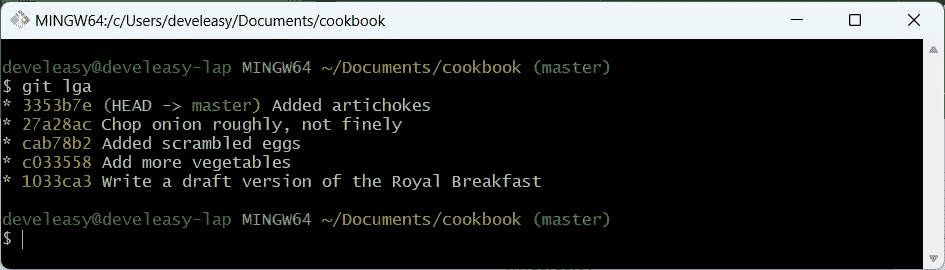
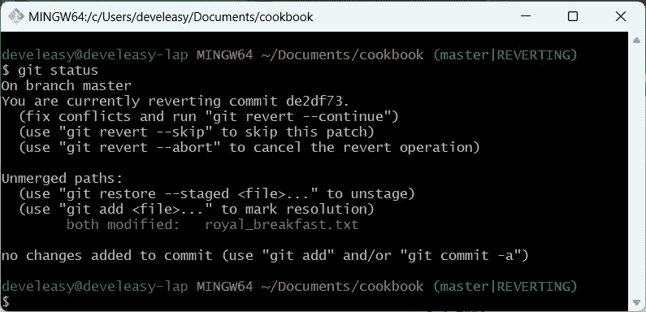

# 撤销你的早餐(见 Git #8)

> 原文：<https://medium.com/codex/undo-your-breakfast-meet-git-8-433a1c6cb1e1?source=collection_archive---------7----------------------->

## 如何恢复 Git 中的更改

照片由[尼克·费因斯](https://unsplash.com/@jannerboy62?utm_source=medium&utm_medium=referral)在 [Unsplash](https://unsplash.com?utm_source=medium&utm_medium=referral) 拍摄

# 介绍

你好，欢迎阅读致力于程序员 Git 基础知识(不仅仅是)系列的下一篇文章。

在您的工作流中利用 Git，您可以安全有效地存储文件中所做的更改。然而，有时您可能会意识到您告诉 Git 跟踪一些事实上不应该记录的东西。

幸运的是，Git 提供了几种撤销历史更改的方法，每种方法都可以在不同的情况下使用，我将在本文中对此进行解释。

我们开始吧！

# 撤销更改的可能情况

有几个可能的原因和阶段让您想要恢复 Git 中的更改——考虑下面的例子:

*   如果变更尚未提交，则取消转移
*   撤消已经提交的更改

您应该已经熟悉了诸如*暂存区/索引*和*提交*等术语。如果没有，我鼓励您阅读本系列中我以前的文章。

# 如果更改未提交，则撤消更改

让我们想象一下这个场景:

> 您对著名的皇家早餐进行了修改，将文件保存在您最喜欢的文本编辑器中，并且关闭了笔记本电脑，因为该睡觉了。**你决定暂时不提交你的工作**，因为你知道这只是你新想法的草稿。
> 
> 第二天，你带着新鲜的头脑醒来，你得出的结论是，新的想法是废话，最好不要改变任何东西，因为皇家早餐已经很完美了。
> 
> 原来，要恢复配方中的更改已经太晚了，因为文件已经被保存了，而且文本编辑器中的撤销操作很可能不起作用，因为您之前已经关闭了编辑器。

哦，我说过太晚了吗？使用 Git，根本不需要，只需使用`git reset`、`git checkout`，或者两者都使用，就可以将修改后的文件恢复到原始状态(上一次提交所代表的状态)。让我们看看在什么情况下哪个命令是相关的。

## 更改不是暂存的

假设您尚未转移更改，您应该使用哪个命令来恢复文件？使用`git checkout -- <file>`，用最新提交的版本替换所选文件。

比如我修改了保存在`royal_breakfast.txt`里的菜谱，所以想用`git checkout -- royal_breakfast.txt`。如果你想恢复当前目录(以及子目录)中所有的*跟踪的*文件，你也可以使用`git checkout -- .`。

该历史包括四次提交

用番茄酱装饰盘子？嗯…

配方已修改，但更改尚未进行

使用“git checkout ”,您可以轻松地将工作目录与上次提交的目录对齐

git 结账后根本没有番茄酱

你可能想知道为什么我使用了`git checkout`而不是`git restore`，即使 Git 建议我在输入`git status`后使用`git restore`。好吧，Git 的官方文档清楚地说明了这是一个实验性的特性，将来可能会改变。

Git 中的一些命令是实验性的，比如“git restore”

## 变化已经上演

如果您已经用`git add`暂存了变更，但是还没有提交它们，那么与前面的场景相比，您只需要执行一个额外的步骤。

首先，您需要通过使用`git reset -- <file>`从暂存区域中移除变更，在我的例子中，这将是`git reset -- royal_breakfast.txt`。然后，你需要执行与上一段所述相同的操作，即`git checkout -- royal_breakfast.txt`。

同样，尽管 Git 建议使用`git restore --staged`，但我将坚持使用老方法，除非`git restore`不再是实验性的。

番茄酱的变化这次上演了

首先，将变更从临时区域移走

然后，从最后一次提交中恢复您的工作目录

# 撤消已经提交的更改

然而，有时不需要的变更已经到达了存储库。尽管如此，Git 还是提供了一些方法来处理它，所以让我们来看看。

## 如果您的错误提交应该留在历史中(git revert)

`git revert`命令非常有用并且简单易用。此外，这个命令提供了一个安全、干净的解决方案来恢复不需要的提交——只需键入`git revert <commit_id>`。

git revert 有什么特别之处？它保留了错误的提交，这意味着您将得到包含两次提交的 Git 历史记录:错误的一次，以及恢复前一次提交的第二次。

首先，让我们创建两个提交。

第一个变化包含番茄酱装饰

番茄酱装饰承诺

第二个变化包含朝鲜蓟

提交与朝鲜蓟创建

最近两次提交的历史记录

突然，您发现伴随第一次提交而来的更改不应该存储在存储库中，但是第二次提交很好，应该保持原样。也就是说，带有番茄酱装饰的提交`de2df73`是我们想要去掉的，而提交`ab6091f`应该保留。

对于这种场景，`git revert`是一个完美的解决方案。为了让事情恢复正常，我只需键入`git revert de2d`。

还原操作在历史记录之上引入了新的提交

你可能会问一个问题: ***“我怎么知道我要摆脱的提交是否应该留在历史中？”***

为了给一个重要的问题提供一个简单的答案，现在，假设在以下情况下，你应该选择`git revert`而不是其他方法:

*   您想要撤消的更改不是当前*分支*中的最新提交，或者
*   提交已经被*推送到*一个远程存储库，并被其他人使用

如果您不知道推送是什么意思，请不要担心——这是在您使用远程存储库时使用的一个概念，目前我只使用本地存储库。

如果你认为你不需要历史上的最后一个(或最后几个)提交，就选`git reset`，我会在下面解释。

## 如果错误的提交可以从历史中删除

让我们假设 Git 历史中的最后三次提交将被删除。因为我一直在本地存储库上工作，所以我不会与任何人共享这些提交，所以我可以安全地删除它们。

要从历史记录中删除三次提交，请使用`git reset --hard HEAD~3`。这个命令可以翻译成这样:

> 将`HEAD`指针向后移动三步，并从当前提交重新创建工作目录。

从现在开始，当前提交将是 27a28ac

在执行“git 重置”之后，Git 会告诉你当前的提交是什么

删除这三个提交是成功的

当我们使用 Git 时，我们总是使用引用来指向历史中的某个地方。

如果您向后移动`HEAD`，您将无法访问前面的历史，这意味着历史看起来好像从未包含我们的错误提交，即`de2d…`。

这个命令很有用，但是请确保您知道自己在做什么，否则您可能会丢失一部分历史记录。如果您想从历史中删除一个提交，但是作为一个安全网，您想将与该提交相关的更改保留在工作目录中，请使用`git reset HEAD~3`或`git reset --soft HEAD~3`。通过使用这两种方法中的任何一种，您仍然需要从工作目录中手动恢复更改。

当然，Git 包括一个名为`git reflog`的安全按钮，允许您在使用`git reset --hard`后恢复提交，但这绝对是另一篇文章的主题。

## 如果错误的提交只需要修改

我经常使用的另一个超级有用的命令是`git commit --amend`。使用上面的命令，您可以对现有的提交进行额外的更改。

比方说，你决定在早餐中加入朝鲜蓟(我确实喜欢朝鲜蓟)。让我们向他们介绍配方，并创建一个提交。

在食谱中加入朝鲜蓟

食谱中提到了朝鲜蓟

你读了这个食谱一次，两次，注意到关于朝鲜蓟的信息不是很准确。读者会知道你指的是腌洋蓟吗？他们会知道应该从盐水中取出朝鲜蓟吗？

那么，让我们修改一下食谱，把这些细节包括进去。

通常，当变更被暂存时，您将创建一个出现在历史顶部的全新提交，如下所示。

通过引入另一个提交来修复上一个提交是可行的，但是我们可以做得更好

假设我们要修改的提交是历史上的最后一个提交，我们可以简单地编辑现有的提交，而不是创建新的提交。要做到这一点，只需输入`git commit --amend`，然后 **Git 会将您的更改从暂存区合并到现有的提交**。

确保进行修改的变更

提交修改成功

修改后，提交的校验和从 3353b7e 更改为 2129442

从现在开始，一次提交包含所有必需的信息

但是，要注意可能已经提交的提交，因为修改后的提交的校验和已经改变，这可能会导致保持历史同步的严重问题(并且您的同事会不再喜欢您)。

# 额外收获:解决冲突

出现了一个必须解决的冲突

如果您正在恢复提交，并且看到类似这样的情况，不要惊慌。这条消息意味着我们得到了*一个必须*解决的*冲突*。我还没有向您解释什么是冲突，但简而言之，当单个文件中有相互重叠的更改时，就会发生冲突。

Git 的好处是它不会让你陷入混乱——如果你不知道该做什么，简单地服从 Git 告诉你的，然后键入`git revert --abort`。这将把你带到冲突发生前的状态。

在这种紧张的情况下，唯一剩下的就是一组你可以安全删除的文件。然而，在你这样做之前，浏览一下它们，看看这种冲突的原因是什么，这可能是有用的。

如果发生冲突，你总是可以退后一步，仔细考虑

因为我中止了与`git revert --abort`的冲突解决，让我们通过键入`git revert de2d`再次尝试恢复更改，并解决冲突。

当我打开冲突的文件时，我可以看到帮助我理解发生了什么的标记。

基本上，`<<<<<<< HEAD`和`=======`之间的文本导致了冲突，Git 需要我的帮助来决定该怎么做。

正如你所看到的，我已经在配料部分并排添加了番茄酱和朝鲜蓟，所以 Git 不确定要保留什么，去掉什么。我们想删除所有与番茄酱相关的内容，所以让我们稍微整理一下这个食谱。

解决冲突后的方法

配方现在已经修正了——注意，我还删除了指向冲突点的标记。

一旦我编辑并保存了文件，我就可以继续使用 Git Bash 并完成恢复操作。要做到这一点:

*   将冲突的文件添加到索引中
*   让 Git 通过键入`git revert --continue`继续恢复我们的更改

已解决的冲突仍然需要添加到索引中

已解决的冲突必须移动到索引/临时区域

所有冲突都已解决，让我们继续执行恢复操作

还原操作在历史记录之上引入了新的提交

恢复操作成功—食谱中没有番茄酱

总的来说，有很好的解决冲突的工具，但是出现的冲突非常简单，所以旧的记事本足以修复它。

# 参考

[1]王南钧·什皮查考斯基，*如何开始用 Git 做饭(遇见 Git # 4)*[https://medium . com/codex/How-to-start-cooking-with-Git-Meet-Git-4-a 286 e4e 08109](/codex/how-to-start-cooking-with-git-meet-git-4-a286e4e08109)