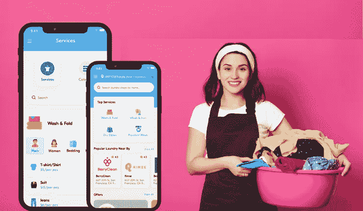
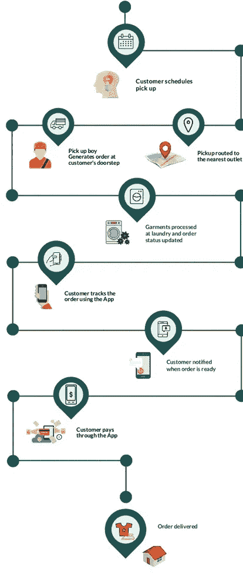

# 构成热门洗衣应用的独特关键功能

> 原文：<https://medium.com/codex/unique-key-features-that-constitute-a-hit-laundry-app-3b8b669354be?source=collection_archive---------15----------------------->

洗衣应用程序开发

洗衣应用

著名企业家理查德·布兰森说过这样一句话:“商业机会就像公共汽车。总会有下一个来的。”

这就是为什么对于新的创业公司来说，专注于利用这些解决方案变得至关重要。从长远来看，这将有助于从第一天起就获得最大回报。

如果你仔细想想，在我们生活的当前技术创新时代，应用程序使生活变得轻松，并帮助企业在最终消费者中获得良好的可见性。接下来是帮助他们建立强大的在线形象。

几乎每个企业都有这些解决方案，因此，实体传统企业也将建立应用程序也就不足为奇了。因此，当谈到传统的设置，其中最突出的是洗衣业务。

# 传统洗衣设置——为什么需要应用程序？

例如，仔细想想传统的洗衣店，顾客会去洗衣店干洗或水洗衣服。洗衣专业人员必须管理登记簿，以记录他们洗过或干洗过的衣服，等等。所有这一切无疑是一项乏味的任务。然而，随着应用程序的出现，业务流程实现了自动化。维护客户记录变得更加简单。为洗衣企业建立强大的在线知名度也变得轻而易举。所有这一切，最终使得按需洗衣应用市场的收入飙升。事实上，根据 Statista 的数据，按需洗衣业务到 2024 年将创造 960 亿美元的收入。

通过这些数字，很明显，如果你想为你的洗衣店建立一个在线形象，获得一个应用程序是一个富有成效的想法。

在下面的几行中，我解释了在按需洗衣应用开发过程中需要遵循的步骤，以构建一个强大的解决方案，为洗衣机构带来最大收入。在此之前，让我解释一下开发该解决方案的重要性，以及该解决方案将有助于解决哪些挑战。

# 按需洗衣应用的优势和挑战

*   **节省时间**

毫无疑问，没有人愿意把周末花在洗衣服上。这就是按需洗衣应用派上用场的地方。它帮助客户节省时间。顾客只需在应用程序上点击几下，就可以从目的地取走衣服。完工后，衣服被送到顾客手中。

*   **防止不愉快的杂务**

在十大令人不愉快的家务事类别下，洗衣是其中一类。因此，为了避免令人不愉快的琐事，该应用程序是为客户解决这一问题的解决方案。客户可以从应用程序中选择一个人来执行这项任务。

*   **自动完成传统洗衣设置的任务**

正如我前面提到的，人们去洗衣店干洗或水洗衣服。这意味着洗衣店必须管理庞大的登记簿等。因此，为了确保任务的自动化，我们开发了按需洗衣应用。随着它的出现，使所有这些任务自动化成为可能。换句话说，传统的洗衣店现在已经能够自动完成任务，也可以避免额外的文书工作。

因此，如果一个人在寻求用洗衣应用程序在应用程序市场建立一个强大的存在，他们会通过遵循一些步骤和流程来实现它。

当你读下面几行时，你会被这些技巧所激励。

让我们开始吧。

# 如何创建一款热门洗衣 App？

> ***拥有商业模式的知识***

在接受洗衣应用程序开发服务之前，你应该考虑的一个重要因素是了解不同的商业模式。

有两种商业模式可供你选择。

*   **按需洗衣商业模式**

顾客安排送洗衣物。衣物的收取通过按需洗衣业务模式进行。在这种模式下，洗衣初创公司可以从与他们合作的洗衣机构获得的佣金以及该应用程序完成的取货和送货中获得收入。

*   **店内型号**

通过该模型，商店可以教育顾客如何取送衣物。这是为那些无法雇用员工来执行洗衣收取和交付的设置。

根据你的商业目标，选择一个理想的商业模式。这将帮助你以一种相当顺利的方式实现这些未来的目标。

> ***知道 App 操作***

直到你不知道一个应用程序的操作，它才变得毫无意义。对于洗衣应用来说尤其如此。因此，知道它的操作。

要理解这一点，请看下图。

图片来源——topappdevelopmentcompanies.com

**上图描绘了该应用的无缝操作。以下是对此的解释。**

1.  顾客安排洗衣服务
2.  将衣物提取请求发送到最近的接收衣物的洗衣店
3.  交付专业人员旁边分配的订单
4.  送货专业人员挑选订单
5.  然后，订单请求被发送到洗衣店，订单状态为客户更新
6.  客户跟踪订单，直到交货，同时也能够支付

所以，你必须了解应用程序的操作。

 [## 我推荐的 10 个技巧可以通过在线应用程序推动干洗业务的销售

### 我敢肯定，当这是一个星期天的早上，你们大多数人都会觉得很懒，而且你记得你今天要洗衣服…

python .平原英语. io](https://python.plainenglish.io/10-tips-i-recommend-to-drive-sales-with-online-app-for-dry-cleaning-business-1c597998180a) 

> ***确定包含在*** 中的基本特征

在您了解操作之后，下一个关键步骤是确定哪些特性的包含将使操作无缝。因此，正如你已经知道的，该应用程序有三个部分——顾客、洗衣设置和送货设置。因此，他们的每个应用程序必须具有下列功能。

**客户应用程序中的特性**

*   可供选择的服务类型
*   所选服务的估计成本
*   选择提货和交货时间
*   订单状态跟踪
*   推送通知

**在洗衣设置应用程序中**

*   洗衣工管理
*   订单管理
*   用户管理
*   报告和分析
*   服务提供商管理

**交付专业应用中包含的功能**

*   收入
*   访问客户数据
*   实时位置跟踪
*   接受/拒绝请求
*   推送通知

这些功能将允许所有三个部分的无缝操作，并确保无缝洗衣服务。

遵循所有这些步骤后，您可以构建一个按需洗衣应用程序，该应用程序易于为您的客户操作，并帮助您从第一天起就为您的洗衣设置建立强大的在线可视性！

当你是一家初创公司时，确保财务保持完整是至关重要的。尤其是当你是一个传统的企业，如洗衣店。因此，当采用洗衣应用程序开发服务时，要评估成本因素。

阅读下面几行，从而了解开发一个洗衣应用程序的估计成本。

# 开发洗衣应用程序的预计成本

在亚洲，开发一款洗衣应用的估计成本在每小时 20 至 50 美元之间。以东欧为例，每小时从 40 美元到 150 美元不等。在美国，每小时的费用在 70 到 200 美元之间。

iOS 或 Android 平台的成本分别为 10，000 美元至 25，000 美元。而对于高级应用程序，它是 50，000 美元。

# 结尾词

将您的传统洗衣设备推向数字化道路的最佳方式是，立即联系洗衣应用开发公司。通过他们在洗衣应用程序开发服务中引导最佳实践的专业知识，他们开发的最终解决方案将有助于为您的企业创造价值，并从第一天起获得最大收入。