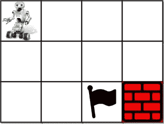
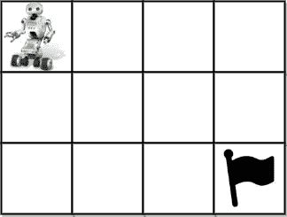

# 独特的道路 III

> 原文：<https://medium.com/codex/unique-paths-iii-b0feb87ebe6b?source=collection_archive---------9----------------------->

## 今日问题[2022 年 12 月 31 日]

给你一个`m x n`整数数组`grid`，其中`grid[i][j]`可能是:

*   `1`代表出发方块。恰好有一个起始方块。
*   `2`代表结束方块。恰好有一个结束方块。
*   `0`代表我们可以走过的空方块。
*   代表我们无法跨越的障碍。

返回从起点方块到终点方块的 4 向行走的次数，该次数正好经过每个非障碍方块一次。

**例 1:**



```
Input: grid = [[1,0,0,0],[0,0,0,0],[0,0,2,-1]]
Output: 2
Explanation: We have the following two paths: 
1\. (0,0),(0,1),(0,2),(0,3),(1,3),(1,2),(1,1),(1,0),(2,0),(2,1),(2,2)
2\. (0,0),(1,0),(2,0),(2,1),(1,1),(0,1),(0,2),(0,3),(1,3),(1,2),(2,2)
```

**例 2:**



```
Input: grid = [[1,0,0,0],[0,0,0,0],[0,0,0,2]]
Output: 4
Explanation: We have the following four paths: 
1\. (0,0),(0,1),(0,2),(0,3),(1,3),(1,2),(1,1),(1,0),(2,0),(2,1),(2,2),(2,3)
2\. (0,0),(0,1),(1,1),(1,0),(2,0),(2,1),(2,2),(1,2),(0,2),(0,3),(1,3),(2,3)
3\. (0,0),(1,0),(2,0),(2,1),(2,2),(1,2),(1,1),(0,1),(0,2),(0,3),(1,3),(2,3)
4\. (0,0),(1,0),(2,0),(2,1),(1,1),(0,1),(0,2),(0,3),(1,3),(1,2),(2,2),(2,3)
```

**例 3:**


```
Input: grid = [[0,1],[2,0]]
Output: 0
Explanation: There is no path that walks over every empty square exactly once.
Note that the starting and ending square can be anywhere in the grid.
```

# 解决办法

这个问题与使用 DFS(深度优先搜索)找到唯一路径是一样的。但是只有一个转折，那就是我们应该遍历所有的空单元格。

因此，首先我们对空单元进行计数，当我们到达最终目的地时，我们检查空单元计数是否等于 0。

一旦我们离开该单元，我们将其标记为未访问，并将空单元加 1。

```
class Solution {
    public int uniquePathsIII(int[][] grid) {
        int totalEmptyCells = 0;
        int startRow = -1;
        int startCol = -1;
        for(int i=0;i<grid.length;i++) {
            for(int j=0;j<grid[0].length;j++) {
                if(grid[i][j] == 1) {
                    startRow = i;
                    startCol = j;
                } else if(grid[i][j] == 0)
                    totalEmptyCells++;
            }
        }

        return countPaths(grid, startRow, startCol, totalEmptyCells);
    }

    public int countPaths(int[][] grid, int startRow, int startCol, int totalEmptyCells) {
        int m = grid.length;
        int n = grid[0].length;
        boolean[][] visited = new boolean[m][n];

        return dfs(grid, startRow, startCol, m, n, visited, totalEmptyCells+1);
    }

    public int dfs(int[][] grid, int i, int j, int m, int n, boolean[][] visited, int totalEmptyCells) {

        if(i < 0 || j < 0 || i >= m || j >= n) return 0;

        if(grid[i][j] == -1) return 0; // blocker

        if(visited[i][j]) return 0; // already visited

        if(grid[i][j] == 2) { // reached finish state
            if(totalEmptyCells == 0) return 1;
            return 0;
        }

        visited[i][j] = true;
        totalEmptyCells--;

        int ans = 0;
        ans += dfs(grid, i+1, j, m, n, visited, totalEmptyCells);
        ans += dfs(grid, i-1, j, m, n, visited, totalEmptyCells);
        ans += dfs(grid, i, j+1, m, n, visited, totalEmptyCells);
        ans += dfs(grid, i, j-1, m, n, visited, totalEmptyCells);

        totalEmptyCells++;
        visited[i][j] = false;
        return ans;
    }
}
```

加入我的电报频道，获取每日 Leetcode 挑战解决方案。

 [## 唯一主|编码

### 编码#编程# leet code # code chef # hacker rank # interview bit # gfg

t.me](https://t.me/sole_master_coding) 

**谢谢大家！！！**

**2023 #新年快乐**