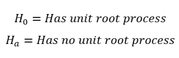
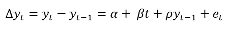
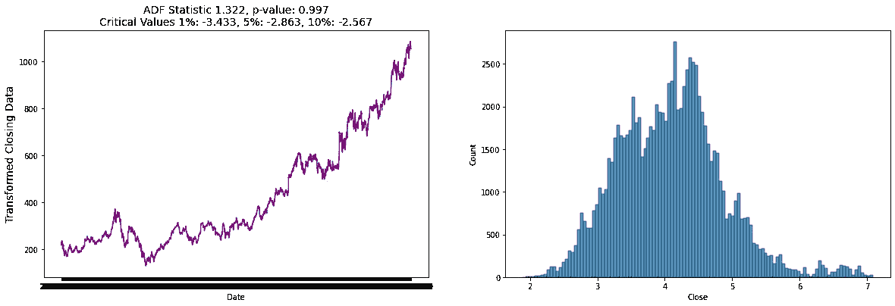
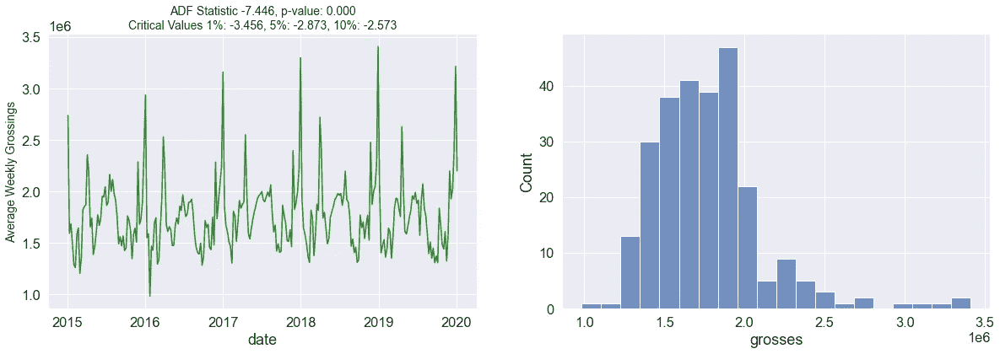
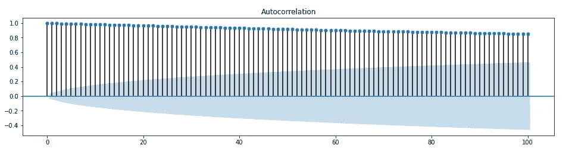
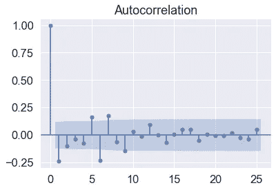
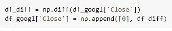
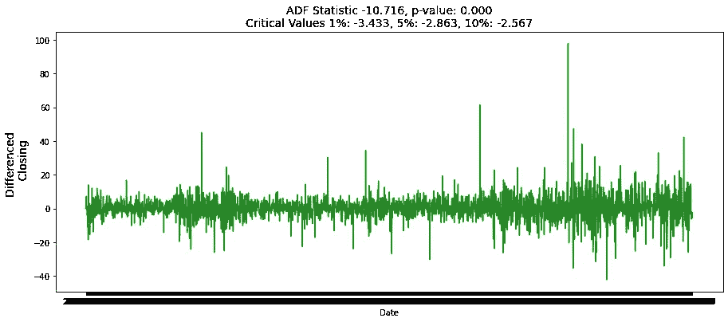

# 时间序列中的单位根

> 原文：<https://medium.com/codex/unit-root-in-time-series-38d451d742ce?source=collection_archive---------1----------------------->

在数据科学中，我们经常谈论给事物添加叙述，通常是在数据可视化的背景下。这就是我喜欢时间系列的原因，我们的叙述来源于时间的流逝，就像真实的故事一样。住房数据是一种常见的实践和现实生活场景，我们在其中设置时间、地点等等。有时我们的数据讲述的故事可能是随机的。不容易预测接下来会发生什么，就像在故事里一样。幸运的是，测量单位根有助于确定随机性。

# 覆盖地面

在我们跳到什么是单位根或单位根过程之前，让我们从更广泛的角度来讨论时间序列。平稳性、季节性和随机性。

## 平稳性

根据杜克大学福库商学院的 Robert Nau)的说法，“一个*平稳的*时间序列的统计特性，如均值、方差、自相关等。都是不变的。这些变量的一致性使得预测变得更加容易。平均来说，一个平稳的时间序列比一个具有*随机*趋势的时间序列出现的频率要低。

下面是百老汇电视剧《邪恶力量》的年度票房收入的一个例子。这是没有任何数学操作的。虽然它有*季节性*趋势的起伏，但我们看到这些总量的滚动平均值和标准差仍然是平坦的水平线，这意味着平稳性。即使你不知道“邪恶”是什么，你也可能知道他们有一个坚实的商业模式来解释这些季节性趋势。

## 季节性

季节性是一个非常直接的概念。这表明，商业模式控制之外的因素仍将对公司的财务表现产生巨大影响。在百老汇的一次展示中，我们可以看到下降发生在 9 月份左右，原因是人们返校和暑假结束。在圣诞节和新年等钱包打开、人们互赠礼物的时候，价格会大幅上涨。

关于季节性，要记住的一件重要事情是，即使结果不可预测，它也可能存在。在这种情况下，时间序列甚至更难跟踪，为了更好地了解趋势，必须去除季节性因素。

## 随机的

很大程度上，这是一个表示随机性的时髦词。随机性(也称为漂移的随机行走)可以定义为具有不确定性的变量或过程。这些功能彼此之间缺乏依赖性。(2)当一个特征的概率很重要时，随机性将被用在单词随机性之上。而诸如“随机抽样”这样的术语只是指缺乏偏倚，但并不推断结果。

# 单位根及其测量方法

## 单位根

一个*单位根*是一个度量单位，用来确定一个时间序列模型有多少平稳性。也被称为*单位根过程，*我们使用统计假设检验来确定模型的随机性。这些是平稳性的统计假设检验，旨在确定是否需要差异。(3)尽管有无数的方法来检查单位根过程的存在，我使用了一个扩展的 Dickey Fuller 测试。

*为什么这很重要？*在一个有单位根的模型，会发生尖峰和对模型的冲击。这意味着股价可能会大幅上涨或下跌，而这与季节性无关。如果模型中存在随机性，这种冲击的影响将随时间而消失。在构建更广泛的商业模式时需要考虑的一件重要事情。

***单元根测试的类型:***

*   迪基富勒试验/扩展迪基富勒试验
*   Elliott-Rothenberg-Stock 检验，它有两个子类型:

1.  *P 检验考虑了误差项的序列相关性。*
2.  *DF-GLS 检验可应用于无截距的去趋势数据。*

*   施密特-菲利普斯检验:亚型是 rho 检验和 tau 检验。
*   Phillips–Perron(PP)检验是 Dickey Fuller 检验的一种改进，修正了误差中的自相关和异方差。
*   Zivot-Andrews 检验允许在截距或线性趋势(4)中的未知点出现突变。

## 迪基富勒试验

Dickey Fuller 检验是一种统计假设检验，用于测量时间序列模型中的随机性。迪基富勒测试是基于线性回归。

上面的 Dickey Fuller 测试实际上创建了一个与预定临界值进行比较的 *t 统计量*。低于这个临界统计量允许我们拒绝零假设，接受替代方案。如果我们高于这个检验统计量，我们就不能拒绝零假设。临界值根据相关数据制成表格。计算临界值的公式又长又难，所以我不会在这里讨论，但要知道它们是为每个新数据集量身定制的。

迪基富勒检验的无效假设和替代假设。

迪基·富勒检验公式

## 增强迪基富勒试验

序列相关性可能是一个问题，在这种情况下，可以使用增强的 Dickey-Fuller (ADF)检验。ADF 处理更大、更复杂的模型。它确实有相当高的 I 型错误率的缺点。(4)标题中列出了增强的 Dickey Fuller 的密钥提取，它处理增强的数据。这是一种改进的算法，用于处理高维数据。

下面是来自两个不同数据集的增强 Dickey Fuller 测试的结果。一个是随机的，另一个是零。用紫色编码的第一个测试颜色具有高 p 值和远高于最高临界值的测试统计值。这意味着它*有*个单位根过程，因此本质上是随机的。我们不能拒绝无效假设。

谷歌股票的广告富勒测试。

第二个测试以绿色进行颜色编码，具有低 p 值和远低于最低临界值的测试统计值。这意味着*没有*单位根过程，因此本质上是非随机的。我们拒绝无效假设，接受替代方案。

广告富勒测试'邪恶'的票房。

# 调整随机的单位根

## 自相关

就像相关性衡量两个变量之间线性关系的程度一样，自相关衡量一个时间序列的*滞后值*之间的线性关系(3)自相关意味着线性模型是自我意识的，它不断地考虑自身的过去版本。时滞是指在给定的一段时间后，模型衡量其当前绩效与过去绩效的对比。这是衡量模型稳定性的另一种方式。这是一个简单的方法，而不是试图根据你的广告结果对你的图表进行颜色编码。

下面是谷歌股票在 5 年内的相关图。这些线非常接近 1，并且呈略微下降的视觉模式，这表明自相关性很高。

谷歌股价的相关图。

查看下面的第二个相关图，我们可以看到自相关性非常低，随机意味着我们的模型是稳定的。通常相关图从第一个滞后在 1 处与其自身完全相关开始。每个滞后越接近 0，模型中出现的自相关就越少。

邪恶的百老汇票房收入的相关图。

## 区别

*差分*是一种可以应用于数据集的技术，目的是消除任何种类的随机性。这是一种使非平稳时间序列平稳的方法，即计算连续观测值之间的差异。这是一种在单位根检验和自相关检验运行后应用的技术。

对数等变换有助于稳定时间序列的方差。“差异可以通过消除时间序列水平的变化来帮助稳定时间序列的平均值，从而消除(或减少)趋势和季节性。”(3)

我见过几种不同的区分方法。有些需要很长的代码段，有些则很简单。幸运的是，Numpy 中有一个内置的函数用于区分。只是要小心，因为它可能带有需要消除的警告或错误消息。

Python 中用于差分的两行代码。

谷歌股价差异后的 ADF 测试结果。

# 结论

评估指标可能是我们数据科学武库中最有价值的工具。虽然单位根并不度量模型的性能，但是它给了我们对模型行为的强大洞察力。在时间序列中，模型的行为与时间的流逝直接相关。像迪基富勒和增强迪基富勒测试这样的测试帮助我们评估这种行为。自相关和差分也是时间序列中增强给定结果可信度的极好工具。

# 资源

①[https://people.duke.edu/~rnau/411home.htm](https://people.duke.edu/~rnau/411home.htm)

(2)[https://machine learning mastery . com/random-in-machine-learning/](https://machinelearningmastery.com/stochastic-in-machine-learning/)

(3)乔治·阿萨纳索普洛斯(2018 年)。预测:原理与实践。(第二版)。OTexts。

④https://www.statisticshowto.com/unit-root/