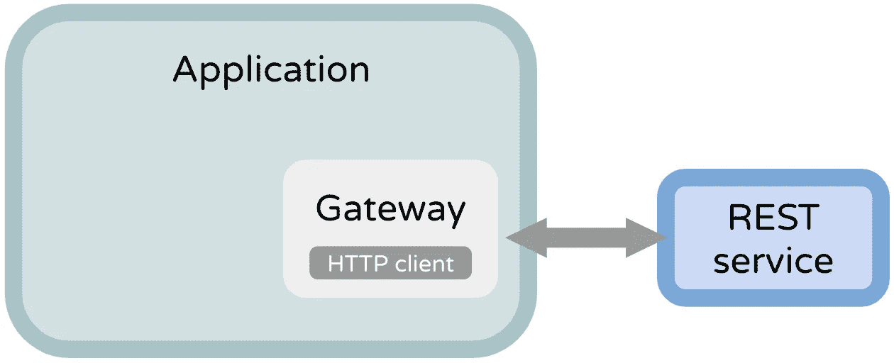
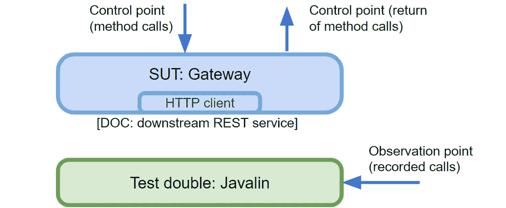

# 使用 Javalin 测试网关客户端

> 原文：<https://medium.com/codex/unit-testing-a-gateway-with-javalin-24e3b7e88ef2?source=collection_archive---------3----------------------->

## 在 Kotlin/Java 中，如何测试您的应用程序是否正确使用了外部 REST API？我们会用 Javalin 来做。

如何在你的应用中对网关进行单元测试？

📝*我把这篇文章改编到了* [*官方 Javalin docs 页面*](https://javalin.io/tutorials/using-javalin-as-http-simulator) *。*

我的建议是使用 [**Javalin**](https://javalin.io/) (一个轻量级的 web 服务器)作为测试替身，从而取代外部 API(DOC:dependent-on 组件)。我们将启动 Javalin 作为真正的 API，但是在本地主机上运行，这样[网关](/onfido-tech/designing-gateways-for-greater-good-b6d8340465c7)([SUT](https://en.wikipedia.org/wiki/System_under_test))就看不出区别。我们将通过断言对 test double 的调用来确认有效性。

⚠️ *不要混淆测试 API 调用和测试你自己的 API 处理程序。我们想解决前者:测试一个 REST 客户端；不是休息服务。*

# 开始前

我们将有两个测试`ProfileGateway`的例子:一个查询和一个命令，根据[命令/查询分离](https://martinfowler.com/bliki/CommandQuerySeparation.html):

*   **查询**:检查是否正确使用了外部方的 GET 响应；我们将断言一个方法的输出；
*   **命令**:检查是否按预期进行了 POST 调用；我们将断言一个结果，即 posted 主体。

我们只需要这个样板文件来保证 Javalin 在每次测试中都停止运行:

不要担心，因为这不会使你的测试变慢；Javalin 启动速度极快(几秒钟内启动/停止数百次)。

📝*我将使用* [*我的配方来创建单元测试*](https://levelup.gitconnected.com/how-to-write-a-test-using-tdd-b2828788d7ea) *。*

# 示例 1:测试 API 的 GET

假设你的应用程序依赖于一个外部 API 来获取用户的配置文件——一个 [*查询*](https://martinfowler.com/bliki/CommandQuerySeparation.html) 。我们需要测试`ProfileGateway`是否处理得很好，即数据的解析和正确转换。

## 通用配方

1.  **安排**:用一个单独的处理程序准备 Javalin，仅仅是为了模拟你的外部 API 端点；在处理程序内部，编写一个存根响应，就好像您是 API 所有者一样；
2.  **act** :调用取数据的 [subject](https://en.wikipedia.org/wiki/System_under_test) 方法；
3.  **assert** :测试你的 subject 正确解析了存根响应(API JSON →你的域表示)；或者，您可以检查调用次数和 HTTP 详细信息(例如，您是否发送了正确的标头)。

# 示例 2:测试 API 的 POST

现在我们来看一个 [*命令*](https://martinfowler.com/bliki/CommandQuerySeparation.html) 的例子——有一个副作用需要测试。在这种情况下，我们需要断言数据是由`ProfileGateway`正确准备并提交给第三方的。也可以测试 HTTP 调用细节。

## 通用配方

1.  **安排**:用一个单独的处理程序准备 Javalin，仅仅是为了模拟你的外部 API 端点；在处理程序内部，存储您稍后想要断言的内容，比如路径、头和主体；
2.  **Act** :调用执行副作用的 subject 方法；
3.  **断言**:测试处理器中存储的值是否正确；例如，主体必须已经正确地转换为外部 API(您的域表示→ API JSON)。

⚠️ *无论做什么，* ***永远不要做 Javalin 测试处理程序*** *里面的断言。
为什么？因为如果他们失败了，他们会抛出一个 JUnit 异常，这个异常会被 Javalin 吞掉；* ***测试会变绿！总是把断言做在最后*** *于是按照* [*排列、行动，断言模式*](https://levelup.gitconnected.com/how-to-write-a-test-using-tdd-b2828788d7ea) *。*

# 替代方法

提及 Javalin 提案的替代方案很重要:

*   🛑 **嘲讽 HTTP 客户端**(比如用[mock](https://mockk.io/)，[httpclientmock](https://github.com/PawelAdamski/HttpClientMock))
    `when httpClient.get is called with ... respond with ...`
    你会[嘲讽你不拥有的东西](https://github.com/testdouble/contributing-tests/wiki/Don't-mock-what-you-don't-own)；你会嘲笑一个数据库驱动吗？嘲笑 REST 客户端也是一样糟糕的。您可以将测试与 HTTP 客户端结合起来，这是一个实现细节。
    *有了 Javalin，你在实现中使用哪个 REST 客户端都没关系(* [*Java HTTP 客户端*](https://openjdk.java.net/groups/net/httpclient/intro.html) *，* [*Apache HTTP 客户端*](https://hc.apache.org/httpcomponents-client-5.0.x/index.html) *，* [*改型*](https://github.com/square/retrofit) *等等)。*
*   模仿 HTTP 客户端的包装器你只是创建了一个额外的直通层。此外，您无论如何也没有模仿 HTTP。最后，您没有抽象外部当事人数据模型。使用 Javalin，你有(本地主机)网络参与，所以它更真实。例如，模拟网络错误(例如 401 未授权)来查看您的系统如何处理它们是很简单的。
*   **使用一个模仿 HTTP 层**语言的库(例如 [vrc](https://github.com/vcr/vcr) ， [ExVCR](https://github.com/parroty/exvcr) ， [VCR.py](https://github.com/kevin1024/vcrpy) )
    如果它是一个支持良好的库，并且没有具体耦合到任何 HTTP 客户端，我认为这是一个很好的替代方案。这不如我的提议现实，但值得考虑。
*   **为基于 HTTP 的 API**使用模拟器(例如 [MockServer](https://www.baeldung.com/mockserver) 、 [WireMock](https://www.baeldung.com/introduction-to-wiremock) 、 [JSON Server](https://github.com/typicode/json-server) )
    与 Javalin 提案的技术相同，但是使用了内置了 [DSL](https://en.wikipedia.org/wiki/Domain-specific_language) 的专用库。
    *我两个都试过，最后都换成了 Javalin，因为我不想学他们的 DSL。此外，当测试失败时，Javalin 可以更容易地修复它。(Python 的等价库是 HTTPretty 的***库，但它看起来并不奇怪。)**
*   ***集成，系统，** [**契约**](https://lsoares.medium.com/contract-testing-using-pact-io-7632e5ee33ab) **，端到端测试**
    这些都是对单元测试的补充而不是替代。*

*📝如果你使用 Javalin 作为你的应用程序 web 服务器，那就更好了，因为你不会添加额外的测试库。*

*你可以在 GitHub repo ( [测试](https://github.com/lsoares/clean-architecture-sample/blob/master/src/test/kotlin/adapters/ProfileGatewayTest.kt)和[实现](https://github.com/lsoares/clean-architecture-sample/blob/master/src/main/kotlin/adapters/ProfileGateway.kt))中找到给出的例子[。](https://github.com/lsoares/clean-architecture-sample)*