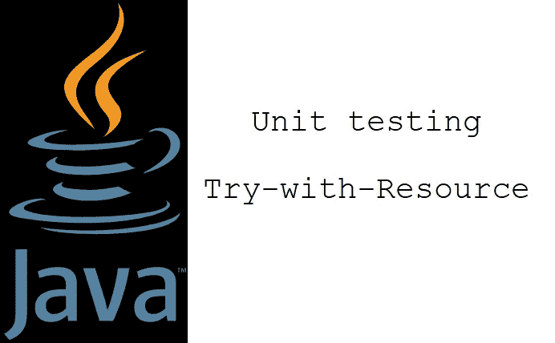

# 单元测试 Java 的资源尝试

> 原文：<https://medium.com/codex/unit-testing-javas-try-with-resource-2cf793fdbc34?source=collection_archive---------1----------------------->

Java 的 try-with-resource 是一种方便的语法捷径。它将开发人员从跟踪可关闭的资源和关闭一个`finally`块中解放出来

# 概观

我们中的一些人可能记得做了很多这样无聊冗长的`try` - `finally` - `if-not-null` - `close()`！

在一个典型的日子里，我们执行这些步骤十几次: