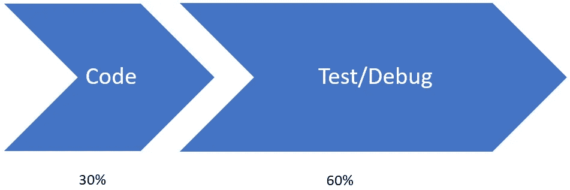

# 单元测试让我慢了下来

> 原文：<https://medium.com/codex/unit-tests-slow-me-down-98a6bac41462?source=collection_archive---------0----------------------->

埃米尔·布鲁克纳在 [Unsplash](https://unsplash.com?utm_source=medium&utm_medium=referral) 上的照片

只有这样才有意义。如果我被迫去写单元测试，我所写的代码是我写我想写的代码的两倍多。当我更改代码时，我被迫也更改单元测试。我的很多代码都不可测试。迟早，它们会变得陈旧，我开始忽略这些测试。因此，它们是对时间的巨大浪费。我的截止日期很紧，因为管理层给我压力要我加快进度，所以避免单元测试是一个简单的选择。不要让我开始谈论 TDD 有多愚蠢。

读过我其他文章的人会意识到我不是这么想的。但不幸的是，这是我们行业中相当多的人持有的观点。他们真的相信单元测试是不必要的，只会减慢过程。

持这种观点的更有思想的人相信更高层次的测试包含了单元测试所覆盖的内容。只要我们在做集成、系统、验收、性能和安全测试，就没有理由编写单元测试。如果我们做了所有这些事情，我们将在过程的最后获得相同的质量，那么为什么要浪费时间编写单元测试呢？

他们完全没有抓住要点。我们编写单元测试是为了更快。

# 积木

软件开发就像用积木搭建。我们把一个大而复杂的问题分解成容易处理的部分。然后我们建造这些部件，并把它们组装成更大的部件。最终，我们将大量部件组装成一个工作系统。

您当然可以将所有这些部分组装起来，然后测试最终的系统。但是这碰到了经典的调试问题:“我知道有东西坏了，但是我不知道在哪里。”调试是深入到那一大堆程序块中并找出哪一个有缺陷的过程。有时是不同的有缺陷的块组合在一起产生了缺陷。

# 代码调试周期

在软件开发中有一种说法，一个项目的前 90%和后 10%花费的时间一样长。这是因为当你在调试的时候，你不知道还有多少工作要做。有很多关于跟踪 bug 数量、解决时间等的试探法，试图预测一个项目何时会发布稳定版本，但这些都只是猜测。有时候，修复最后一个 bug 可能会破坏其他东西。有时候，这些倒退是在幕后发生的，所以直到下一个用户接受周期你才知道。

下面是一个典型的不浪费单元测试时间的软件开发项目:

10%是需求/设计，30%是编码，60%是测试/调试循环。大多数软件开发的改进都集中在减少 30%的编码时间上。这是一种逻辑，如果我们消除了单元测试所花费的时间，我们就能更快地完成代码。

尽我们所能从测试/调试周期中去掉一大块不是更有意义吗？节省的回报是稍快编码的两倍。

回到积木的类比。当您不知道哪个(或者如果有的话)块工作正常时，调试会变得非常困难。你实际上是在脆弱的基础上工作。其中任何一块都可能会粉碎和损坏其他东西。相反，如果我们知道每个单独的组件都按预期工作，并且我们只是跟踪交互中的问题，那就容易多了。

比方说，当我们编码时，编写单元测试要多花 50%的时间。(我不同意这个估计，我认为使用 TDD 实际上比不使用 TDD 更快。)我们假设一个 1000 小时的项目。我们将不再花 300 小时编码，而是花 450 小时编码。我们的测试/调试时间只需要减少 25%就可以弥补编写测试的额外时间。

节省了 25%以上。现在有了实心砌块，我们可以:

*   我们永远不会倒退。同样的错误不会再次出现，因为它会被之前的测试发现。对于我们发现的每一个 bug，我们都会创建一个测试来验证它不会再次出现。
*   我们不会有任何程序块的行为不符合要求的错误。我们对这些模块进行了测试，所以我们进去时知道它们按照指定的方式工作。
*   我们不必担心缺陷级联。如果我们在一个地方做了更改，我们可以运行整个测试集，并知道我们是否在其他地方破坏了某些东西。
*   我们不必害怕清理代码。我们可以无所畏惧地移动东西。我们可以简化一个块，并保证行为没有改变。
*   当你通过单元测试而不是通过调试器来调试时，实际的细节调试会更快。大多数调试时间都浪费在手工设置测试条件上。您发现的大多数 bug 实际上只是被遗漏的测试。

根据我的经验，从真正可靠的单元测试套件开始可以减少 75%的调试时间。我们 1000 小时的项目只进行了 450 小时的编码和 150 小时的调试。整个项目花费的时间减少了 40%。并且质量比临时的方法高得多。

450 小时的编码时间是很长的，尤其是如果你遵循 TDD 的话。实际上用 TDD 编码和不用它一样快。有没有大脑冻结试图解决一个编码问题？当你试图写下一个失败的测试，或者写足够通过测试的代码时，这种情况很少发生。每次你进行测试并获得许可时，你的大脑就会产生多巴胺。这有助于你进入心流并停留在那里。真正的答案是总体节约接近 50–60%。

# 当我修改代码时，我被迫也修改单元测试

你测试不正确。单元测试应该测试行为。它不应该与代码耦合。您唯一需要更改测试的时候应该是您更改预期行为或者添加额外的预期行为的时候。

# 我的很多代码都是不可测试的

如果你先写测试，那就不会发生。测试优先方法的主要好处之一是它迫使你以一种可测试的方式设计你的代码。您还会发现，被设计为可测试的代码不那么脆弱。

对此我要提出的一个警告是，测试 UI 代码是很困难的。您可以测试 UI 是否有您期望的一组元素，但是当您将小部件移动几个像素或者将颜色更改为合适的色调时，您将不会构建单元测试。

# 测试变得陈旧

如果你在测试行为就不会。测试实际上是记录预期行为的好方法。如果您随着预期行为的改变而更新测试，测试就不会过时。

# 管理层向我施压，要求我加快速度

我表示怀疑。管理层向你施压，要求你更快发布。他们希望你更有效率。他们不在乎你打字有多快或者你写了多少代码，他们想看到结果。在编码上多花一点时间会让你在通过验收测试时看起来像个英雄。

# 如果你想走得快，就走得慢

就像军事特种兵说的“慢就是顺，顺就是快。”

正如这篇文章的标题所说，**单元测试让我慢了下来**。这让我跑得更快。