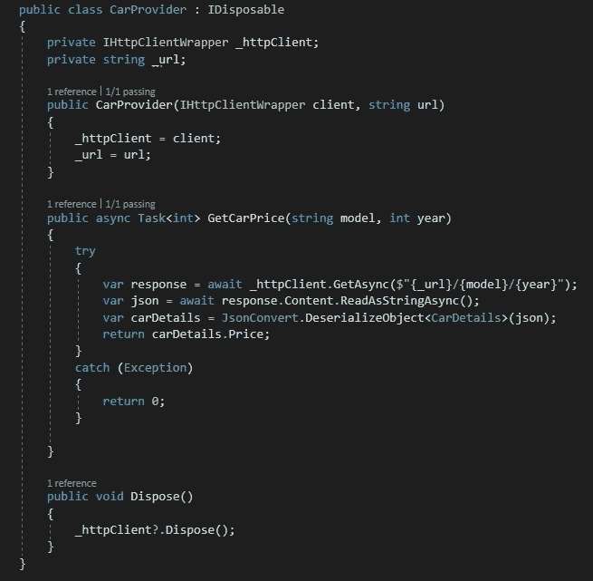
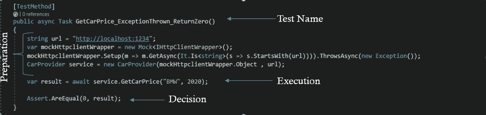

# 单元测试——什么？为什么？怎么会？

> 原文：<https://medium.com/codex/unit-tests-what-why-how-89964e7041fe?source=collection_archive---------11----------------------->

> 作为一名计算机专业的学生，我并没有真正理解编写单元测试的核心原因。当我第一次想推送我的代码，正在等待代码评审时，我得到了一条评论——“*你的单元测试在哪里？*”。

## 当你说单元测试时，你指的是什么？

顾名思义，这是一种测试单元的方法——逻辑上隔离的最小代码片段。在单元测试中，我们不能试图涉及组件之间的集成，我们不打算依赖外部资源(如数据库、web 服务等)。).由于单元测试与外部资源隔离，我们应该能够在本地或任何其他机器上运行它们。

单元测试也是 TDD(测试驱动开发)的一部分，TDD 是一种软件开发过程，它依赖于在软件完全开发之前将软件需求转换成测试用例。在这个过程中，在编写新代码之前，为每个功能创建测试用例。

如今有许多工具可以运行、创建和编写单元测试，例如: [VSTest](https://github.com/microsoft/vstest) 、 [Karma](https://karma-runner.github.io/latest/index.html) 、 [MSTest](https://github.com/microsoft/testfx) 、 [NUnit](https://nunit.org/) 、 [XUnit](https://xunit.net/) 、 [Junit](https://junit.org/junit5/) 。

## 单元测试的核心原因是什么？

最常听到的原因是:

*   涵盖了我们无法使用手动或其他软件测试的情况，例如组件/系统/自动化测试，尤其是边缘情况。
*   早期问题识别。
*   快速执行运行时，这是在将代码更改应用到源代码控制之前的第一层测试。

但是…

当我想到单元测试时，首先想到的是 ***依赖注入*** 。将创建对象的任务转移给其他人，并直接使用该对象，这被称为依赖注入。这有助于我们遵循 **SOLID 的依赖倒置和单一责任原则。**

使用依赖注入比让组件满足它们自己的依赖有几个好处。这些优势包括:

*   可读性:更容易看出组件有哪些依赖关系
*   可扩展性:依靠抽象而不是实现，代码可以很容易地改变给定的实现
*   可维护性:遵循可靠的原则
*   易测性

当依赖关系可以被注入到一个组件中时，对那些依赖关系的模仿也可以。模拟对象用于测试，作为真实实现的替代。我们可以为模拟对象配置不同的行为，这样我们就可以测试组件来正确处理所有的行为。例如，我们可以测试组件是否能够处理 mock 何时返回正确的对象，何时返回 null，以及何时抛出异常。此外，mock 对象通常会记录对它们调用了什么方法以及调用了多少次，因此测试可以验证使用 mock 的组件是否按预期使用了它们。

很明显，如果我们试图为不遵循依赖注入模式的组件编写测试，我们很快就会发现许多场景甚至部分组件行为是不可测试的。

例如，如果我们的组件使用一个网络层组件(比如 *HttpClient)* 并且我们没有一个开发 url，或者我们运行测试的机器被阻止访问互联网，如果我们不使用依赖注入，我们将不能测试所有使用 *HttpClient* 功能的行为。

**当我们编写单元测试时，它迫使我们遵循坚实的原则编写更可读、可扩展和可维护的软件**。

## 我们如何编写单元测试？

单元测试应该像我们写文章一样来写。
在一篇文章中，我们有一个**标题**、**引言**、文章**实质**和一个**结论**。
在一个单元测试中，我们有一个**测试名称、准备、组件行为的执行**，以及一个**决策**:

1.  测试名称:应该包括测试内容和预期结果
2.  **准备**:创建具有特定行为的模拟对象，并将其注入到被测组件中
3.  **执行组件的行为:**运行我们想要测试的方法
4.  **决定:**比较预期结果和实际结果，决定测试是否通过

这里有一个例子:

我们有一个类 **CarProvider** ，它依赖 IHttpClientWrapper 的方法**GetCarPrice*(string model，int year)*** ，当给定型号和年份时，该方法将返回价格。

**测试名**描述了当一个异常被抛出时，我们期望从方法 *GetCarPrice* 得到一个返回值 0。

在**准备**部分，我们正在创建 IHttpClientWrapper 的模拟对象，我们将它注入到 CarProvider 组件中，并将其设置为抛出异常。然后，我们用模拟对象注入 CarProvider 组件。

在**执行**部分，我们调用我们测试的方法。

在**决策**部分，我们将得到的结果与预期结果(0)进行比较，并决定测试是失败还是通过。

所以不要等待代码评审，开始编写单元测试吧😉