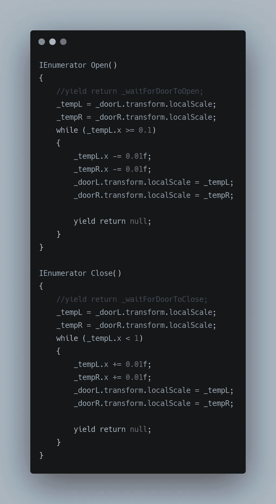

# Unity 开发—协同程序

> 原文：<https://medium.com/codex/unity-development-coroutines-adae74fcd857?source=collection_archive---------20----------------------->

我们已经看到了如何使用变量，移动对象，碰撞和触发器如何与 unity 甚至协同程序一起工作。

让我们把所有的知识放在一起，做一个简单的自动门系统。

在我们继续下一步之前，让我们简要地看一下协程。

**协程:**

可以把它们想象成一个特殊的函数，让你暂停/延长代码块的执行。任何例行工作或任何您希望随时间执行的事情，这时您将使用协程。例如，日夜循环，它总是发生，所以它可以被假设为一个例行工作或一个秘密游戏，其中一个敌人发现了你，现在他暂停了他正在做的一切，并移动到他最后一次看到你的地方，在这里，停止他正在做的任何事情(可能是巡逻)的行为可以使用协程来完成。因此，您可以假设，无论何时，当您需要在一段时间内做一些事情，或者当您做一些需要中断的事情或中断流程的事件时，使用协程都是一个安全的选择。

让我们来制作一个自动门系统，当玩家靠近门时，门会自动打开，进入门后会自动关闭。

在这里，开门和关门的动作可以看作是一个例程，所以我们可以使用协程来实现它。

让我们从运动开始，

其中， **UserInput()** 返回我们的输入的规范化向量 3。Clamp 用于创建玩家边界。

移动完成后，让我们继续创建一个触发区，玩家一接触它就触发一个事件。

在这里，跳跳虎是一个空的游戏对象，它包含一个带有触发器的盒子碰撞器，以及一个触发我们的**协程**的行为脚本。

完成后，让我们检查碰撞，这可以通过，

这里，当我们进入触发区域时，调用 **OnTriggerEnter()** ，当我们退出该区域时，调用 **OnTriggerExit()** 。**“其他”**存储与我们的游戏物体发生碰撞的物体的碰撞体。 **GetComponent()** 用于获取**触发事件(脚本)**中的 **DoorClose()** 。

现在让我们来看看使这成为可能的协程，

这里的想法是，在触发我们的事件打开/关闭门时。我们将收缩/扩展门，因此当我们减少或增加对象的局部比例时，使用 **while 循环**。但是，如果这是一个正常的方法，整个过程将在一个单一的框架中完成，这不是我们想要的。因此，我们使用协程，协程允许我们使用 **yield return** 语句，其中 null 表示我们作为 while 循环在继续之前一直等到帧的末尾。这给了我们一种渐进和一致的开门/关门的感觉。

**StartCoroutine()** 是自明的。

你可以查看我以前的[文章](https://sidthakur3519.medium.com)来了解更多关于主题的细节。

最后一个小技巧，使单面缩放对象…

当我们沿着一个轴缩放一个对象时，通常会发生这种情况

因此，这可以通过创建一个空对象，重置其**变换**，然后用我们想要的对象作为父对象，并将其设置到我们想要的位置来实现，例如，如果我们希望沿 x 轴正方向缩放对象，我们可以将变换设置为 0.5，如果我们希望沿负方向缩放，我们可以通过将其变换设置为-0.5 来实现。(0.5，因为我们的立方体对象的比例为 1)。

更多即将推出！！！！！！